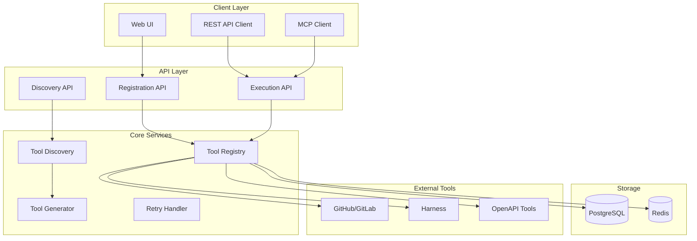

# Dynamic Tools Implementation Plan

> **Document Version**: 1.0  
> **Feature**: Dynamic Tool Registration for DevOps MCP  
> **Scope**: MVP Implementation  
> **LLM Optimization**: Structured for Claude Opus 4

## Table of Contents

1. [Executive Summary](#executive-summary)
2. [Technical Architecture](#technical-architecture)
3. [Implementation Phases](#implementation-phases)
4. [Detailed Component Specifications](#detailed-component-specifications)
5. [API Specifications](#api-specifications)
6. [Security Considerations](#security-considerations)
7. [Testing Strategy](#testing-strategy)
8. [Rollout Plan](#rollout-plan)

---

## Executive Summary

### <objective>
Implement a dynamic tool registration system that allows users to add new DevOps tools without code changes, supporting self-hosted instances (GitHub Enterprise, GitLab), SaaS platforms (Harness.io, SonarQube), and any API with OpenAPI specifications.
</objective>

### <key-features>
- **Generic OpenAPI adapter** that works with ANY tool (no hardcoded tool-specific logic)
- **Dynamic authentication** based on OpenAPI security schemes
- **OpenAPI-driven tool generation** for ALL APIs
- **Multi-tenant isolation** with per-tenant credentials
- **Intelligent API discovery** with multiple strategies
- **Built-in retry policies** for reliability
- **Support for ANY tool**: GitHub, GitLab, Harness, SonarQube, Dynatrace, JFrog, and any custom API
- **Health check monitoring** for registered tools
- **Zero tool-specific code** - everything driven by OpenAPI specs
</key-features>

### <constraints>
- MVP scope - no OAuth implementation
- Must work with existing authentication system
- Preserve backward compatibility with static tools
- Support both cloud and self-hosted deployments
- Follow existing codebase patterns (Gin routing, resilience package, auth middleware)
- Use existing error response structure
</constraints>

---

## Dynamic Architecture Philosophy

### <no-hardcoding-principle>
**CRITICAL**: This system contains ZERO tool-specific code. All tool behavior is discovered and generated dynamically from OpenAPI specifications.

#### What This Means:
1. **No Tool-Specific Adapters**: Instead of GitHubAdapter, GitLabAdapter, etc., we have ONE generic OpenAPIAdapter
2. **Dynamic Authentication**: Auth methods are extracted from OpenAPI security schemes, not hardcoded
3. **Automatic Tool Generation**: All tools/actions are generated from OpenAPI operations
4. **Discovery Not Configuration**: The system discovers capabilities rather than having them pre-defined
5. **Future-Proof**: Any new API with OpenAPI specs works immediately without code changes

#### Architecture Components:
```
┌─────────────────────┐
│   User Registers    │
│   New Tool (URL)    │
└──────────┬──────────┘
           │
           ▼
┌─────────────────────┐
│  Discovery Service  │ ← Finds OpenAPI spec
│  (No tool-specific  │   using smart strategies
│      logic)         │
└──────────┬──────────┘
           │
           ▼
┌─────────────────────┐
│  OpenAPI Adapter    │ ← Parses spec and
│  (Generic for ALL   │   generates tools
│      tools)         │   dynamically
└──────────┬──────────┘
           │
           ▼
┌─────────────────────┐
│  Dynamic Auth       │ ← Configures auth based
│  (From security     │   on OpenAPI security
│      schemes)       │   schemes
└──────────┬──────────┘
           │
           ▼
┌─────────────────────┐
│   Ready to Use!     │
│  (No coding needed) │
└─────────────────────┘
```
</no-hardcoding-principle>

---

## Technical Architecture

### <system-overview>

</system-overview>

### <core-components>

#### 1. Tool Registry
- Manages tool lifecycle (register, update, delete, enable/disable)
- Maintains per-tenant tool configurations
- Handles credential encryption and storage

#### 2. Discovery Service
- Attempts automatic OpenAPI discovery
- Checks multiple standard locations
- Handles subdomain discovery (e.g., apidocs.harness.io)

#### 3. Tool Generator
- Converts OpenAPI specs to tool definitions
- Maps operations to standardized actions
- Validates and sanitizes tool configurations

#### 4. Execution Engine
- Handles tool invocation with retry policies
- Manages authentication per request
- Tracks execution metrics and errors

</core-components>

---

## Implementation Phases

### <phase-1>
**Week 1-2: Core Infrastructure**

<tasks>
- [ ] Create database schema for tool configurations
- [ ] Implement base ToolPlugin interface
- [ ] Build credential encryption/decryption
- [ ] Add tool lifecycle management APIs
- [ ] Implement retry handler with configurable policies
- [ ] Create health check service with on-demand checking and caching
</tasks>

<deliverables>
- Database migrations (including health_status fields)
- Core tool registry implementation
- Basic CRUD APIs for tools
- Retry policy framework
- Health check cache (5-minute TTL)
</deliverables>
</phase-1>

### <phase-2>
**Week 3: Tool Discovery & Generation**

<tasks>
- [ ] Implement OpenAPI discovery strategies
- [ ] Build subdomain discovery logic
- [ ] Create OpenAPI to tool converter
- [ ] Add tool validation framework
- [ ] Implement connection testing
</tasks>

<deliverables>
- Discovery service with multiple strategies
- OpenAPI parser and validator
- Tool generation from specs
- Connection test endpoint
</deliverables>
</phase-2>

### <phase-3>
**Week 4: Dynamic Components**

<tasks>
- [ ] Implement the ONE generic OpenAPI adapter
- [ ] Create intelligent discovery service
- [ ] Build dynamic authentication system
- [ ] Add credential template generation
- [ ] Create discovery hint system (optional user-provided)
- [ ] Implement capability extraction from specs
- [ ] Add OpenAPI security scheme parser
- [ ] Test with various real-world APIs
</tasks>

<deliverables>
- Single OpenAPI adapter that handles ALL tools
- Discovery service with multiple strategies
- Dynamic auth based on security schemes
- Zero tool-specific code
- Tested with GitHub, GitLab, Harness, SonarQube, etc.
</deliverables>
</phase-3>

### <phase-4>
**Week 5-6: Integration & Testing**

<tasks>
- [ ] Integration with existing auth system
- [ ] End-to-end testing suite
- [ ] Performance optimization
- [ ] Documentation and examples
- [ ] Security audit
- [ ] Configure health check caching and monitoring
- [ ] Set up health check alerts
</tasks>

<deliverables>
- Fully integrated system
- Test coverage >80%
- Performance benchmarks
- User documentation
- Health monitoring dashboard
- MVP health check configuration (on-demand with 5min cache)
</deliverables>
</phase-4>

---

## Detailed Component Specifications

### <database-schema>
```sql
-- Tool configurations per tenant
CREATE TABLE tool_configurations (
    id UUID PRIMARY KEY DEFAULT gen_random_uuid(),
    tenant_id UUID NOT NULL,
    tool_type VARCHAR(50) NOT NULL,
    tool_name VARCHAR(100) NOT NULL,
    display_name VARCHAR(200),
    config JSONB NOT NULL,
    credentials_encrypted BYTEA,
    auth_type VARCHAR(20) NOT NULL DEFAULT 'token', -- Added missing field
    retry_policy JSONB,
    status VARCHAR(20) DEFAULT 'active',
    health_status VARCHAR(20) DEFAULT 'unknown',
    last_health_check TIMESTAMP,
    created_at TIMESTAMP DEFAULT NOW(),
    updated_at TIMESTAMP DEFAULT NOW(),
    created_by VARCHAR(100),
    UNIQUE(tenant_id, tool_name),
    INDEX idx_tenant_status (tenant_id, status),
    INDEX idx_tenant_type (tenant_id, tool_type)
);

-- Tool discovery sessions
CREATE TABLE tool_discovery_sessions (
    id UUID PRIMARY KEY DEFAULT gen_random_uuid(),
    tenant_id UUID NOT NULL,
    session_id VARCHAR(100) UNIQUE,
    tool_type VARCHAR(50),
    base_url VARCHAR(500),
    status VARCHAR(50),
    discovered_urls JSONB,
    selected_url VARCHAR(500),
    created_at TIMESTAMP DEFAULT NOW(),
    expires_at TIMESTAMP DEFAULT NOW() + INTERVAL '1 hour'
);

-- Tool execution audit log
CREATE TABLE tool_executions (
    id UUID PRIMARY KEY DEFAULT gen_random_uuid(),
    tool_config_id UUID REFERENCES tool_configurations(id),
    tenant_id UUID NOT NULL,
    action VARCHAR(100),
    parameters JSONB,
    status VARCHAR(20),
    retry_count INT DEFAULT 0,
    error TEXT,
    response_time_ms INT,
    executed_at TIMESTAMP DEFAULT NOW(),
    executed_by VARCHAR(100),
    INDEX idx_tenant_tool_time (tenant_id, tool_config_id, executed_at DESC)
);

-- Retry attempts tracking
CREATE TABLE tool_execution_retries (
    id UUID PRIMARY KEY DEFAULT gen_random_uuid(),
    execution_id UUID REFERENCES tool_executions(id),
    attempt_number INT NOT NULL,
    error_type VARCHAR(50),
    error_message TEXT,
    backoff_ms INT,
    attempted_at TIMESTAMP DEFAULT NOW()
);
```
</database-schema>

### <core-interfaces>
```go
// OpenAPI Adapter - The ONLY adapter needed
type OpenAPIAdapter interface {
    // Discovery
    DiscoverAPIs(ctx context.Context, config ToolConfig) (*DiscoveryResult, error)
    
    // Tool generation from ANY OpenAPI spec
    GenerateTools(config ToolConfig, spec *openapi3.T) ([]*tool.Tool, error)
    
    // Dynamic authentication based on security schemes
    AuthenticateRequest(req *http.Request, creds *models.TokenCredential) error
    
    // Connection testing
    TestConnection(ctx context.Context, config ToolConfig) error
    
    // Extract auth requirements from spec
    ExtractAuthSchemes(spec *openapi3.T) []SecurityScheme
}

// Tool configuration
type ToolConfig struct {
    ID               string
    TenantID         string
    Type             string
    Name             string
    BaseURL          string
    DocumentationURL string
    OpenAPIURL       string
    Config           map[string]interface{}
    Credential       *models.TokenCredential
    RetryPolicy      *resilience.RetryPolicy
}

// Extended retry policy for tools (embeds base policy)
type ToolRetryPolicy struct {
    resilience.RetryPolicy
    RetryableErrors  []string `json:"retryable_errors"`
    RetryOnTimeout   bool     `json:"retry_on_timeout"`
    RetryOnRateLimit bool     `json:"retry_on_rate_limit"`
}

// Health check configuration
type HealthCheckConfig struct {
    Mode           string        `json:"mode"` // "on-demand", "active", "hybrid"
    CacheDuration  time.Duration `json:"cache_duration"`
    StaleThreshold time.Duration `json:"stale_threshold"`
    CheckTimeout   time.Duration `json:"check_timeout"`
}

// Tool health status
type HealthStatus struct {
    IsHealthy    bool      `json:"is_healthy"`
    LastChecked  time.Time `json:"last_checked"`
    ResponseTime int       `json:"response_time_ms"`
    Error        string    `json:"error,omitempty"`
    Version      string    `json:"version,omitempty"`
}

// Discovery result
type DiscoveryResult struct {
    Status           string
    OpenAPISpec      *openapi3.T
    DiscoveredURLs   []string
    Capabilities     []Capability
    RequiresManual   bool
    SuggestedActions []string
}

// Dynamic credential configuration (no hardcoding!)
type CredentialTemplate struct {
    SupportedTypes []string           // Extracted from OpenAPI
    RequiredFields []CredentialField  // Based on security schemes
    AuthSchemes    []SecurityScheme   // From OpenAPI spec
}

// Example: GitHub's OpenAPI would yield:
// - SupportedTypes: ["bearer", "basic"]
// - RequiredFields: [{name: "token", type: "string"}]
// - AuthSchemes: [{type: "http", scheme: "bearer"}]
```
</core-interfaces>

---

## API Specifications

### <api-registration>
```go
// API Registration following existing patterns
func (api *DynamicToolAPI) RegisterRoutes(router *gin.RouterGroup) {
    tools := router.Group("/tools")
    
    // Collection endpoints
    tools.GET("", api.listTools)                    // List all tools for tenant
    tools.POST("", api.registerTool)                // Register new tool
    
    // Discovery endpoints
    tools.POST("/discover", api.startDiscovery)     // Start discovery session
    tools.POST("/discover/:session_id/confirm", api.confirmDiscovery)
    
    // Single tool endpoints
    tools.GET("/:tool", api.getToolDetails)         // Get tool details
    tools.PUT("/:tool", api.updateTool)             // Update tool config
    tools.DELETE("/:tool", api.deleteTool)          // Delete tool
    tools.POST("/:tool/test", api.testConnection)   // Test tool connectivity
    
    // Action endpoints (matching existing pattern)
    tools.GET("/:tool/actions", api.listToolActions)
    tools.GET("/:tool/actions/:action", api.getActionDetails)
    tools.POST("/:tool/actions/:action", api.executeAction)
    
    // Query endpoint
    tools.POST("/:tool/queries", api.queryToolData)
}
```
</api-registration>

### <registration-api>
```yaml
# Register ANY tool - no type-specific code!
POST /api/v1/tools
Content-Type: application/json
Authorization: Bearer {token}

{
  "name": "my-api-tool",
  "display_name": "My Custom API",
  "base_url": "https://api.example.com",
  "openapi_url": "https://api.example.com/openapi.json",  # Optional
  "auth_config": {
    "type": "bearer",      # Or "api_key", "basic", etc.
    "token": "xxxxx"       # Credentials based on type
  },
  "retry_policy": {
    "max_attempts": 3,
    "initial_delay": "1s",
    "max_delay": "30s",
    "multiplier": 2.0,
    "jitter": 0.1,
    "retry_on_timeout": true,
    "retry_on_rate_limit": true
  },
  "health_check": {
    "mode": "on-demand",
    "cache_duration": "5m",
    "stale_threshold": "10m",
    "check_timeout": "5s"
  }
}

Response 201:
{
  "id": "tool-uuid",
  "name": "internal-gitlab",
  "status": "active",
  "capabilities": ["issues", "merge_requests", "pipelines"],
  "tools_created": 15,
  "discovery_method": "template",
  "_links": {
    "self": "/api/v1/tools/internal-gitlab",
    "test": "/api/v1/tools/internal-gitlab/test",
    "execute": "/api/v1/tools/internal-gitlab/execute"
  }
}

Error Response 400:
{
  "error": "Invalid tool configuration",
  "code": "INVALID_CONFIG",
  "details": {
    "field": "base_url",
    "reason": "URL must use HTTPS"
  }
}
```
</registration-api>

### <discovery-api>
```yaml
# Start discovery session - works with ANY API!
POST /api/v1/tools/discover
{
  "base_url": "https://app.harness.io"  # Just provide URL, no type needed!
}

Response 200:
{
  "session_id": "disc-session-123",
  "status": "needs_confirmation",
  "suggestions": [
    {
      "url": "https://apidocs.harness.io",
      "type": "swagger-ui",
      "confidence": 0.9
    },
    {
      "url": "https://docs.harness.io/api",
      "type": "documentation",
      "confidence": 0.7
    }
  ],
  "expires_in": 3600
}

# Confirm discovery selection
POST /api/v1/tools/discover/{session_id}/confirm
{
  "selected_url": "https://apidocs.harness.io",
  "auth_token": "pat.xxxxx"
}
```
</discovery-api>

### <execution-api>
```yaml
# Execute tool action
POST /api/v1/tools/{tool_name}/execute
Authorization: Bearer {token}
Content-Type: application/json

{
  "action": "create_issue",
  "context_id": "ctx-123",  # Following existing pattern
  "parameters": {
    "title": "Bug in login",
    "description": "Login fails with 2FA",
    "labels": ["bug", "auth"]
  }
}

Response 200:
{
  "result": {
    "issue_id": "PROJ-123",
    "url": "https://gitlab.internal.com/project/issues/123"
  },
  "execution_time_ms": 145,
  "retry_attempts": 0
}

# Test tool connection (forces fresh health check)
POST /api/v1/tools/{tool_name}/test
Authorization: Bearer {token}

Response 200:
{
  "status": "healthy",
  "response_time_ms": 234,
  "capabilities": ["issues", "merge_requests", "pipelines"],
  "version": "15.0.1",
  "last_checked": "2025-01-25T10:30:00Z",
  "cached": false
}

# List tools for tenant
GET /api/v1/tools
Authorization: Bearer {token}

Response 200:
{
  "tools": [
    {
      "id": "uuid-1",
      "name": "company-gitlab",
      "type": "gitlab",
      "status": "active",
      "health_status": "healthy",
      "last_health_check": "2025-01-25T10:30:00Z"
    }
  ]
}

# Update tool configuration
PUT /api/v1/tools/{tool_name}
Authorization: Bearer {token}

{
  "config": {
    "base_url": "https://gitlab.newdomain.com"
  },
  "auth_token": "glpat-newtoken"
}

# Delete tool
DELETE /api/v1/tools/{tool_name}
Authorization: Bearer {token}

Response 204 No Content

# Get tool actions/capabilities
GET /api/v1/tools/{tool_name}/actions
Authorization: Bearer {token}

Response 200:
{
  "tool": "internal-gitlab",
  "actions": [
    {
      "name": "create_issue",
      "description": "Create a new issue",
      "parameters": {
        "title": {"type": "string", "required": true},
        "description": {"type": "string", "required": false},
        "labels": {"type": "array", "required": false}
      }
    }
  ]
}
```
</execution-api>

---

## How It Works - Real Examples

### <discovery-examples>
**Tool Discovery Examples**

#### 1. GitHub Enterprise
```bash
POST /api/v1/tools/discover
{
  "base_url": "https://github.enterprise.company.com",
  "auth_type": "token",
  "credentials": {
    "token": "ghp_xxxxxxxxxxxx"
  }
}

# Discovery process:
# 1. Tries: https://github.enterprise.company.com/api/v3/openapi.json ✓
# 2. Finds 150+ operations including issues, PRs, repos, workflows
# 3. Generates tools like: github_enterprise_create_issue, github_enterprise_list_repos
```

#### 2. GitLab Self-Hosted
```bash
POST /api/v1/tools/discover
{
  "base_url": "https://gitlab.company.com",
  "auth_type": "token",
  "credentials": {
    "token": "glpat-xxxxxxxxxxxx"
  }
}

# Discovery process:
# 1. Tries: https://gitlab.company.com/api/v4/openapi.json ✓
# 2. Finds operations for projects, MRs, CI/CD, packages
# 3. Generates tools like: gitlab_create_merge_request, gitlab_trigger_pipeline
```

#### 3. Harness.io (Multiple APIs)
```bash
POST /api/v1/tools/discover
{
  "base_url": "https://app.harness.io",
  "hints": {
    "account_id": "kmpySmUISimoRrJL6NL73w",
    "openapi_paths": [
      "/gateway/api/openapi.json",
      "/ng/api/openapi.json",
      "/ccm/api/openapi.json"
    ]
  },
  "auth_type": "api_key",
  "credentials": {
    "token": "pat.kmpySmUISimoRrJL6NL73w.xxxx",
    "header_name": "x-api-key"
  }
}

# Discovery process:
# 1. Finds multiple OpenAPI specs for different Harness modules
# 2. Generates tools for pipelines, deployments, cost management
# 3. Tools prefixed by module: harness_ng_create_pipeline, harness_ccm_get_costs
```

#### 4. SonarQube
```bash
POST /api/v1/tools/discover
{
  "base_url": "https://sonarqube.company.com",
  "auth_type": "token",
  "credentials": {
    "token": "squ_xxxxxxxxxxxx"
  },
  "config": {
    "api_prefix": "/api"
  }
}

# Discovery process:
# 1. Tries common paths, finds API at /api
# 2. SonarQube doesn't have OpenAPI, so uses HTML parsing
# 3. Finds Web API documentation page
# 4. Extracts available endpoints from documentation
# 5. Generates tools: sonarqube_analyze_project, sonarqube_get_issues
```

#### 5. JFrog Artifactory
```bash
POST /api/v1/tools/discover
{
  "base_url": "https://artifactory.company.com",
  "auth_type": "api_key",
  "credentials": {
    "token": "AKCxxxxxxxxxx",
    "header_name": "X-JFrog-Art-Api"
  }
}

# Discovery process:
# 1. Tries: https://artifactory.company.com/artifactory/api/openapi.json
# 2. Falls back to: /api/v2/swagger.json ✓
# 3. Finds repository, artifact, and security operations
# 4. Generates: jfrog_upload_artifact, jfrog_create_repository
```

#### 6. Dynatrace
```bash
POST /api/v1/tools/discover
{
  "base_url": "https://abc12345.live.dynatrace.com",
  "auth_type": "api_key",
  "credentials": {
    "token": "dt0c01.xxxxxxxxxxxx",
    "header_name": "Authorization",
    "header_prefix": "Api-Token"
  }
}

# Discovery process:
# 1. Tries: https://abc12345.live.dynatrace.com/api/v2/openapi.json ✓
# 2. Finds monitoring, alerting, and configuration APIs
# 3. Generates: dynatrace_create_alert, dynatrace_get_metrics
```

#### 7. Custom Internal API (with hints)
```bash
POST /api/v1/tools/discover
{
  "base_url": "https://api.internal.company.com",
  "hints": {
    "openapi_url": "https://api.internal.company.com/v2/api-docs",
    "api_version": "2.0"
  },
  "auth_type": "oauth2",
  "credentials": {
    "token": "eyJhbGciOiJSUzI1NiIsInR5cCI6IkpXVCJ9..."
  }
}

# Discovery process:
# 1. Uses hint to go directly to OpenAPI spec
# 2. Parses custom operations specific to company
# 3. Generates tools based on operationIds in spec
```

#### 8. Tool Without OpenAPI (Web Scraping Fallback)
```bash
POST /api/v1/tools/discover
{
  "base_url": "https://legacy-tool.company.com",
  "auth_type": "basic",
  "credentials": {
    "username": "admin",
    "password": "secure-password"
  }
}

# Discovery process:
# 1. No OpenAPI spec found at common locations
# 2. Falls back to HTML parsing
# 3. Looks for API documentation pages
# 4. Extracts endpoint patterns from docs
# 5. Generates basic CRUD tools with limited functionality
```
</discovery-examples>

### <github-example>
**Detailed GitHub Discovery Flow**

1. User provides: `base_url: "https://github.com"`
2. Discovery service:
   - Tries `https://github.com/.well-known/openapi.json` (404)
   - Tries `https://github.com/swagger.json` (404)
   - Detects GitHub pattern, tries `https://api.github.com`
   - Finds `https://api.github.com/openapi.json` ✓
3. OpenAPI adapter parses 3MB spec with 600+ operations
4. Extracts security scheme: Bearer token
5. Generates tools with operation IDs:
   - `github_repos_create_for_authenticated_user`
   - `github_issues_create`
   - `github_pulls_create`
   - `github_actions_create_workflow_dispatch`
6. Each tool includes:
   - Required parameters from path/query/body
   - Optional parameters with defaults
   - Response schema for validation

**Result**: Full GitHub API available with ZERO GitHub-specific code!
</github-example>

### <custom-api-example>
**Custom API with Complex Auth**

1. User provides:
```json
{
  "base_url": "https://internal-api.company.com",
  "auth_type": "custom",
  "credentials": {
    "api_key": "sk_live_xxxx",
    "api_secret": "ss_xxxx",
    "header_name": "X-Company-Auth",
    "signature_method": "HMAC-SHA256"
  }
}
```

2. Discovery finds OpenAPI spec with custom security scheme:
```yaml
components:
  securitySchemes:
    companyAuth:
      type: apiKey
      in: header
      name: X-Company-Auth
      description: "Format: {api_key}:{timestamp}:{signature}"
```

3. Dynamic auth system:
   - Detects signature requirement
   - Generates HMAC-SHA256 signature
   - Formats header as specified
   - Adds to all requests automatically

**Result**: Complex custom auth handled dynamically!
</custom-api-example>

### <auth-discovery>
**How Authentication is Discovered**

From OpenAPI spec:
```yaml
components:
  securitySchemes:
    bearerAuth:
      type: http
      scheme: bearer
    apiKey:
      type: apiKey
      in: header
      name: X-API-Key
```

System automatically:
1. Detects available auth methods
2. Prompts user for right credentials
3. Applies auth correctly to requests
4. No hardcoding needed!
</auth-discovery>

---

## Security Considerations

### <security-requirements>

#### 1. Credential Management
- All credentials encrypted at rest using AES-256
- Per-tenant encryption keys
- Credentials never logged or exposed in errors
- Automatic credential rotation reminders

#### 2. URL Validation
- Block internal IP ranges (10.x, 172.x, 192.168.x)
- Prevent SSRF attacks
- Validate SSL certificates
- Maximum redirect limits

#### 3. OpenAPI Validation
- Disable external references in specs
- Size limits on spec files (10MB)
- Schema validation before parsing
- Sanitize all generated tool names/descriptions

#### 4. Rate Limiting
- Per-tenant rate limits
- Per-tool execution limits
- Circuit breakers for failing tools
- Backpressure handling

</security-requirements>

### <security-implementation>
```go
// URL validation
func (v *SecurityValidator) ValidateURL(urlStr string) error {
    parsed, err := url.Parse(urlStr)
    if err != nil {
        return fmt.Errorf("invalid URL: %w", err)
    }
    
    // Ensure HTTPS for production
    if parsed.Scheme != "https" && !v.allowHTTP {
        return fmt.Errorf("HTTPS required")
    }
    
    // Check for internal IPs
    if ip := net.ParseIP(parsed.Hostname()); ip != nil {
        if ip.IsLoopback() || ip.IsPrivate() || ip.IsLinkLocalUnicast() {
            return ErrInternalIPBlocked
        }
    }
    
    // Resolve and check
    ctx, cancel := context.WithTimeout(context.Background(), 5*time.Second)
    defer cancel()
    
    addrs, err := v.resolver.LookupHost(ctx, parsed.Hostname())
    if err != nil {
        return fmt.Errorf("DNS resolution failed: %w", err)
    }
    
    for _, addr := range addrs {
        if ip := net.ParseIP(addr); ip != nil {
            if ip.IsLoopback() || ip.IsPrivate() || ip.IsLinkLocalUnicast() {
                return ErrInternalIPBlocked
            }
        }
    }
    
    return nil
}

// Credential encryption
func (c *CredentialManager) EncryptCredential(
    tenantID string, 
    credential *models.TokenCredential,
) ([]byte, error) {
    // Get tenant-specific key
    key := c.getTenantKey(tenantID)
    
    // Serialize credential
    data, err := json.Marshal(credential)
    if err != nil {
        return nil, err
    }
    
    // Encrypt with AES-256-GCM
    return c.encrypt(key, data)
}
```
</security-implementation>

---

## Testing Strategy

### <test-plan>

#### 1. Unit Tests
- Plugin interface implementations
- OpenAPI discovery logic
- Tool generation from specs
- Retry policy calculations
- Security validators

#### 2. Integration Tests
- Database operations
- External API mocking
- End-to-end tool registration
- Multi-tenant isolation
- Credential encryption/decryption

#### 3. E2E Tests
- Register GitHub Enterprise
- Register custom OpenAPI tool
- Execute tool with retries
- Handle authentication failures
- Discovery flow completion

#### 4. Performance Tests
- Concurrent tool executions
- Large OpenAPI spec parsing
- Database query optimization
- Cache effectiveness

</test-plan>

### <test-examples>
```go
func TestToolDiscovery(t *testing.T) {
    // Setup
    mockServer := httptest.NewServer(http.HandlerFunc(func(w http.ResponseWriter, r *http.Request) {
        switch r.URL.Path {
        case "/openapi.json":
            w.Header().Set("Content-Type", "application/json")
            w.Write([]byte(testOpenAPISpec))
        default:
            w.WriteHeader(404)
        }
    }))
    defer mockServer.Close()
    
    // Test discovery
    discovery := NewToolDiscovery()
    result, err := discovery.DiscoverAPIs(context.Background(), ToolConfig{
        BaseURL: mockServer.URL,
        Type:    "custom",
    })
    
    // Assertions
    assert.NoError(t, err)
    assert.Equal(t, "success", result.Status)
    assert.NotNil(t, result.OpenAPISpec)
    assert.Len(t, result.Capabilities, 5)
}

func TestRetryPolicy(t *testing.T) {
    attempts := 0
    handler := NewRetryHandler(DefaultRetryPolicies)
    
    result, err := handler.ExecuteWithRetry(
        context.Background(),
        "github",
        "test_operation",
        func() (interface{}, error) {
            attempts++
            if attempts < 3 {
                return nil, &RateLimitError{RetryAfter: 1 * time.Second}
            }
            return "success", nil
        },
    )
    
    assert.NoError(t, err)
    assert.Equal(t, "success", result)
    assert.Equal(t, 3, attempts)
}

func TestHealthCheckCaching(t *testing.T) {
    // Setup
    cache := ttl.NewCache()
    checker := &HealthChecker{
        cache: cache,
        timeout: 5 * time.Second,
    }
    
    tool := &Tool{Name: "test-gitlab", BaseURL: "https://gitlab.test.com"}
    
    // First check - should hit the API
    health1 := checker.CheckHealth(context.Background(), tool)
    assert.True(t, health1.IsHealthy)
    assert.False(t, health1.WasCached)
    
    // Second check - should be cached
    health2 := checker.CheckHealth(context.Background(), tool)
    assert.True(t, health2.IsHealthy)
    assert.True(t, health2.WasCached)
    assert.Equal(t, health1.LastChecked, health2.LastChecked)
    
    // Simulate cache expiry
    time.Sleep(5 * time.Minute)
    
    // Third check - should hit API again
    health3 := checker.CheckHealth(context.Background(), tool)
    assert.True(t, health3.IsHealthy)
    assert.False(t, health3.WasCached)
    assert.NotEqual(t, health1.LastChecked, health3.LastChecked)
}
```
</test-examples>

---

## Integration with Existing Systems

### <service-integration>

#### 1. Authentication Integration
```go
// Use existing auth service
func (api *DynamicToolAPI) registerTool(c *gin.Context) {
    // Get tenant from auth context
    claims, _ := auth.GetClaims(c)
    tenantID := claims.TenantID
    
    // Get credentials from context
    creds, _ := auth.CredentialsFromContext(c.Request.Context())
    
    // Proceed with tool registration...
}
```

#### 2. Database Integration
```go
// Use existing database patterns
func (s *ToolService) CreateTool(ctx context.Context, tool *ToolConfig) error {
    return s.db.WithTx(ctx, func(tx *sqlx.Tx) error {
        query := `
            INSERT INTO tool_configurations 
            (tenant_id, tool_type, tool_name, config, credentials_encrypted, status)
            VALUES ($1, $2, $3, $4, $5, $6)
            RETURNING id`
        
        return tx.QueryRowContext(ctx, query,
            tool.TenantID,
            tool.Type,
            tool.Name,
            tool.Config,
            encryptedCreds,
            "active",
        ).Scan(&tool.ID)
    })
}
```

#### 3. Observability Integration
```go
// Use existing logger and metrics
func (api *DynamicToolAPI) executeTool(c *gin.Context) {
    start := time.Now()
    
    // Check health from cache first
    health := api.healthChecker.GetCachedHealth(toolName)
    if health == nil || health.IsStale() {
        health = api.healthChecker.CheckHealth(ctx, tool)
        if !health.IsHealthy {
            c.JSON(http.StatusServiceUnavailable, gin.H{
                "error": "Tool unhealthy",
                "code": "TOOL_UNHEALTHY",
                "details": map[string]interface{}{
                    "last_error": health.Error,
                    "last_checked": health.LastChecked,
                },
            })
            return
        }
    }
    
    // Log execution
    api.logger.Info("Executing tool action", map[string]interface{}{
        "tool": c.Param("tool"),
        "action": action,
        "tenant_id": tenantID,
        "health_cached": health.WasCached,
    })
    
    // Record metrics
    defer func() {
        api.metrics.Histogram("tool_execution_duration", time.Since(start), map[string]string{
            "tool": toolName,
            "action": action,
            "status": status,
        })
        api.metrics.Counter("tool_health_checks", 1, map[string]string{
            "tool": toolName,
            "cached": fmt.Sprintf("%v", health.WasCached),
        })
    }()
}
```

#### 4. Error Handling Pattern
```go
// Follow existing error response patterns
func (api *DynamicToolAPI) handleError(c *gin.Context, err error) {
    switch e := err.(type) {
    case *ValidationError:
        c.JSON(http.StatusBadRequest, gin.H{
            "error": e.Message,
            "code": "VALIDATION_ERROR",
            "details": e.Details,
        })
    case *NotFoundError:
        c.JSON(http.StatusNotFound, gin.H{
            "error": "Tool not found",
            "code": "NOT_FOUND",
        })
    default:
        api.logger.Error("Internal error", map[string]interface{}{
            "error": err.Error(),
        })
        c.JSON(http.StatusInternalServerError, gin.H{
            "error": "Internal server error",
            "code": "INTERNAL_ERROR",
        })
    }
}
```

</service-integration>

---

## Cutover Plan

### <cutover-objective>
Replace static GitHub tool implementation with dynamic tool system in a single deployment with zero downtime and automatic migration of existing configurations.
</cutover-objective>

### <cutover-strategy>

#### <pre-cutover-phase>
<tasks>
- [ ] **Remove Static Code (Day 1-2)**
  - [ ] Delete hardcoded tool definitions in `tool_api.go`
  - [ ] Remove static action mappings (lines 77-439)
  - [ ] Delete tool-specific switch statements
  - [ ] Remove GitHub adapter configuration from `config.yaml`
  
- [ ] **Create Migration Scripts (Day 3)**
  - [ ] Write tenant credential migration SQL
  - [ ] Create tool configuration pre-population script
  - [ ] Build credential encryption migration
  - [ ] Develop verification queries
  
- [ ] **Update API Implementation (Day 4)**
  - [ ] Replace static handlers with dynamic registry calls
  - [ ] Update route registration to use new endpoints
  - [ ] Modify authentication flow for dynamic tools
  - [ ] Update error handling patterns
  
- [ ] **Testing & Validation (Day 5)**
  - [ ] Test migration scripts on staging data
  - [ ] Verify API compatibility
  - [ ] Load test new implementation
  - [ ] Validate rollback procedures
</tasks>
</pre-cutover-phase>

#### <cutover-execution>
<step number="1" duration="15min">
<action>Create Production Backup</action>
<commands>
```bash
# Create timestamped backup
export BACKUP_ID=$(date +%Y%m%d-%H%M%S)
kubectl create job backup-${BACKUP_ID} --from=cronjob/db-backup

# Verify backup completion
kubectl wait --for=condition=complete job/backup-${BACKUP_ID} --timeout=600s

# Tag current deployment
kubectl annotate deployment mcp-server backup.id=${BACKUP_ID}
```
</commands>
<validation>Backup job completed successfully</validation>
</step>

<step number="2" duration="5min">
<action>Deploy Database Migrations</action>
<commands>
```bash
# Apply migration job
kubectl apply -f - <<EOF
apiVersion: batch/v1
kind: Job
metadata:
  name: migrate-dynamic-tools-${BACKUP_ID}
spec:
  template:
    spec:
      containers:
      - name: migrate
        image: mcp-migrator:latest
        command: ["/migrate"]
        args: ["--up", "--version", "001_dynamic_tools"]
      restartPolicy: Never
EOF

# Wait for completion
kubectl wait --for=condition=complete job/migrate-dynamic-tools-${BACKUP_ID}
```
</commands>
<validation>Migration completed, verify with: SELECT COUNT(*) FROM tool_configurations WHERE tool_type='github'</validation>
</step>

<step number="3" duration="20min">
<action>Blue-Green Deployment</action>
<commands>
```bash
# Deploy new version as green
kubectl apply -f deployments/mcp-server-dynamic-tools.yaml
kubectl set label deployment mcp-server-green version=dynamic-tools

# Wait for green deployment ready
kubectl wait --for=condition=available deployment/mcp-server-green

# Run smoke tests against green
./scripts/test-green-deployment.sh

# Switch traffic to green
kubectl patch service mcp-server -p '{"spec":{"selector":{"version":"dynamic-tools"}}}'

# Scale down blue deployment
kubectl scale deployment mcp-server-blue --replicas=0
```
</commands>
<validation>All health checks pass, traffic switched successfully</validation>
</step>

<step number="4" duration="10min">
<action>Verify Migration Success</action>
<commands>
```bash
# Check migrated tools
kubectl exec -it deploy/mcp-server-green -- psql -c "
  SELECT tenant_id, tool_name, status, health_status 
  FROM tool_configurations 
  WHERE tool_type='github'
"

# Test GitHub API compatibility
curl -X POST https://api.mcp.com/api/v1/tools/github-default/actions/create_issue \
  -H "Authorization: Bearer $TEST_TOKEN" \
  -d '{"repository":"test/repo","title":"Migration Test"}'

# Monitor metrics
kubectl exec -it deploy/prometheus -- promtool query instant \
  'rate(dynamic_endpoint_calls_total[5m])'
```
</commands>
<validation>All GitHub tools active, API calls successful, metrics show traffic</validation>
</step>
</cutover-execution>

#### <rollback-procedure>
<trigger conditions="ANY">
- API error rate > 5%
- GitHub authentication failures > 0
- Response time > 1000ms p95
- Health check failures
</trigger>

<rollback-steps>
```bash
# Step 1: Switch traffic back to blue (30 seconds)
kubectl patch service mcp-server -p '{"spec":{"selector":{"version":"static-tools"}}}'

# Step 2: Scale blue deployment back up
kubectl scale deployment mcp-server-blue --replicas=3

# Step 3: Verify blue deployment health
kubectl wait --for=condition=available deployment/mcp-server-blue

# Step 4: If data corruption suspected, restore DB
kubectl create job restore-${BACKUP_ID} --from=cronjob/db-restore \
  --env="BACKUP_ID=${BACKUP_ID}" \
  --env="RESTORE_POINT=pre_migration"

# Step 5: Delete green deployment
kubectl delete deployment mcp-server-green
```
</rollback-steps>
</rollback-procedure>

</cutover-strategy>

### <migration-implementation>

#### <credential-migration>
<source-table>tenant_credentials</source-table>
<destination-table>tool_configurations</destination-table>
<mapping>
```sql
-- Phase 1: Create encryption function
CREATE OR REPLACE FUNCTION encrypt_credential(
    p_tenant_id UUID,
    p_token TEXT
) RETURNS BYTEA AS $$
DECLARE
    v_key BYTEA;
BEGIN
    -- Get tenant-specific encryption key
    SELECT encryption_key INTO v_key
    FROM tenant_keys
    WHERE tenant_id = p_tenant_id;
    
    -- Encrypt using AES-256-GCM
    RETURN pgcrypto.encrypt(
        p_token::BYTEA,
        v_key,
        'aes-256-gcm'
    );
END;
$$ LANGUAGE plpgsql SECURITY DEFINER;

-- Phase 2: Migrate GitHub credentials (including Enterprise)
WITH github_configs AS (
    SELECT 
        t.id as tenant_id,
        t.name as tenant_name,
        c.github_token,
        c.github_webhook_secret,
        c.github_enterprise_url,
        CASE 
            WHEN c.github_enterprise_url IS NOT NULL THEN 'github-enterprise'
            ELSE 'github'
        END as tool_type,
        COALESCE(c.github_enterprise_url, 'https://api.github.com') as base_url,
        NOW() as migration_time
    FROM tenants t
    INNER JOIN tenant_credentials c ON t.id = c.tenant_id
    WHERE c.github_token IS NOT NULL
        AND c.github_token != ''
)
INSERT INTO tool_configurations (
    id,
    tenant_id,
    tool_type,
    tool_name,
    display_name,
    config,
    credentials_encrypted,
    retry_policy,
    status,
    health_status,
    created_at,
    created_by
)
SELECT
    gen_random_uuid(),
    gc.tenant_id,
    gc.tool_type::VARCHAR(50),
    CASE 
        WHEN gc.tool_type = 'github-enterprise' THEN 'github-enterprise-default'
        ELSE 'github-default'
    END::VARCHAR(100),
    CASE 
        WHEN gc.tool_type = 'github-enterprise' THEN 'GitHub Enterprise'
        ELSE 'GitHub'
    END::VARCHAR(200),
    jsonb_build_object(
        'base_url', gc.base_url,
        'api_version', 'v3',
        'webhook_secret', gc.github_webhook_secret,
        'migrated_from', 'static_config',
        'migration_time', gc.migration_time,
        'is_enterprise', (gc.tool_type = 'github-enterprise')
    ),
    encrypt_credential(gc.tenant_id, gc.github_token),
    jsonb_build_object(
        'max_attempts', 3,
        'initial_delay', '1s',
        'max_delay', '30s',
        'multiplier', 2.0,
        'jitter', 0.1,
        'retry_on_timeout', true,
        'retry_on_rate_limit', true
    ),
    'active'::VARCHAR(20),
    'unknown'::VARCHAR(20),
    gc.migration_time,
    'migration-script'::VARCHAR(100)
FROM github_configs gc;

-- Phase 3: Verify migration
SELECT 
    COUNT(*) as migrated_count,
    COUNT(DISTINCT tenant_id) as unique_tenants
FROM tool_configurations
WHERE tool_type = 'github'
    AND created_by = 'migration-script';
```
</mapping>
</credential-migration>

#### <api-compatibility-layer>
<old-endpoint>/api/v1/tools/github/actions/:action</old-endpoint>
<new-endpoint>/api/v1/tools/github-default/actions/:action</new-endpoint>
<compatibility-handler>
```go
// Temporary compatibility middleware
func (api *DynamicToolAPI) githubCompatibilityMiddleware() gin.HandlerFunc {
    return func(c *gin.Context) {
        // Intercept old GitHub routes
        if strings.Contains(c.Request.URL.Path, "/tools/github/") {
            // Get tenant from auth context
            claims, _ := auth.GetClaims(c)
            tenantID := claims.TenantID
            
            // Look up migrated GitHub tool
            tool, err := api.toolService.GetToolByType(
                c.Request.Context(),
                tenantID,
                "github",
            )
            if err != nil {
                c.JSON(http.StatusNotFound, gin.H{
                    "error": "GitHub tool not found",
                    "migration_hint": "Please re-register your GitHub tool",
                })
                return
            }
            
            // Rewrite path to use actual tool name
            c.Request.URL.Path = strings.Replace(
                c.Request.URL.Path,
                "/tools/github/",
                fmt.Sprintf("/tools/%s/", tool.Name),
                1,
            )
            
            // Log for monitoring
            api.logger.Info("GitHub compatibility redirect", map[string]interface{}{
                "tenant_id": tenantID,
                "old_path": c.Request.URL.Path,
                "new_path": c.Request.URL.Path,
            })
        }
        
        c.Next()
    }
}

// webhookCompatibilityMiddleware handles webhook endpoint migration
func (api *DynamicToolAPI) webhookCompatibilityMiddleware() gin.HandlerFunc {
    return func(c *gin.Context) {
        // Handle old webhook endpoints
        if c.Request.URL.Path == "/webhooks/github" {
            // Get webhook secret from request headers
            signature := c.GetHeader("X-Hub-Signature-256")
            if signature == "" {
                c.JSON(http.StatusUnauthorized, gin.H{"error": "Missing signature"})
                return
            }
            
            // Find the GitHub tool for this webhook
            // This would need to match based on webhook secret
            api.logger.Info("GitHub webhook compatibility redirect", map[string]interface{}{
                "old_path": c.Request.URL.Path,
                "method": c.Request.Method,
            })
            
            // Process webhook through new system
            c.Request.URL.Path = "/api/v1/tools/github-default/webhooks"
        }
        
        c.Next()
    }
}
```
</compatibility-handler>
</api-compatibility-layer>

#### <validation-queries>
```sql
-- Check migration completeness
WITH migration_status AS (
    SELECT 
        t.id as tenant_id,
        t.name as tenant_name,
        CASE 
            WHEN tc.id IS NOT NULL THEN 'migrated'
            WHEN c.github_token IS NOT NULL THEN 'pending'
            ELSE 'no_github'
        END as status
    FROM tenants t
    LEFT JOIN tenant_credentials c ON t.id = c.tenant_id
    LEFT JOIN tool_configurations tc ON t.id = tc.tenant_id 
        AND tc.tool_type = 'github'
)
SELECT 
    status,
    COUNT(*) as count,
    array_agg(tenant_name) as tenants
FROM migration_status
GROUP BY status;

-- Verify credential decryption works
SELECT 
    t.tenant_id,
    t.tool_name,
    CASE 
        WHEN pgcrypto.decrypt(
            t.credentials_encrypted,
            k.encryption_key,
            'aes-256-gcm'
        ) IS NOT NULL THEN 'valid'
        ELSE 'invalid'
    END as credential_status
FROM tool_configurations t
JOIN tenant_keys k ON t.tenant_id = k.tenant_id
WHERE t.tool_type = 'github'
LIMIT 10;
```
</validation-queries>

</migration-implementation>

### <cutover-monitoring>

#### <metrics-collection>
```go
// Cutover metrics implementation
type CutoverMetrics struct {
    MigrationSuccess    prometheus.Counter
    MigrationFailures   prometheus.Counter
    LegacyAPICalls      prometheus.Counter
    DynamicAPICalls     prometheus.Counter
    APILatency          *prometheus.HistogramVec
    AuthFailures        *prometheus.CounterVec
    CompatibilityHits   prometheus.Counter
}

func NewCutoverMetrics() *CutoverMetrics {
    return &CutoverMetrics{
        MigrationSuccess: prometheus.NewCounter(prometheus.CounterOpts{
            Name: "github_tool_migration_success_total",
            Help: "Total successful GitHub tool migrations",
        }),
        MigrationFailures: prometheus.NewCounter(prometheus.CounterOpts{
            Name: "github_tool_migration_failures_total",
            Help: "Total failed GitHub tool migrations",
        }),
        APILatency: prometheus.NewHistogramVec(
            prometheus.HistogramOpts{
                Name: "tool_api_duration_milliseconds",
                Help: "API latency by tool type and version",
                Buckets: []float64{10, 25, 50, 100, 250, 500, 1000, 2500, 5000},
            },
            []string{"tool_type", "api_version", "action"},
        ),
        AuthFailures: prometheus.NewCounterVec(
            prometheus.CounterOpts{
                Name: "tool_auth_failures_total",
                Help: "Authentication failures by tool and phase",
            },
            []string{"tool_type", "phase"},
        ),
    }
}
```
</metrics-collection>

#### <monitoring-queries>
```promql
# Critical alerts for cutover

# 1. Migration verification
sum(github_tool_migration_success_total) / 
(sum(github_tool_migration_success_total) + sum(github_tool_migration_failures_total))
< 1.0

# 2. API performance regression
histogram_quantile(0.95, 
  rate(tool_api_duration_milliseconds_bucket{tool_type="github",api_version="dynamic"}[5m])
) > 
histogram_quantile(0.95, 
  rate(tool_api_duration_milliseconds_bucket{tool_type="github",api_version="static"}[5m])
) * 1.2

# 3. Authentication failures spike
rate(tool_auth_failures_total{tool_type="github",phase="post_cutover"}[1m]) > 0

# 4. Legacy API still receiving traffic
rate(legacy_endpoint_calls_total[5m]) > 0
```
</monitoring-queries>

#### <cutover-dashboard>
```json
{
  "dashboard": {
    "title": "GitHub Tool Migration Cutover",
    "panels": [
      {
        "title": "Migration Progress",
        "type": "stat",
        "targets": [
          {
            "expr": "sum(github_tool_migration_success_total)",
            "legendFormat": "Successful Migrations"
          },
          {
            "expr": "sum(github_tool_migration_failures_total)",
            "legendFormat": "Failed Migrations"
          }
        ]
      },
      {
        "title": "API Version Traffic Split",
        "type": "timeseries",
        "targets": [
          {
            "expr": "rate(tool_api_requests_total{tool_type='github',api_version='static'}[1m])",
            "legendFormat": "Static API"
          },
          {
            "expr": "rate(tool_api_requests_total{tool_type='github',api_version='dynamic'}[1m])",
            "legendFormat": "Dynamic API"
          }
        ]
      },
      {
        "title": "Response Time Comparison (p95)",
        "type": "gauge",
        "targets": [{
          "expr": "histogram_quantile(0.95, rate(tool_api_duration_milliseconds_bucket{tool_type='github'}[5m])) by (api_version)"
        }]
      },
      {
        "title": "Error Rate by API Version",
        "type": "timeseries",
        "targets": [{
          "expr": "rate(tool_api_errors_total{tool_type='github'}[1m]) by (api_version)"
        }]
      }
    ]
  }
}
```
</cutover-dashboard>

</cutover-monitoring>

### <implementation-changes>

#### <static-code-removal>
<file path="/apps/mcp-server/internal/api/handlers/tool_api.go">
<remove lines="77-439">
```go
// DELETE: All hardcoded tool action mappings
var allowedActions []string
switch toolName {
case "github":
    allowedActions = []string{...}
// ... all switch cases
}
```
</remove>
<replace-with>
```go
// Use dynamic tool registry
tool, err := api.toolRegistry.GetTool(c, toolName)
if err != nil {
    c.JSON(http.StatusNotFound, gin.H{"error": "Tool not found"})
    return
}

action, exists := tool.GetAction(actionName)
if !exists {
    c.JSON(http.StatusNotFound, gin.H{"error": "Action not found for this tool"})
    return
}
```
</replace-with>
</file>

<file path="/apps/mcp-server/internal/api/handlers/tool_api.go">
<remove lines="171-207">
```go
// DELETE: Hardcoded tool map
toolMap := map[string]map[string]interface{}{
    "github": {...},
    // ... all tool definitions
}
```
</remove>
<replace-with>
```go
// Get tool from dynamic registry
tool, err := api.toolRegistry.GetToolForTenant(c, tenantID, toolName)
if err != nil {
    c.JSON(http.StatusNotFound, gin.H{"error": "Tool not found"})
    return
}

toolDetails := tool.ToAPIResponse()
```
</replace-with>
</file>
</static-code-removal>

#### <new-dynamic-implementation>
<file path="/apps/mcp-server/internal/api/handlers/dynamic_tool_api.go">
```go
package handlers

import (
    "context"
    "fmt"
    "net/http"
    
    "github.com/developer-mesh/developer-mesh/apps/mcp-server/internal/services"
    "github.com/developer-mesh/developer-mesh/pkg/observability"
    "github.com/gin-gonic/gin"
)

// DynamicToolAPI handles dynamic tool operations
type DynamicToolAPI struct {
    toolService  *services.ToolService
    logger       observability.Logger
    metrics      *CutoverMetrics
}

// RegisterRoutes registers all dynamic tool routes
func (api *DynamicToolAPI) RegisterRoutes(router *gin.RouterGroup) {
    // Apply compatibility middleware
    router.Use(api.githubCompatibilityMiddleware())
    
    tools := router.Group("/tools")
    
    // Collection endpoints
    tools.GET("", api.listTools)
    tools.POST("", api.registerTool)
    
    // Discovery endpoints  
    tools.POST("/discover", api.startDiscovery)
    tools.POST("/discover/:session_id/confirm", api.confirmDiscovery)
    
    // Single tool endpoints
    tools.GET("/:tool", api.getToolDetails)
    tools.PUT("/:tool", api.updateTool)
    tools.DELETE("/:tool", api.deleteTool)
    tools.POST("/:tool/test", api.testConnection)
    
    // Action endpoints
    tools.GET("/:tool/actions", api.listActions)
    tools.POST("/:tool/actions/:action", api.executeAction)
}
```
</file>
</new-dynamic-implementation>

#### <migration-scripts>
<file path="/migrations/001_dynamic_tools_cutover.sql">
```sql
-- Migration: Static GitHub to Dynamic Tools
-- Version: 001
-- Date: 2025-01-25

BEGIN;

-- Create audit table for migration
CREATE TABLE IF NOT EXISTS migration_audit (
    id UUID PRIMARY KEY DEFAULT gen_random_uuid(),
    migration_version VARCHAR(50) NOT NULL,
    tenant_id UUID NOT NULL,
    status VARCHAR(20) NOT NULL,
    details JSONB,
    executed_at TIMESTAMP DEFAULT NOW()
);

-- Create migration metadata table
CREATE TABLE IF NOT EXISTS migration_metadata (
    version VARCHAR(50) PRIMARY KEY,
    status VARCHAR(20) NOT NULL,
    summary JSONB,
    applied_at TIMESTAMP DEFAULT NOW()
);

-- Execute migration
DO $$
DECLARE
    v_tenant RECORD;
    v_success_count INT := 0;
    v_failure_count INT := 0;
BEGIN
    FOR v_tenant IN 
        SELECT t.id, t.name, c.github_token
        FROM tenants t
        JOIN tenant_credentials c ON t.id = c.tenant_id
        WHERE c.github_token IS NOT NULL
    LOOP
        BEGIN
            -- Insert tool configuration
            INSERT INTO tool_configurations (
                id, tenant_id, tool_type, tool_name, display_name,
                config, credentials_encrypted, auth_type, retry_policy,
                status, health_status, created_at, created_by
            )
            SELECT
                gen_random_uuid(),
                v_tenant.id,
                'github'::VARCHAR(50),
                'github-default'::VARCHAR(100),
                'GitHub'::VARCHAR(200),
                jsonb_build_object(
                    'base_url', 'https://api.github.com',
                    'api_version', 'v3',
                    'webhook_secret', c.github_webhook_secret,
                    'migrated_from', 'static_config',
                    'migration_time', NOW()
                ),
                encrypt_credential(v_tenant.id, v_tenant.github_token),
                'token'::VARCHAR(20),
                jsonb_build_object(
                    'max_attempts', 3,
                    'initial_delay', '1s',
                    'max_delay', '30s',
                    'multiplier', 2.0,
                    'jitter', 0.1,
                    'retry_on_timeout', true,
                    'retry_on_rate_limit', true
                ),
                'active'::VARCHAR(20),
                'unknown'::VARCHAR(20),
                NOW(),
                'migration-script'::VARCHAR(100)
            FROM tenant_credentials c
            WHERE c.tenant_id = v_tenant.id;
            
            v_success_count := v_success_count + 1;
            
            -- Log success
            INSERT INTO migration_audit (migration_version, tenant_id, status)
            VALUES ('001_dynamic_tools', v_tenant.id, 'success');
            
        EXCEPTION WHEN OTHERS THEN
            v_failure_count := v_failure_count + 1;
            
            -- Log failure
            INSERT INTO migration_audit (migration_version, tenant_id, status, details)
            VALUES ('001_dynamic_tools', v_tenant.id, 'failed', 
                    jsonb_build_object('error', SQLERRM));
        END;
    END LOOP;
    
    -- Verify migration
    IF v_failure_count > 0 THEN
        RAISE EXCEPTION 'Migration failed for % tenants', v_failure_count;
    END IF;
    
    -- Update migration metadata
    INSERT INTO migration_metadata (version, status, summary)
    VALUES (
        '001_dynamic_tools',
        'completed',
        jsonb_build_object(
            'total_tenants', v_success_count + v_failure_count,
            'successful', v_success_count,
            'failed', v_failure_count,
            'completed_at', NOW()
        )
    );
END $$;

-- Add rollback support
SAVEPOINT before_migration;

EXCEPTION
    WHEN OTHERS THEN
        ROLLBACK TO SAVEPOINT before_migration;
        INSERT INTO migration_audit (
            migration_version, 
            tenant_id, 
            status, 
            details
        )
        VALUES (
            '001_dynamic_tools',
            '00000000-0000-0000-0000-000000000000'::UUID,
            'rollback',
            jsonb_build_object(
                'error', SQLERRM,
                'rollback_at', NOW()
            )
        );
        RAISE;

COMMIT;
```
</file>
</migration-scripts>

</implementation-changes>

### <cutover-timeline>

#### <preparation-schedule>
<day number="1-2" tasks="Code Removal">
<checklist>
- [ ] Create feature branch `feature/dynamic-tools-cutover`
- [ ] Remove static tool handlers from `tool_api.go`
- [ ] Delete hardcoded action mappings (lines 77-439)
- [ ] Remove static tool definitions (lines 171-207)
- [ ] Update route registration
- [ ] Run unit tests to ensure no regressions
- [ ] Commit: "refactor: remove static GitHub tool implementation"
</checklist>
</day>

<day number="3" tasks="Migration Development">
<checklist>
- [ ] Write credential encryption function
- [ ] Create migration script `001_dynamic_tools_cutover.sql`
- [ ] Build verification queries
- [ ] Test migration on dev database copy
- [ ] Create rollback script
- [ ] Document migration steps
- [ ] Commit: "feat: add GitHub tool migration scripts"
</checklist>
</day>

<day number="4" tasks="Staging Validation">
<checklist>
- [ ] Deploy to staging environment
- [ ] Run migration on staging data
- [ ] Execute full test suite
- [ ] Performance benchmark comparison
- [ ] Test rollback procedure
- [ ] Fix any issues found
- [ ] Commit: "test: validate dynamic tools cutover"
</checklist>
</day>

<day number="5" tasks="Final Preparation">
<checklist>
- [ ] Update runbooks
- [ ] Prepare monitoring dashboards
- [ ] Configure alerts
- [ ] Brief operations team
- [ ] Send customer notification
- [ ] Final code review
- [ ] Merge to release branch
</checklist>
</day>
</preparation-schedule>

#### <cutover-window>
<time>Saturday 2:00 AM - 6:00 AM UTC</time>
<team>
- Lead Engineer: Executes cutover steps
- Backend Engineer: Monitors metrics and logs
- SRE: Manages infrastructure and rollback
</team>

<schedule>
```
02:00 - 02:15: Pre-cutover checks and backup
02:15 - 02:30: Database migration execution
02:30 - 03:00: Blue-green deployment
03:00 - 03:30: Traffic switchover and validation
03:30 - 04:00: Monitor and verify
04:00 - 06:00: Extended monitoring window
```
</schedule>

<communication>
- Customer notification: 48 hours advance
- Status page update: 30 minutes before
- Slack channels: #eng-oncall, #customer-success
- Escalation: VP Engineering if rollback needed
</communication>
</cutover-window>

</cutover-timeline>

---

## Rollout Plan

### <rollout-phases>

#### Phase 1: Internal Testing (Week 1)
- Deploy to development environment
- Internal team testing with known tools
- Gather feedback on discovery flow
- Fix critical issues

#### Phase 2: Beta Release (Week 2)
- Deploy to staging environment
- Select beta customers
- Monitor tool registrations
- Collect usage metrics

#### Phase 3: General Availability (Week 3)
- Production deployment
- Documentation release
- Support team training
- Monitor adoption metrics

</rollout-phases>

### <success-metrics>
- Tool registration success rate >90%
- Automatic discovery success rate >70%
- Average registration time <2 minutes
- Zero security incidents
- API response time <500ms p95
</success-metrics>

### <monitoring>
```yaml
# Key metrics to track
metrics:
  - tool_registrations_total
  - tool_discovery_success_rate
  - tool_execution_duration_histogram
  - tool_retry_attempts_total
  - tool_authentication_failures_total
  - openapi_parse_duration_histogram
  - tool_health_check_duration_histogram
  - tool_health_check_cache_hit_rate
  - tool_availability_gauge

# Alerts
alerts:
  - name: high_tool_failure_rate
    condition: failure_rate > 0.1
    severity: warning
    
  - name: discovery_service_down
    condition: discovery_success_rate < 0.5
    severity: critical
    
  - name: tool_unhealthy
    condition: tool_availability < 0.9
    severity: warning
    duration: 5m
```
</monitoring>

---

## Appendix

### <example-tool-registrations>

#### GitLab Self-Hosted
```json
{
  "type": "gitlab",
  "name": "company-gitlab",
  "config": {
    "base_url": "https://gitlab.company.com",
    "version": "15.0"
  },
  "auth_token": "glpat-xxxxx",
  "auth_type": "token"
}
```

#### Harness.io with Custom URL
```json
{
  "type": "harness",
  "name": "prod-harness",
  "config": {
    "base_url": "https://app.harness.io",
    "account_id": "myaccount"
  },
  "documentation_url": "https://apidocs.harness.io",
  "auth_token": "pat.myaccount.xxxxx",
  "auth_type": "bearer"
}
```

#### SonarQube
```json
{
  "type": "sonarqube",
  "name": "quality-scanner",
  "config": {
    "base_url": "https://sonar.company.com",
    "project_key": "my-project"
  },
  "auth_token": "squ_xxxxx",
  "auth_type": "token"
}
```

#### JFrog Artifactory
```json
{
  "type": "artifactory",
  "name": "artifact-repo",
  "config": {
    "base_url": "https://artifactory.company.com",
    "repository": "libs-release"
  },
  "auth_token": "AKCxxxxxxxxx",
  "auth_type": "bearer"
}
```

#### Dynatrace
```json
{
  "type": "dynatrace",
  "name": "monitoring",
  "config": {
    "base_url": "https://abc12345.live.dynatrace.com",
    "environment_id": "abc12345"
  },
  "auth_token": "dt0c01.xxxxx",
  "auth_type": "bearer"
}
```

#### Custom OpenAPI Tool
```json
{
  "type": "openapi",
  "name": "internal-api",
  "config": {
    "base_url": "https://api.internal.com"
  },
  "openapi_url": "https://api.internal.com/swagger.json",
  "auth_token": "Bearer xxxxx",
  "auth_type": "bearer",
  "retry_policy": {
    "max_attempts": 5,
    "initial_delay": "2s",
    "max_delay": "30s",
    "multiplier": 2.0,
    "jitter": 0.1,
    "retry_on_timeout": true
  }
}
```
</example-tool-registrations>

### <troubleshooting-guide>

#### Common Issues

1. **Discovery Fails**
   - Check if API documentation is on different subdomain
   - Verify authentication token has sufficient permissions
   - Try providing explicit documentation_url or openapi_url
   - Check for CORS restrictions on documentation site

2. **Tool Registration Hangs**
   - Check network connectivity to tool
   - Verify SSL certificates are valid
   - Check if tool requires proxy configuration
   - Ensure base_url is reachable from server

3. **Authentication Errors**
   - Ensure token hasn't expired
   - Verify auth_type matches tool requirements (bearer vs token)
   - Check if IP whitelisting is required
   - For self-hosted tools, verify firewall rules

4. **OpenAPI Parsing Fails**
   - Validate OpenAPI spec with online validators
   - Check spec version (OpenAPI 3.0+ preferred)
   - Ensure no external references ($ref to external files)
   - Verify spec size is under 10MB limit

5. **Tool Execution Timeouts**
   - Adjust retry policy settings
   - Check if tool has rate limiting
   - Verify network latency to tool
   - Consider increasing timeout values

</troubleshooting-guide>

### <tool-specific-notes>

#### GitHub Enterprise
- Requires personal access token with appropriate scopes
- API usually at: `https://github.company.com/api/v3`
- No OpenAPI spec provided, uses built-in templates

#### GitLab Self-Hosted
- API at: `https://gitlab.company.com/api/v4`
- OpenAPI spec available at `/api/v4/openapi.json` (v14.0+)
- Requires personal access token or project token

#### Harness.io
- Multiple API versions, prefer v1
- Documentation often on separate subdomain
- Requires account ID in most API calls
- Bearer token authentication

#### SonarQube
- API at: `/api` or `/web_api`
- No standard OpenAPI, uses custom discovery
- Token authentication, user tokens preferred

#### JFrog Artifactory
- REST API at `/artifactory/api`
- OpenAPI spec sometimes at `/artifactory/api/openapi.json`
- API key or Bearer token authentication

#### Dynatrace
- Environment-specific URLs
- API at: `/api/v2`
- API tokens with specific scopes required

</tool-specific-notes>

---

*Document optimized for Claude Opus 4 with structured XML tags, clear task decomposition, and comprehensive examples for optimal LLM processing.*