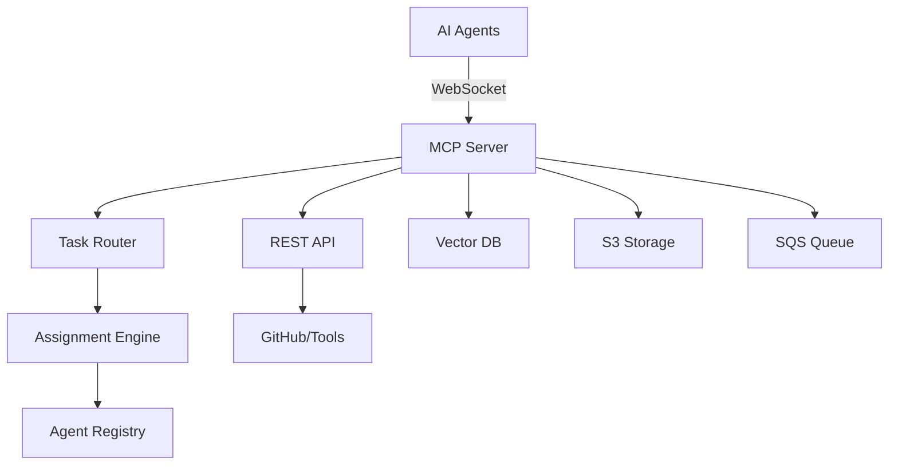

# DevOps MCP - AI Agent Orchestration Platform


[](https://goreportcard.com/report/github.com/S-Corkum/devops-mcp)

> 🚀 The production-ready platform for orchestrating multiple AI agents in your DevOps workflows
> 
> Connect AI models • Intelligent task routing • Real-time collaboration • Enterprise scale

## 🎯 Transform Your DevOps with AI Orchestration

DevOps teams struggle to integrate AI effectively - managing multiple models, coordinating agents, and optimizing costs. DevOps MCP solves this with intelligent orchestration that routes tasks to the right AI agent at the right time.

### Why DevOps MCP?

- **🤖 Multi-Agent Orchestration**: Register and coordinate multiple AI agents with different capabilities
- **🧠 Intelligent Task Routing**: Automatically route tasks based on capability, performance, and cost
- **⚡ Real-time Collaboration**: WebSocket-based coordination with binary protocol optimization
- **💰 Cost Optimization**: Smart routing minimizes AI costs while maximizing performance
- **🏢 Enterprise Ready**: Production AWS integration with circuit breakers and observability

## 🌟 Key Features

### AI Agent Orchestration
- **Capability-Based Discovery**: Agents advertise their strengths (code analysis, security, documentation)
- **Dynamic Load Balancing**: Routes tasks to least-loaded agents in real-time
- **Collaboration Strategies**: MapReduce, parallel execution, consensus building
- **Workload Management**: Track and optimize agent utilization

### Intelligent Task Assignment
- **Multiple Routing Algorithms**:
  - Performance-based: Route to fastest agents
  - Cost-optimized: Minimize API costs
  - Capability-match: Match task requirements to agent strengths
  - Least-loaded: Balance work across agents
- **Circuit Breakers**: Automatic failover when agents fail
- **Priority Queuing**: Critical tasks get processed first

### AWS Bedrock Integration
- **Multiple Embedding Models**:
  - Amazon Titan (v1 & v2)
  - Cohere (English & Multilingual)
  - Claude 3 (experimental)
- **Smart Provider Routing**: Automatic failover between models
- **Cost Tracking**: Per-model usage and cost optimization
- **Quality Scoring**: Route based on embedding quality needs

### Real-time Communication
- **Binary WebSocket Protocol**: Compressed messages for efficiency
- **Mixed Message Support**: Text and binary in same connection
- **Connection Pooling**: Efficient resource utilization
- **Heartbeat Monitoring**: Automatic reconnection handling

## 📊 Real-World Impact

### 🎯 Intelligent Code Review
Route security reviews to specialized models, style checks to faster models
- **70% faster PR reviews** with better coverage
- Parallel analysis by multiple specialized agents
- Cost savings through intelligent routing

### 📚 Multi-Agent Documentation
Coordinate multiple AI agents to generate comprehensive docs
- **Generate complete API docs in minutes**, not hours
- Different agents handle different sections
- Consistency through orchestration

### 🚨 Smart Incident Response
Route alerts to specialized agents based on severity and type
- **50% reduction in MTTR** with AI-powered triage
- Automatic escalation to appropriate agents
- Learning from resolution patterns

## 🏗️ Architecture



### Core Components
- **MCP Server**: WebSocket server for real-time agent communication
- **Task Router**: Intelligent routing based on capabilities and load
- **Agent Registry**: Tracks online agents and their capabilities
- **Assignment Engine**: Sophisticated algorithms for task distribution
- **Vector Database**: pgvector for semantic search and embeddings
- **Event Queue**: SQS for asynchronous task processing

## 🚀 Quick Start

### Prerequisites
- Go 1.24+ (workspace support)
- Docker & Docker Compose
- AWS Account (for production features)
- PostgreSQL 14+ with pgvector

### Option 1: Docker (Recommended)

```bash
# Clone repository
git clone https://github.com/S-Corkum/devops-mcp.git
cd devops-mcp

# Configure environment
cp .env.example .env
# Edit .env with your AWS credentials and settings

# Start all services
docker-compose up -d

# Verify health
curl http://localhost:8080/health
curl http://localhost:8081/health
```

### Option 2: Local Development

```bash
# Clone and setup
git clone https://github.com/S-Corkum/devops-mcp.git
cd devops-mcp

# Install dependencies
make deps

# Start infrastructure (PostgreSQL, Redis)
make dev-setup

# Run database migrations
make migrate-up

# Start services
make dev

# In another terminal, register an AI agent
curl -X POST http://localhost:8080/api/v1/agents/register \
  -H "Content-Type: application/json" \
  -d '{
    "id": "agent-001",
    "name": "Code Analyzer",
    "capabilities": ["code-review", "security-scan"],
    "model_id": "amazon.titan-embed-text-v1"
  }'
```

## 🎮 Usage Examples

### Register an AI Agent

```go
// WebSocket connection to MCP
ws, _ := websocket.Dial("ws://localhost:8080/ws", "", "http://localhost")

// Register agent
msg := AgentRegistration{
    Type: "agent.register",
    Payload: AgentInfo{
        ID: "security-agent",
        Name: "Security Scanner",
        Capabilities: []string{"security", "vulnerability-scan"},
        ModelID: "amazon.titan-embed-text-v2",
    },
}
websocket.JSON.Send(ws, msg)
```

### Submit a Task

```bash
# Submit task via REST API
curl -X POST http://localhost:8081/api/v1/tasks \
  -H "Content-Type: application/json" \
  -d '{
    "type": "code-review",
    "priority": "high",
    "repository": "github.com/org/repo",
    "capabilities_required": ["security", "code-review"]
  }'
```

### Monitor Agent Performance

```bash
# Get agent metrics
curl http://localhost:8081/api/v1/agents/agent-001/metrics

# Response shows:
# - Active tasks: 3
# - Completed tasks: 147
# - Average response time: 1.2s
# - Cost per task: $0.0003
```

## 📈 Performance Metrics

- **Binary Protocol**: Significant performance improvements with compression
- **Concurrent Agents**: Handle 1000+ simultaneous AI agents
- **Task Routing**: Sub-100ms routing decisions
- **Availability**: 99.9% uptime with circuit breakers
- **Scalability**: Horizontal scaling with distributed task processing

## 🛠️ Technology Stack

- **Language**: Go 1.24+ with workspace support
- **Databases**: PostgreSQL 14+ (pgvector), Redis 6.2+
- **AI/ML**: AWS Bedrock (Titan, Cohere, Claude)
- **Queue**: AWS SQS
- **Storage**: AWS S3
- **Protocol**: WebSocket with binary encoding
- **Observability**: OpenTelemetry, Prometheus, Grafana

## 📚 Documentation

### Getting Started
- [Quick Start Guide](docs/getting-started/quick-start-guide.md)
- [Agent Registration Guide](docs/guides/agent-registration-guide.md)
- [Task Routing Algorithms](docs/guides/task-routing-algorithms.md)

### Architecture
- [System Overview](docs/architecture/system-overview.md)
- [AI Agent Orchestration](docs/architecture/ai-agent-orchestration.md)
- [Multi-Agent Collaboration](docs/architecture/multi-agent-collaboration.md)

### API Reference
- [WebSocket Protocol](docs/api-reference/agent-websocket-protocol.md)
- [REST API Reference](docs/api-reference/rest-api-reference.md)
- [SDK Documentation](docs/guides/agent-sdk-guide.md)

### Operations
- [Production Deployment](docs/operations/production-deployment.md)
- [Performance Tuning](docs/operations/performance-tuning-guide.md)
- [Cost Optimization](docs/operations/cost-optimization-guide.md)

## 🤝 Contributing

We welcome contributions! Please see our [Contributing Guide](docs/contributing/CONTRIBUTING.md) for details.

### Development Workflow
1. Fork the repository
2. Create a feature branch
3. Make your changes with tests
4. Run `make pre-commit`
5. Submit a pull request

## 📄 License

This project is licensed under the MIT License - see the [LICENSE](LICENSE) file for details.

## 🙏 Acknowledgments

- AWS Bedrock team for AI/ML infrastructure
- pgvector for vector similarity search
- OpenTelemetry for observability standards
- The Go community for excellent tooling

---

Built with ❤️ for the DevOps community