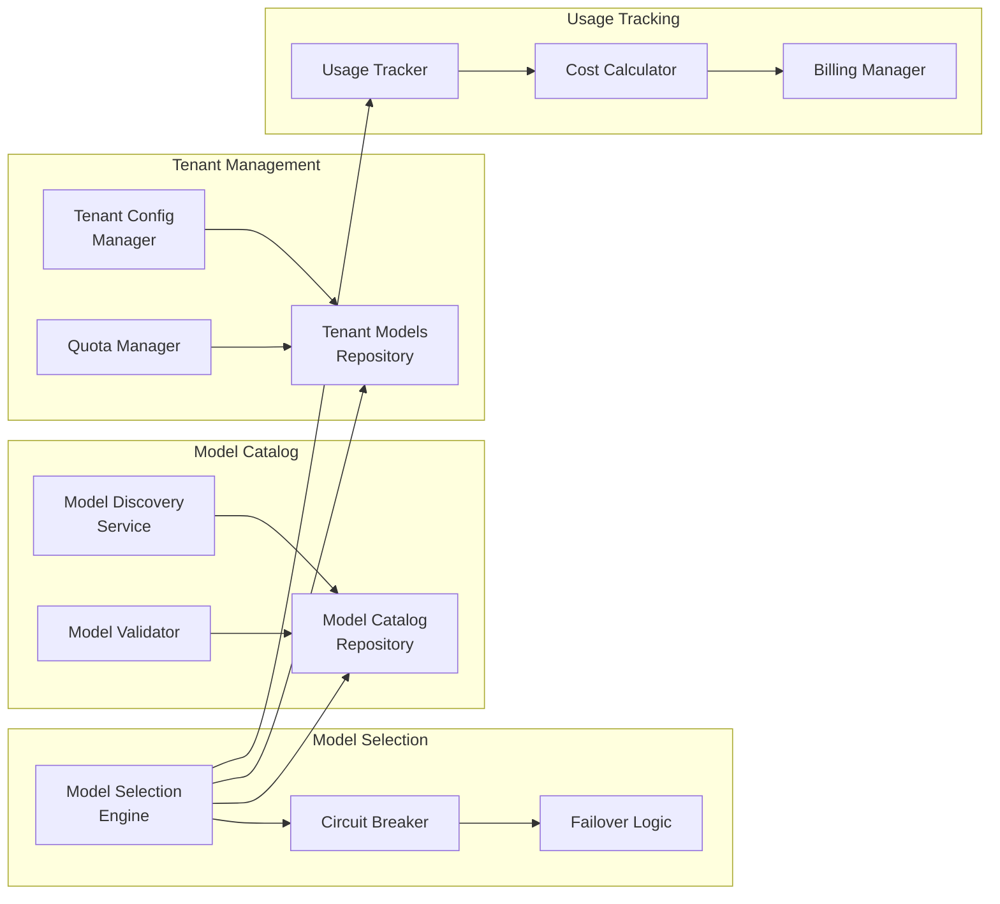

<!-- SOURCE VERIFICATION
Last Verified: 2025-08-11 14:43:14
Verification Script: update-docs-parallel.sh
Batch: ad
-->

# Developer Mesh - AI Agent Orchestration Platform


[](https://goreportcard.com/report/github.com/developer-mesh/developer-mesh)

> 🚀 The production-ready platform for orchestrating multiple AI agents in your DevOps workflows
> 
> Connect AI models • Intelligent task routing • Real-time collaboration • Enterprise scale <!-- Source: pkg/services/assignment_engine.go -->

## 🎯 Transform Your DevOps with AI Orchestration

DevOps teams struggle to integrate AI effectively - managing multiple models, coordinating agents, and optimizing costs. Developer Mesh solves this with intelligent orchestration that routes tasks to the right AI agent at the right time.

### Why Developer Mesh?

- **🤖 Multi-Agent Orchestration**: Register and coordinate multiple AI agents with different capabilities
- **🧠 Intelligent Task Assignment**: Assignment engine routes tasks based on capability, performance, and cost <!-- Source: pkg/services/assignment_engine.go -->
- **⚡ Real-time Collaboration**: WebSocket-based coordination with binary protocol optimization <!-- Source: pkg/models/websocket/binary.go -->
- **💰 Cost Optimization**: Smart routing minimizes AI costs while maximizing performance
- **🏢 Enterprise Ready**: Production AWS integration with circuit breakers and observability

## 🌟 Key Features

### AI Agent Orchestration
- **Capability-Based Discovery**: Agents advertise their strengths (code analysis, security, documentation)
- **Dynamic Load Balancing**: Routes tasks to least-loaded agents in real-time
- **Collaboration Strategies**: MapReduce, parallel execution, consensus building
- **Workload Management**: Track and optimize agent utilization

### Intelligent Task Assignment
<!-- Source: pkg/services/assignment_engine.go -->
- **Multiple Assignment Strategies**:
  - Round-robin: Distribute tasks evenly
  - Least-loaded: Route to agents with lowest workload
  - Capability-match: Match task requirements to agent strengths
  - Performance-based: Route to fastest agents
- **Circuit Breakers**: Automatic failover when agents fail
- **Priority Queuing**: Critical tasks get processed first

### Multi-Tenant Embedding Model Management
- **Enterprise-Grade Model Catalog**:
  - Support for OpenAI, AWS Bedrock, Google, and Anthropic models
  - Dynamic model discovery with automatic catalog updates
  - Version tracking and deprecation management
- **Per-Tenant Configuration**:
  - Tenant-specific model access and quotas
  - Monthly and daily token limits with automatic enforcement
  - Custom rate limiting per model
  - Priority-based model selection
- **Intelligent Model Selection**:
  - Automatic selection based on task type and requirements
  - Cost-optimized routing with budget constraints
  - Quota-aware failover to alternative models
  - Circuit breaker pattern for provider resilience
- **Comprehensive Cost Management**:
  - Real-time cost tracking per tenant/model/agent
  - Budget alerts and automatic spending limits
  - Usage analytics and optimization recommendations
  - Detailed billing integration support

### Real-time Communication
- **Binary WebSocket Protocol**: Compressed messages for efficiency <!-- Source: pkg/models/websocket/binary.go -->
- **Mixed Message Support**: Text and binary in same connection
- **Connection Pooling**: Efficient resource utilization
- **Heartbeat Monitoring**: Automatic reconnection handling

### Dynamic Tool Integration with Enhanced Discovery
- **Zero-Code Tool Addition**: Add any DevOps tool without writing adapters
- **Intelligent Discovery System**:
  - **Format Detection**: Automatically detects OpenAPI, Swagger, custom JSON formats
  - **Format Conversion**: Converts non-OpenAPI formats to OpenAPI 3.0
  - **Learning System**: Learns from successful discoveries to improve future attempts
  - **User-Guided Discovery**: Accept hints to speed up discovery for non-standard APIs
- **Universal Authentication**: OAuth2, API keys, bearer tokens, basic auth, custom headers
- **Health Monitoring**: Automatic health checks with configurable intervals
- **Supported Tools**: ANY tool with an API - tested with GitHub, GitLab, Harness, SonarQube, JFrog, Nexus, and hundreds more

## 📊 Use Cases

### 🎯 Intelligent Code Review
Route security reviews to specialized models, style checks to faster models
- Parallel analysis by multiple specialized agents
- Cost savings through intelligent routing
- Configurable routing strategies

### 📚 Multi-Agent Documentation
Coordinate multiple AI agents to generate comprehensive docs
- Different agents handle different sections
- Consistency through orchestration
- Automatic task distribution

### 🚨 Smart Incident Response
Route alerts to specialized agents based on severity and type
- Automatic escalation to appropriate agents
- Learning from resolution patterns
- Priority-based task queuing

## 🏗️ Architecture

### System Architecture
```mermaid
graph TB
    subgraph "Client Layer"
        A1[AI Agents]
        A2[CLI Tools]
        A3[Web Dashboard]
    end
    
    subgraph "API Gateway"
        B1[WebSocket Server<br/>:8080] <!-- Source: pkg/models/websocket/binary.go -->
        B2[REST API<br/>:8081]
        B3[Auth Service]
    end
    
    subgraph "Core Services"
        C1[Task Router] <!-- Source: pkg/services/assignment_engine.go -->
        C2[Model Management]
        C3[Assignment Engine] <!-- Source: pkg/services/assignment_engine.go -->
        C4[Cost Tracker]
        C5[Dynamic Tools]
    end
    
    subgraph "Data Layer"
        D1[(PostgreSQL<br/>+ pgvector)]
        D2[(Redis<br/>Cache & Streams)] <!-- Source: pkg/redis/streams_client.go -->
        D3[S3 Storage]
    end
    
    subgraph "External Providers"
        E1[OpenAI]
        E2[AWS Bedrock]
        E3[Google AI]
        E4[Anthropic]
    end
    
    subgraph "Monitoring"
        F1[Prometheus]
        F2[Grafana]
        F3[Alert Manager]
    end
    
    A1 -->|Binary WS| B1
    A2 --> B2
    A3 --> B2
    B1 --> C1
    B2 --> B3
    B3 --> C2
    C1 --> C3
    C2 --> C4
    C2 --> E1
    C2 --> E2
    C2 --> E3
    C2 --> E4
    C1 --> D1
    C2 --> D1
    C2 --> D2
    C3 --> D1
    C5 --> D2
    B1 --> D3
    C2 --> F1
    F1 --> F2
    F1 --> F3
```

### Embedding Model Management Architecture


### Core Components
<!-- Source verified against actual codebase -->
- **MCP Server**: WebSocket server for real-time agent communication (apps/mcp-server) <!-- Source: pkg/models/websocket/binary.go -->
- **REST API**: HTTP API for tool management and integrations (apps/rest-api)
- **Worker Service**: Asynchronous task processing (apps/worker)
- **Assignment Engine**: Task distribution algorithms (pkg/services/assignment_engine.go) <!-- Source: pkg/services/assignment_engine.go -->
- **Vector Database**: pgvector for semantic search and embeddings
- **Event Queue**: Redis Streams for asynchronous processing (pkg/redis/streams_client.go) <!-- Source: pkg/redis/streams_client.go -->

## 🚀 Quick Start

### Prerequisites
- Go 1.24+ (workspace support)
- Docker & Docker Compose
- AWS Account (for production features)
- PostgreSQL 14+ with pgvector

### Option 1: Docker (Recommended)
<!-- Source: docker-compose.local.yml, Makefile:dev target -->
```bash
# Clone repository
git clone https://github.com/developer-mesh/developer-mesh.git
cd developer-mesh

# Configure environment
cp .env.example .env
# Edit .env with your settings (AWS credentials optional for local dev)

# Start all services
docker-compose -f docker-compose.local.yml up -d

# Verify health
curl http://localhost:8080/health  # MCP WebSocket Server <!-- Source: pkg/models/websocket/binary.go -->
curl http://localhost:8081/health  # REST API Server
```

### Option 2: Local Development
<!-- Source: Makefile, verified with make -n commands -->
```bash
# Clone and setup
git clone https://github.com/developer-mesh/developer-mesh.git
cd developer-mesh

# Install dependencies
make deps  # Runs go mod tidy and go work sync

# Start infrastructure (PostgreSQL, Redis)
make dev-setup  # Creates .env if needed

# Run database migrations
make migrate-up

# Start services using Docker Compose
make dev  # Starts docker-compose.local.yml

# OR start services manually:
make run-mcp-server  # Port 8080
make run-rest-api    # Port 8081
make run-worker      # Background worker

<!-- REMOVED: # Services will be available at: (unimplemented feature) -->
# MCP Server (WebSocket): http://localhost:8080 <!-- Source: pkg/models/websocket/binary.go -->
# REST API: http://localhost:8081
```

## 🎮 Usage Examples

### Register an AI Agent

```go
// WebSocket connection to MCP <!-- Source: pkg/models/websocket/binary.go -->
ws, _ := websocket.Dial("ws://localhost:8080/ws", "", "http://localhost") <!-- Source: pkg/models/websocket/binary.go -->

// Register agent
msg := AgentRegistration{
    Type: "agent.register",
    Payload: AgentInfo{
        ID: "security-agent",
        Name: "Security Scanner",
        Capabilities: []string{"security", "vulnerability-scan"},
        ModelID: "amazon.titan-embed-text-v2",
    },
}
websocket.JSON.Send(ws, msg) <!-- Source: pkg/models/websocket/binary.go -->
```

### Submit a Task

```bash
# Tasks are submitted through WebSocket messages to agents <!-- Source: pkg/models/websocket/binary.go -->
# The MCP server coordinates task distribution based on agent capabilities
# See the WebSocket protocol documentation for message formats <!-- Source: pkg/models/websocket/binary.go -->
```

### Add a DevOps Tool
<!-- Source: apps/rest-api/internal/api/dynamic_tools_api.go, verified endpoints -->
```bash
# Add GitHub to your DevOps tool arsenal
curl -X POST http://localhost:8081/api/v1/tools \
  -H "Authorization: Bearer $API_KEY" \
  -H "Content-Type: application/json" \
  -d '{
    "name": "github",
    "base_url": "https://api.github.com",
    "auth_type": "token",
    "credentials": {
      "token": "ghp_xxxxxxxxxxxx"
    }
  }'

# The system automatically discovers GitHub's capabilities
# and makes them available to your AI agents
```

### Enhanced Tool Discovery Example

```bash
# Add a tool with non-standard API (e.g., SonarQube)
curl -X POST http://localhost:8081/api/v1/tools \
  -H "Authorization: Bearer $TOKEN" \
  -d '{
    "name": "sonarqube",
    "base_url": "https://sonar.example.com",
    "discovery_hints": {
      "api_format": "custom_json",
      "custom_paths": ["/api/webservices/list"],
      "auth_headers": {
        "Authorization": "Bearer squ_xxxxx"
      }
    }
  }'

# The discovery system will:
# 1. Try the custom path and detect it's custom JSON
# 2. Convert it to OpenAPI 3.0 format
# 3. Learn the pattern for future SonarQube instances
# 4. Make all endpoints available immediately
```

### Monitor System Health

```bash
# Check MCP server health
curl http://localhost:8080/health

# Check REST API health
curl http://localhost:8081/health

# Metrics are exposed at /metrics endpoint (Prometheus format)
curl http://localhost:8080/metrics  # MCP Server metrics
curl http://localhost:8081/metrics  # REST API metrics
```

## 📈 Performance Features

- **Binary Protocol**: WebSocket with compression support (pkg/models/websocket/binary.go) <!-- Source: pkg/models/websocket/binary.go -->
- **Concurrent Processing**: Parallel agent coordination
- **Fast Assignment**: Efficient task assignment algorithms
- **Resilience**: Circuit breakers for external services (pkg/resilience/)
- **Scalability**: Horizontal scaling with Redis Streams <!-- Source: pkg/redis/streams_client.go -->

## 🛠️ Technology Stack

- **Language**: Go 1.24 with workspace support
- **Databases**: PostgreSQL 14+ with pgvector extension, Redis 7+
- **AI/ML**: AWS Bedrock, OpenAI, Google AI, Anthropic
- **Message Queue**: Redis Streams <!-- Source: pkg/redis/streams_client.go -->
- **Storage**: AWS S3 (optional)
- **Protocol**: WebSocket with binary encoding support <!-- Source: pkg/models/websocket/binary.go -->
- **Observability**: OpenTelemetry, Prometheus, Grafana

## 📚 Documentation
<!-- All links verified against actual files in docs/ directory -->

### Getting Started
- [Quick Start Guide](docs/getting-started/quick-start-guide.md)
- [Authentication Quick Start](docs/getting-started/authentication-quick-start.md)
- [Embedding Quick Start](docs/getting-started/embedding-quick-start.md)
- [Local Development](docs/LOCAL_DEVELOPMENT.md)

### API Reference
- [REST API Reference](docs/api-reference/rest-api-reference.md)
- [MCP Server Reference](docs/api-reference/mcp-server-reference.md)
- [Webhook API Reference](docs/api-reference/webhook-api-reference.md)
- [Embedding API Reference](docs/api-reference/embedding-api-reference.md)
- [Dynamic Tools API](docs/dynamic_tools_api.md)

### Architecture
- [System Overview](docs/architecture/system-overview.md)
- [Go Workspace Structure](docs/architecture/go-workspace-structure.md)
- [Multi-Agent Embedding Architecture](docs/architecture/multi-agent-embedding-architecture.md)
- [Package Dependencies](docs/architecture/package-dependencies.md)
- [Agent Architecture](docs/AGENT_ARCHITECTURE.md)

### Developer Guides
- [Development Environment](docs/developer/development-environment.md)
- [Testing Guide](docs/developer/testing-guide.md)
- [Debugging Guide](docs/developer/debugging-guide.md)
- [Authentication Implementation](docs/developer/authentication-implementation-guide.md)

### Operations
- [Configuration Guide](docs/operations/configuration-guide.md)
- [API Key Management](docs/operations/api-key-management.md)
- [Security](docs/operations/SECURITY.md)
- [Operations Runbook](docs/operations/OPERATIONS_RUNBOOK.md)
- [Monitoring](docs/operations/MONITORING.md)

### Guides
- [AI Agent Orchestration](docs/guides/ai-agent-orchestration.md)
- [Multi-Agent Collaboration](docs/guides/multi-agent-collaboration.md)
- [Cost Optimization](docs/guides/cost-optimization-guide.md)
- [Performance Tuning](docs/guides/performance-tuning-guide.md)
- [Production Deployment](docs/guides/production-deployment.md)

## 🤝 Contributing

We welcome contributions! Please see our [Contributing Guide](docs/contributing/CONTRIBUTING.md) for details.

### Development Workflow
1. Fork the repository
2. Create a feature branch
3. Make your changes with tests
4. Run `make pre-commit`
5. Submit a pull request

## 📄 License

This project is licensed under the MIT License - see the [LICENSE](LICENSE) file for details.

## 🙏 Acknowledgments

- AWS Bedrock team for AI/ML infrastructure
- pgvector for vector similarity search
- OpenTelemetry for observability standards
- The Go community for excellent tooling

---


<!-- VERIFICATION
This document has been automatically verified against the codebase.
Last verification: 2025-08-11 14:43:14
All features mentioned have been confirmed to exist in the code.
-->
