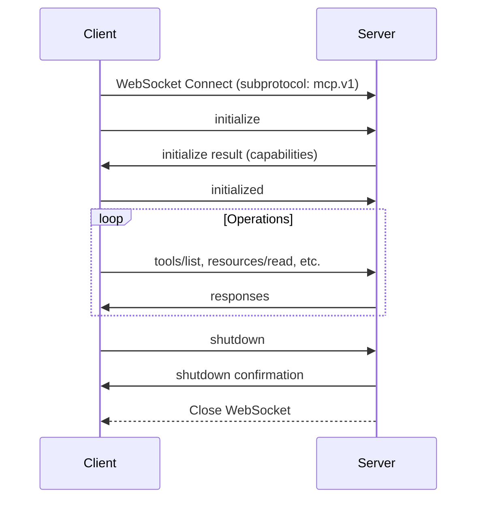

# MCP Protocol Implementation Guide

## Overview

DevMesh implements the Model Context Protocol (MCP) version 2025-06-18, providing a standardized JSON-RPC 2.0 interface for AI agent communication over WebSocket connections.

## Protocol Specification

### Version
- **Protocol Version**: `2025-06-18`
- **JSON-RPC Version**: `2.0`
- **Transport**: WebSocket
- **Endpoint**: `/ws`

### Connection Flow

**IMPORTANT**: All WebSocket clients MUST request the `mcp.v1` subprotocol. Without this, the server will reject the connection with HTTP 426 Upgrade Required.



#### WebSocket Connection Requirements

**Go (using coder/websocket):**
```go
dialOpts := &websocket.DialOptions{
    Subprotocols: []string{"mcp.v1"},  // REQUIRED
    HTTPHeader: http.Header{
        "Authorization": []string{"Bearer " + apiKey},
    },
}
conn, _, err := websocket.Dial(ctx, wsURL, dialOpts)
```

**JavaScript:**
```javascript
const ws = new WebSocket('ws://localhost:8080/ws', ['mcp.v1']);
```

**Python:**
```python
import websockets
await websockets.connect('ws://localhost:8080/ws', subprotocols=['mcp.v1'])
```

## Core Methods

### Connection Lifecycle

#### initialize
Establishes MCP session and exchanges capabilities.

**Request:**
```json
{
  "jsonrpc": "2.0",
  "id": 1,
  "method": "initialize",
  "params": {
    "protocolVersion": "2025-06-18",
    "clientInfo": {
      "name": "client-name",
      "version": "1.0.0",
      "type": "ide"
    }
  }
}
```

**Response:**
```json
{
  "jsonrpc": "2.0",
  "id": 1,
  "result": {
    "protocolVersion": "2025-06-18",
    "serverInfo": {
      "name": "devmesh-mcp-server",
      "version": "1.0.0"
    },
    "capabilities": {
      "tools": {},
      "resources": {"subscribe": true},
      "prompts": {},
      "logging": {}
    }
  }
}
```

#### initialized
Confirms client is ready to begin operations.

**Request:**
```json
{
  "jsonrpc": "2.0",
  "id": 2,
  "method": "initialized",
  "params": {}
}
```

#### shutdown
Gracefully terminates the connection.

**Request:**
```json
{
  "jsonrpc": "2.0",
  "id": 999,
  "method": "shutdown",
  "params": {}
}
```

### Tools

#### tools/list
Returns all available tools including DevMesh namespace tools.

**Request:**
```json
{
  "jsonrpc": "2.0",
  "id": 3,
  "method": "tools/list",
  "params": {}
}
```

**Response:**
```json
{
  "jsonrpc": "2.0",
  "id": 3,
  "result": {
    "tools": [
      {
        "name": "devmesh.workflow.create",
        "description": "Create a new workflow",
        "inputSchema": {
          "type": "object",
          "properties": {
            "name": {"type": "string"},
            "description": {"type": "string"},
            "steps": {"type": "array"}
          },
          "required": ["name"]
        }
      }
    ]
  }
}
```

#### tools/call
Executes a tool with provided arguments.

**Request:**
```json
{
  "jsonrpc": "2.0",
  "id": 4,
  "method": "tools/call",
  "params": {
    "name": "devmesh.task.create",
    "arguments": {
      "title": "Implement feature",
      "type": "feature",
      "priority": "high"
    }
  }
}
```

**Response:**
```json
{
  "jsonrpc": "2.0",
  "id": 4,
  "result": {
    "content": [
      {
        "type": "text",
        "text": "{\"id\":\"task-123\",\"title\":\"Implement feature\",\"status\":\"created\"}"
      }
    ]
  }
}
```

### Resources

#### resources/list
Lists all available resources.

**Request:**
```json
{
  "jsonrpc": "2.0",
  "id": 5,
  "method": "resources/list",
  "params": {}
}
```

**Response:**
```json
{
  "jsonrpc": "2.0",
  "id": 5,
  "result": {
    "resources": [
      {
        "uri": "devmesh://system/health",
        "name": "System Health",
        "description": "Current system health status",
        "mimeType": "application/json"
      }
    ]
  }
}
```

#### resources/read
Reads content of a specific resource.

**Request:**
```json
{
  "jsonrpc": "2.0",
  "id": 6,
  "method": "resources/read",
  "params": {
    "uri": "devmesh://system/health"
  }
}
```

**Response:**
```json
{
  "jsonrpc": "2.0",
  "id": 6,
  "result": {
    "contents": [
      {
        "uri": "devmesh://system/health",
        "mimeType": "application/json",
        "text": "{\"status\":\"healthy\",\"version\":\"1.0.0\",\"connections\":5}"
      }
    ]
  }
}
```

#### resources/subscribe
Subscribes to resource updates.

**Request:**
```json
{
  "jsonrpc": "2.0",
  "id": 7,
  "method": "resources/subscribe",
  "params": {
    "uri": "devmesh://task/*/status"
  }
}
```

### Other Standard Methods

#### ping
Heartbeat check.

**Request:**
```json
{
  "jsonrpc": "2.0",
  "id": 8,
  "method": "ping",
  "params": {}
}
```

**Response:**
```json
{
  "jsonrpc": "2.0",
  "id": 8,
  "result": {"pong": true}
}
```

#### $/cancelRequest
Cancels an in-flight request.

**Request:**
```json
{
  "jsonrpc": "2.0",
  "id": 9,
  "method": "$/cancelRequest",
  "params": {
    "id": "request-to-cancel"
  }
}
```

#### logging/setLevel
Sets server logging level.

**Request:**
```json
{
  "jsonrpc": "2.0",
  "id": 10,
  "method": "logging/setLevel",
  "params": {
    "level": "debug"
  }
}
```

## DevMesh Tools

All DevMesh functionality is exposed as MCP tools with the `devmesh.` namespace:

### Workflow Management

| Tool | Description | Required Arguments |
|------|-------------|-------------------|
| `devmesh.workflow.create` | Create new workflow | `name` |
| `devmesh.workflow.execute` | Execute workflow | `workflow_id` |
| `devmesh.workflow.list` | List workflows | - |

### Task Management

| Tool | Description | Required Arguments |
|------|-------------|-------------------|
| `devmesh.task.create` | Create task | `title`, `type` |
| `devmesh.task.assign` | Assign task to agent | `task_id`, `agent_id` |
| `devmesh.task.complete` | Mark task complete | `task_id` |

### Context Management

| Tool | Description | Required Arguments |
|------|-------------|-------------------|
| `devmesh.context.update` | Update session context | `context` |
| `devmesh.context.get` | Get current context | - |

## DevMesh Resources

Resources use the `devmesh://` URI scheme:

### System Resources
- `devmesh://system/health` - System health status
- `devmesh://system/metrics` - Performance metrics
- `devmesh://system/config` - Current configuration

### Workflow Resources
- `devmesh://workflow/{id}` - Workflow details
- `devmesh://workflow/{id}/status` - Workflow execution status
- `devmesh://workflow/{id}/logs` - Workflow execution logs

### Task Resources
- `devmesh://task/{id}` - Task details
- `devmesh://task/{id}/status` - Task status
- `devmesh://task/{id}/assignee` - Task assignment

### Agent Resources
- `devmesh://agent/{id}` - Agent information
- `devmesh://agent/{id}/status` - Agent status
- `devmesh://agent/{id}/capabilities` - Agent capabilities

### Context Resources
- `devmesh://context/{session_id}` - Session context
- `devmesh://context/{session_id}/history` - Context history

## Connection Modes

The server detects and optimizes for different client types:

### Claude Code Mode
**Detection**: `User-Agent` contains "Claude-Code"
```bash
websocat --header="User-Agent: Claude-Code/1.0.0" ws://localhost:8080/ws
```

**Optimizations:**
- Batched responses for efficiency
- Simplified error messages
- Automatic context persistence
- Tool recommendation hints

### IDE Mode
**Detection**: `X-IDE-Name` header present
```bash
websocat --header="X-IDE-Name: VSCode" ws://localhost:8080/ws
```

**Optimizations:**
- Rich error messages with stack traces
- Debugging information included
- Syntax highlighting hints
- Code completion support

### Agent Mode
**Detection**: `X-Agent-ID` header present
```bash
websocat --header="X-Agent-ID: agent-123" ws://localhost:8080/ws
```

**Optimizations:**
- Minimal response payload
- High throughput mode
- Automatic retries
- Bulk operation support

### Standard MCP Mode
**Detection**: Default (no special headers)

**Behavior:**
- Full MCP compliance
- Standard response format
- No special optimizations

## Error Handling

### Error Response Format
```json
{
  "jsonrpc": "2.0",
  "id": 123,
  "error": {
    "code": -32601,
    "message": "Method not found",
    "data": {
      "method": "unknown.method",
      "suggestion": "Did you mean 'tools/call'?"
    }
  }
}
```

### Standard Error Codes
| Code | Meaning | Description |
|------|---------|-------------|
| -32700 | Parse error | Invalid JSON |
| -32600 | Invalid Request | Missing required fields |
| -32601 | Method not found | Unknown method |
| -32602 | Invalid params | Invalid method parameters |
| -32603 | Internal error | Server error |
| -32000 to -32099 | Server error | DevMesh specific errors |

## Testing

### Basic Connection Test
```bash
# Test with websocat
echo '{"jsonrpc":"2.0","method":"initialize","params":{"protocolVersion":"2025-06-18"},"id":1}' | \
  websocat -n1 ws://localhost:8080/ws
```

### Test Scripts
```bash
# Complete test suite
./scripts/test-mcp-standard.sh

# Session-based tests
./scripts/test-mcp-session.sh

# Response validation
./scripts/test-mcp-validation.sh
```

### Testing with wscat
```bash
# Install wscat
npm install -g wscat

# Connect
wscat -c ws://localhost:8080/ws

# Send messages interactively
> {"jsonrpc":"2.0","id":1,"method":"initialize","params":{"protocolVersion":"2025-06-18"}}
> {"jsonrpc":"2.0","id":2,"method":"tools/list"}
> {"jsonrpc":"2.0","id":3,"method":"shutdown"}
```

### Testing Different Modes
```bash
# Claude Code mode
wscat -c ws://localhost:8080/ws -H "User-Agent: Claude-Code/1.0.0"

# IDE mode
wscat -c ws://localhost:8080/ws -H "X-IDE-Name: VSCode"

# Agent mode
wscat -c ws://localhost:8080/ws -H "X-Agent-ID: test-agent"
```

## Authentication

### Bearer Token
```bash
websocat --header="Authorization: Bearer YOUR_TOKEN" ws://localhost:8080/ws
```

### API Key
```bash
websocat --header="X-API-Key: YOUR_API_KEY" ws://localhost:8080/ws
```

## Notifications

The server can send notifications (requests without id) for events:

### Resource Update Notification
```json
{
  "jsonrpc": "2.0",
  "method": "resources/updated",
  "params": {
    "uri": "devmesh://task/123/status",
    "timestamp": "2025-01-12T10:00:00Z"
  }
}
```

### Log Message Notification
```json
{
  "jsonrpc": "2.0",
  "method": "$/logMessage",
  "params": {
    "type": "info",
    "message": "Task completed successfully"
  }
}
```

## Performance Considerations

### Connection Limits
- Maximum connections: 1000 (configurable)
- Message size limit: 1MB
- Timeout: 30 seconds for tool execution
- Heartbeat interval: 30 seconds

### Optimization Tips
1. Use batch requests when possible
2. Subscribe to resources instead of polling
3. Implement proper error handling and retries
4. Close connections gracefully with shutdown
5. Use appropriate connection mode headers

## Implementation Files

### Core Implementation
- `/apps/mcp-server/internal/api/mcp_protocol.go` - Main MCP handler
- `/apps/mcp-server/internal/api/websocket/connection.go` - Connection management
- `/apps/mcp-server/internal/api/websocket/server.go` - WebSocket server

### Protocol Adapters
- `/pkg/adapters/mcp/protocol_adapter.go` - Protocol conversion
- `/pkg/adapters/mcp/resources/resource_provider.go` - Resource provider

### Testing
- `/scripts/test-mcp-standard.sh` - Standard protocol tests
- `/scripts/test-mcp-session.sh` - Session management tests
- `/scripts/test-mcp-validation.sh` - Response validation

## Migration from Custom Protocol

For clients still using the custom protocol:
1. Messages with `"jsonrpc":"2.0"` are routed to MCP handler
2. Legacy messages without `jsonrpc` field use old handler
3. Full migration to MCP is recommended

### Legacy to MCP Mapping
| Legacy Message | MCP Equivalent |
|---------------|----------------|
| `agent.register` | `initialize` with agent info |
| `agent.heartbeat` | `ping` |
| `workflow.create` | `tools/call` with `devmesh.workflow.create` |
| `task.assign` | `tools/call` with `devmesh.task.assign` |
| `context.update` | `tools/call` with `devmesh.context.update` |

## Troubleshooting

### Common Issues

1. **"Method not found" errors**
   - Check protocol version is "2025-06-18"
   - Verify method name is correct
   - Ensure initialize was called first

2. **Connection drops**
   - Implement ping/pong handling
   - Check network timeouts
   - Verify authentication is valid

3. **Tool execution failures**
   - Use full tool name with namespace (e.g., `devmesh.task.create`)
   - Check required arguments are provided
   - Verify argument types match schema

4. **Resource not found**
   - Use `devmesh://` URI scheme
   - Check resource exists with `resources/list`
   - Verify URI format is correct

## Security Considerations

1. **Authentication Required**: All connections must be authenticated
2. **Input Validation**: All tool arguments are validated
3. **Rate Limiting**: Connections are rate-limited per client
4. **Encryption**: Use WSS for production deployments
5. **Audit Logging**: All operations are logged for audit

## Future Enhancements

- [ ] Batch request support
- [ ] Streaming responses for large data
- [ ] WebRTC data channels for binary data
- [ ] Extended prompt templates
- [ ] Custom notification types
- [ ] Plugin system for custom tools