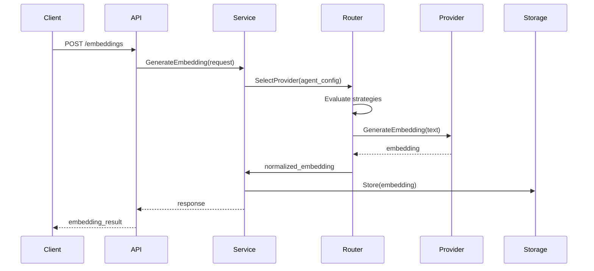
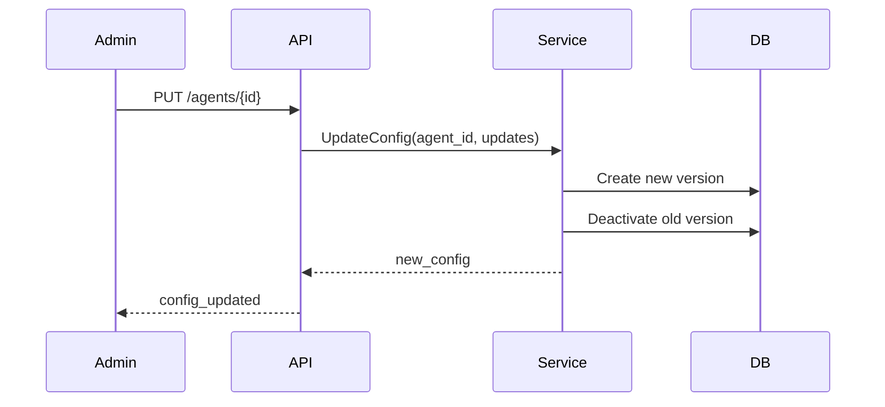

<!-- SOURCE VERIFICATION
Last Verified: 2025-10-17
Verification Method: Manual code and database schema review
Verified Against: pkg/embedding/*, migrations/sql/000015_tenant_embedding_models.up.sql, 000001_initial_schema.up.sql
Status: Schema and provider information corrected
-->

# Multi-Agent Embedding System Architecture

## Overview

The Multi-Agent Embedding System is a sophisticated, production-ready solution designed to provide customized embedding generation for different AI agents. Each agent can have its own embedding strategy, model preferences, and constraints, enabling optimal performance for specific use cases.

## Architecture Principles

### 1. Agent-Centric Design
- Each AI agent has a unique configuration profile
- Configurations are versioned for audit trails
- Agents can have different strategies: quality, speed, cost, or balanced

### 2. Provider Abstraction
- Clean interface for multiple embedding providers
- Easy addition of new providers without changing core logic
- Provider-specific optimizations and error handling

### 3. High Availability
- Circuit breaker pattern for provider failures
- Automatic failover to backup models
- Request queuing during high load

### 4. Cost Optimization
- Per-agent budget tracking
- Smart routing based on cost/performance trade-offs
- Caching to reduce redundant API calls

## System Components

### Core Components

```
┌─────────────────────────────────────────────────────────────────┐
│                           REST API Layer                         │
│  ┌─────────────┐  ┌──────────────┐  ┌─────────────────────┐   │
│  │ Embedding   │  │    Agent     │  │      Search         │   │
│  │   API       │  │ Config API   │  │      API           │   │
│  └─────────────┘  └──────────────┘  └─────────────────────┘   │
└─────────────────────────────────────────────────────────────────┘
                                │
┌─────────────────────────────────────────────────────────────────┐
│                      Embedding Service V2                        │
│  ┌─────────────┐  ┌──────────────┐  ┌─────────────────────┐   │
│  │   Smart     │  │  Dimension   │  │     Circuit         │   │
│  │   Router    │  │   Adapter    │  │     Breaker        │   │
│  └─────────────┘  └──────────────┘  └─────────────────────┘   │
└─────────────────────────────────────────────────────────────────┘
                                │
┌─────────────────────────────────────────────────────────────────┐
│                         Provider Layer                           │
│  ┌─────────────┐  ┌──────────────┐  ┌─────────────────────┐   │
│  │   OpenAI    │  │     AWS      │  │    Google AI        │   │
│  │  Provider   │  │   Bedrock    │  │    Provider        │   │
│  └─────────────┘  └──────────────┘  └─────────────────────┘   │
└─────────────────────────────────────────────────────────────────┘
                                │
┌─────────────────────────────────────────────────────────────────┐
│                         Storage Layer                            │
│  ┌─────────────┐  ┌──────────────┐  ┌─────────────────────┐   │
│  │ PostgreSQL  │  │    Redis     │  │    Metrics DB       │   │
│  │ + pgvector  │  │    Cache     │  │                    │   │
│  └─────────────┘  └──────────────┘  └─────────────────────┘   │
└─────────────────────────────────────────────────────────────────┘
```

### Component Descriptions

#### 1. REST API Layer
- **Embedding API**: Handles embedding generation requests
- **Agent Config API**: Manages agent-specific configurations
- **Search API**: Provides similarity search functionality

#### 2. Embedding Service V2
- **Smart Router**: Intelligently selects providers based on:
  - Agent strategy (quality/speed/cost/balanced)
  - Provider availability
  - Circuit breaker state
  - Cost considerations
  
- **Dimension Adapter**: Normalizes embeddings to standard dimensions
  - Supports PCA, truncation, and padding
  - Preserves semantic information
  - Enables cross-model search

- **Circuit Breaker**: Prevents cascade failures
  - Monitors provider health
  - Automatic recovery testing
  - Graceful degradation

#### 3. Provider Layer
All providers implement the standard Provider interface (pkg/embedding/providers/provider_interface.go) and are managed by the provider factory (pkg/embedding/provider_factory.go).

- **OpenAI Provider** (pkg/embedding/provider_openai.go):
  - Models: text-embedding-3-large, text-embedding-3-small, text-embedding-ada-002
  - Dimensions: 1536-3072
  - Best for: General purpose, high quality embeddings

- **AWS Bedrock Provider** (pkg/embedding/provider_bedrock.go):
  - Models: amazon.titan-embed-text-v2:0, amazon.titan-embed-text-v1, Cohere via Bedrock
  - Dimensions: 1024-1536
  - Best for: AWS-native deployments, compliance requirements

- **Google AI Provider** (pkg/embedding/provider_google.go):
  - Models: text-embedding-004, textembedding-gecko@003
  - Dimensions: 768
  - Best for: Google Cloud deployments, multilingual support
  
- **Voyage AI Provider** (pkg/embedding/provider_voyage.go):
  - Models: voyage-large-2, voyage-2, voyage-code-3, voyage-code-2
  - Best for: Code embeddings and specialized use cases
  - Code-aware models for semantic code search

#### 4. Storage Layer
- **PostgreSQL + pgvector**: 
  - Stores embeddings with metadata
  - Enables similarity search
  - Supports multiple index types (IVFFlat, HNSW)
  
- **Redis Cache**:
  - Caches frequent embeddings
  - Reduces API costs
  - Improves response times
  
- **Metrics DB**:
  - Tracks usage and costs
  - Performance metrics
  - Provider health data

## Data Flow

### Embedding Generation Flow



### Configuration Update Flow



## Key Features

### 1. Multi-Model Support
Each agent can use different models based on task:
- Document embedding: Large models for quality
- Query embedding: Fast models for real-time
- Classification: Specialized models

### 2. Smart Routing Algorithm
```python
def select_provider(agent_config, task_type):
    strategy = agent_config.embedding_strategy
    models = agent_config.model_preferences[task_type]
    
    for model in models.primary_models:
        provider = get_provider_for_model(model)
        if provider.is_healthy():
            if strategy == "quality":
                return provider if model in HIGH_QUALITY_MODELS
            elif strategy == "speed":
                return provider if provider.avg_latency < SPEED_THRESHOLD
            elif strategy == "cost":
                return provider if provider.cost_per_token < COST_THRESHOLD
            elif strategy == "balanced":
                score = calculate_balanced_score(provider)
                if score > BALANCE_THRESHOLD:
                    return provider
    
    # Fallback logic
    return select_fallback_provider(models.fallback_models)
```

### 3. Dimension Normalization
Embeddings support up to 4096 dimensions with flexible normalization:
- **PCA**: For dimensionality reduction while preserving semantic information
- **Truncation**: For simple dimension reduction
- **Padding**: For dimension expansion to match target dimensions
- **Magnitude Preservation**: Maintains vector properties during transformation
- **Per-Model Configuration**: Each model can specify its native dimensions (256-4096)

### 4. Cost Control
- Per-agent daily budgets
- Real-time cost tracking
- Automatic provider switching when approaching limits
- Cost alerts and notifications

### 5. High Availability Features
- **Circuit Breaker States**:
  - Closed: Normal operation
  - Open: Provider disabled, using fallback
  - Half-Open: Testing recovery
  
- **Health Checks**:
  - Periodic provider validation
  - Latency monitoring
  - Error rate tracking

## Database Schema

The multi-tenant embedding system uses these core tables (verified from migrations/sql/):

### Global Model Catalog
```sql
-- Global registry of all available embedding models (000015_tenant_embedding_models.up.sql)
CREATE TABLE mcp.embedding_model_catalog (
    id UUID PRIMARY KEY DEFAULT gen_random_uuid(),
    provider VARCHAR(50) NOT NULL,
    model_name VARCHAR(100) NOT NULL,
    model_id VARCHAR(100) NOT NULL,
    dimensions INTEGER NOT NULL,
    max_tokens INTEGER NOT NULL,
    cost_per_1m_tokens DECIMAL(10, 2) NOT NULL,
    supports_dimensionality_reduction BOOLEAN DEFAULT false,
    min_dimensions INTEGER,
    model_type VARCHAR(50) DEFAULT 'text',
    is_active BOOLEAN DEFAULT true,
    is_deprecated BOOLEAN DEFAULT false,
    deprecated_at TIMESTAMP,
    replacement_model_id UUID,
    capabilities JSONB DEFAULT '{}',
    supported_task_types TEXT[] DEFAULT '{}',
    created_at TIMESTAMP DEFAULT NOW(),
    updated_at TIMESTAMP DEFAULT NOW(),
    UNIQUE(provider, model_name)
);
```

### Tenant-Specific Model Configuration
```sql
-- Per-tenant embedding model access and limits (000015_tenant_embedding_models.up.sql)
CREATE TABLE mcp.tenant_embedding_models (
    id UUID PRIMARY KEY DEFAULT gen_random_uuid(),
    tenant_id UUID NOT NULL,
    model_id UUID NOT NULL REFERENCES mcp.embedding_model_catalog(id),
    is_enabled BOOLEAN DEFAULT true,
    monthly_token_quota BIGINT,
    daily_token_quota BIGINT,
    tokens_used_this_month BIGINT DEFAULT 0,
    tokens_used_today BIGINT DEFAULT 0,
    last_quota_reset TIMESTAMP DEFAULT NOW(),
    cost_limit_usd DECIMAL(10, 2),
    rate_limit_per_minute INTEGER DEFAULT 60,
    configured_dimensions INTEGER,
    custom_config JSONB DEFAULT '{}',
    created_at TIMESTAMP DEFAULT NOW(),
    updated_at TIMESTAMP DEFAULT NOW(),
    UNIQUE(tenant_id, model_id)
);
```

### Agent-Level Model Preferences
```sql
-- Agent-specific embedding model preferences (000015_tenant_embedding_models.up.sql)
CREATE TABLE mcp.agent_embedding_preferences (
    id UUID PRIMARY KEY DEFAULT gen_random_uuid(),
    agent_id UUID NOT NULL REFERENCES mcp.agents(id) ON DELETE CASCADE,
    model_id UUID NOT NULL REFERENCES mcp.embedding_model_catalog(id),
    task_type VARCHAR(50) NOT NULL,
    priority INTEGER DEFAULT 1,
    embedding_strategy VARCHAR(50) DEFAULT 'balanced',
    custom_config JSONB DEFAULT '{}',
    is_active BOOLEAN DEFAULT true,
    created_at TIMESTAMP DEFAULT NOW(),
    updated_at TIMESTAMP DEFAULT NOW(),
    UNIQUE(agent_id, model_id, task_type)
);
```

### Usage Tracking (Partitioned by Month)
```sql
-- Track embedding usage and costs per tenant/agent (000015_tenant_embedding_models.up.sql)
CREATE TABLE mcp.embedding_usage_tracking (
    id UUID DEFAULT gen_random_uuid(),
    tenant_id UUID NOT NULL,
    agent_id UUID,
    model_id UUID NOT NULL REFERENCES mcp.embedding_model_catalog(id),
    timestamp TIMESTAMP NOT NULL DEFAULT NOW(),
    tokens_used INTEGER NOT NULL,
    cost_usd DECIMAL(10, 6) NOT NULL,
    processing_time_ms INTEGER,
    batch_size INTEGER DEFAULT 1,
    task_type VARCHAR(50),
    success BOOLEAN DEFAULT true,
    error_message TEXT,
    metadata JSONB DEFAULT '{}',
    PRIMARY KEY (id, timestamp)
) PARTITION BY RANGE (timestamp);
```

### Agent Configuration (Legacy Compatibility)
```sql
-- Agent-level configuration with versioning (000001_initial_schema.up.sql)
CREATE TABLE mcp.agent_configs (
    id UUID PRIMARY KEY DEFAULT uuid_generate_v4(),
    agent_id UUID NOT NULL REFERENCES mcp.agents(id),
    version INTEGER NOT NULL DEFAULT 1,
    embedding_strategy VARCHAR(50) NOT NULL DEFAULT 'balanced'
        CHECK (embedding_strategy IN ('balanced', 'quality', 'speed', 'cost')),
    model_preferences JSONB NOT NULL DEFAULT '[]',
    constraints JSONB NOT NULL DEFAULT '{}',
    fallback_behavior JSONB NOT NULL DEFAULT '{}',
    metadata JSONB NOT NULL DEFAULT '{}',
    is_active BOOLEAN DEFAULT true,
    created_at TIMESTAMP DEFAULT CURRENT_TIMESTAMP,
    updated_at TIMESTAMP DEFAULT CURRENT_TIMESTAMP,
    created_by UUID,
    UNIQUE(agent_id, version)
);
```

### Embeddings Storage
```sql
-- Vector embeddings with up to 4096 dimensions (000001_initial_schema.up.sql)
CREATE TABLE mcp.embeddings (
    id UUID PRIMARY KEY DEFAULT uuid_generate_v4(),
    tenant_id UUID NOT NULL,
    context_id UUID REFERENCES mcp.contexts(id) ON DELETE CASCADE,
    content TEXT NOT NULL,
    content_hash VARCHAR(64) NOT NULL,
    embedding vector(4096),  -- Max size for future models
    model_id UUID NOT NULL REFERENCES mcp.embedding_models(id),
    model_provider VARCHAR(50) NOT NULL,
    model_name VARCHAR(100) NOT NULL,
    model_dimensions INTEGER NOT NULL,
    configured_dimensions INTEGER,
    processing_time_ms INTEGER,
    magnitude FLOAT,
    metadata JSONB DEFAULT '{}',
    created_at TIMESTAMP NOT NULL DEFAULT CURRENT_TIMESTAMP,
    UNIQUE(tenant_id, content_hash, model_id)
);

-- Vector indexes for similarity search
CREATE INDEX idx_embeddings_vector ON mcp.embeddings
    USING ivfflat (embedding vector_cosine_ops);
```

## Security Considerations

### API Security
- Authentication required for all endpoints
- Rate limiting per API key
- Request validation and sanitization

### Data Security
- Embeddings encrypted at rest
- PII detection and redaction
- Audit logging for all operations

### Provider Security
- API keys stored in secrets manager
- Key rotation support
- Network isolation options

## Performance Optimization

### Caching Strategy
- Cache embeddings for 15 minutes (configurable)
- Cache key: hash(text + model + agent_id)
- LRU eviction policy

### Batch Processing
- Batch requests to providers
- Optimal batch sizes per provider
- Parallel processing for different agents

### Database Optimization
- Vector indexes for similarity search
- Partitioning by tenant/date
- Connection pooling

## Monitoring and Observability

### Metrics
- Request latency (p50, p95, p99)
- Provider availability
- Cost per agent/model
- Cache hit rates
- Error rates by type

### Logging
- Structured JSON logging
- Request/response tracing
- Error details with stack traces

### Alerts
- Provider failures
- Cost threshold exceeded
- High error rates
- Circuit breaker state changes

## Deployment Considerations

### Environment Variables
```bash
# Provider Configuration
OPENAI_ENABLED=true
OPENAI_API_KEY=sk-...
BEDROCK_ENABLED=true
AWS_REGION=us-east-1
GOOGLE_AI_ENABLED=false

# System Configuration
EMBEDDING_CACHE_TTL=15m
CIRCUIT_BREAKER_THRESHOLD=5
MAX_BATCH_SIZE=100
```

### Scaling
- Horizontal scaling of API servers
- Provider request pooling
- Database read replicas
- Redis cluster for caching

### High Availability
- Multi-region deployment
- Provider redundancy
- Database replication
- Automated failover

## Future Enhancements

1. **Additional Providers**
   - Anthropic Claude embeddings
   - Hugging Face models
   - Custom model support

2. **Advanced Features**
   - Multi-modal embeddings
   - Fine-tuned model support
   - Embedding compression

3. **Analytics**
   - Usage analytics dashboard
   - Cost optimization recommendations
