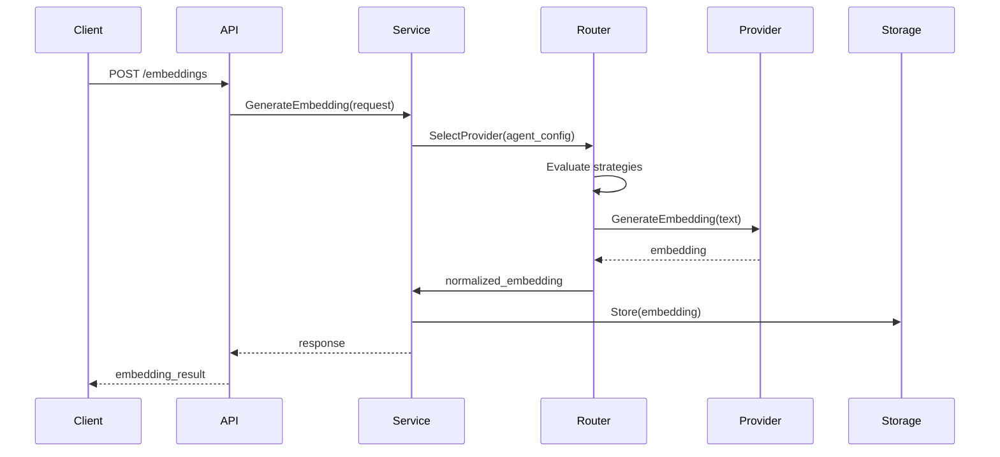
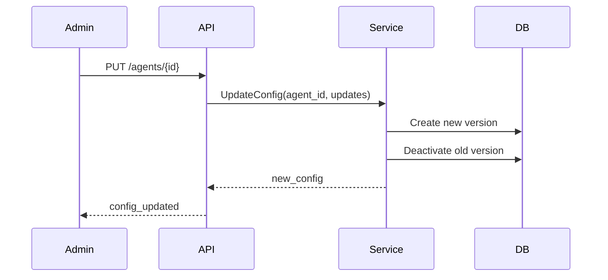

<!-- SOURCE VERIFICATION
Last Verified: 2025-08-11 14:35:45
Verification Script: update-docs-parallel.sh
Batch: aa
-->

# Multi-Agent Embedding System Architecture

## Overview

The Multi-Agent Embedding System is a sophisticated, production-ready solution designed to provide customized embedding generation for different AI agents. Each agent can have its own embedding strategy, model preferences, and constraints, enabling optimal performance for specific use cases.

## Architecture Principles

### 1. Agent-Centric Design
- Each AI agent has a unique configuration profile
- Configurations are versioned for audit trails
- Agents can have different strategies: quality, speed, cost, or balanced

### 2. Provider Abstraction
- Clean interface for multiple embedding providers
- Easy addition of new providers without changing core logic
- Provider-specific optimizations and error handling

### 3. High Availability
- Circuit breaker pattern for provider failures
- Automatic failover to backup models
- Request queuing during high load

### 4. Cost Optimization
- Per-agent budget tracking
- Smart routing based on cost/performance trade-offs
- Caching to reduce redundant API calls

## System Components

### Core Components

```
┌─────────────────────────────────────────────────────────────────┐
│                           REST API Layer                         │
│  ┌─────────────┐  ┌──────────────┐  ┌─────────────────────┐   │
│  │ Embedding   │  │    Agent     │  │      Search         │   │
│  │   API       │  │ Config API   │  │      API           │   │
│  └─────────────┘  └──────────────┘  └─────────────────────┘   │
└─────────────────────────────────────────────────────────────────┘
                                │
┌─────────────────────────────────────────────────────────────────┐
│                      Embedding Service V2                        │
│  ┌─────────────┐  ┌──────────────┐  ┌─────────────────────┐   │
│  │   Smart     │  │  Dimension   │  │     Circuit         │   │
│  │   Router    │  │   Adapter    │  │     Breaker        │   │
│  └─────────────┘  └──────────────┘  └─────────────────────┘   │
└─────────────────────────────────────────────────────────────────┘
                                │
┌─────────────────────────────────────────────────────────────────┐
│                         Provider Layer                           │
│  ┌─────────────┐  ┌──────────────┐  ┌─────────────────────┐   │
│  │   OpenAI    │  │     AWS      │  │    Google AI        │   │
│  │  Provider   │  │   Bedrock    │  │    Provider        │   │
│  └─────────────┘  └──────────────┘  └─────────────────────┘   │
└─────────────────────────────────────────────────────────────────┘
                                │
┌─────────────────────────────────────────────────────────────────┐
│                         Storage Layer                            │
│  ┌─────────────┐  ┌──────────────┐  ┌─────────────────────┐   │
│  │ PostgreSQL  │  │    Redis     │  │    Metrics DB       │   │
│  │ + pgvector  │  │    Cache     │  │                    │   │
│  └─────────────┘  └──────────────┘  └─────────────────────┘   │
└─────────────────────────────────────────────────────────────────┘
```

### Component Descriptions

#### 1. REST API Layer
- **Embedding API**: Handles embedding generation requests
- **Agent Config API**: Manages agent-specific configurations
- **Search API**: Provides similarity search functionality

#### 2. Embedding Service V2
- **Smart Router**: Intelligently selects providers based on:
  - Agent strategy (quality/speed/cost/balanced)
  - Provider availability
  - Circuit breaker state
  - Cost considerations
  
- **Dimension Adapter**: Normalizes embeddings to standard dimensions
  - Supports PCA, truncation, and padding
  - Preserves semantic information
  - Enables cross-model search

- **Circuit Breaker**: Prevents cascade failures
  - Monitors provider health
  - Automatic recovery testing
  - Graceful degradation

#### 3. Provider Layer
- **OpenAI Provider**: 
  - Models: text-embedding-3-large, text-embedding-3-small, text-embedding-ada-002
  - Best for: General purpose, high quality
  
- **AWS Bedrock Provider**:
  - Models: Titan, Cohere
  - Best for: AWS-native deployments, compliance
  
- **Google AI Provider**:
  - Models: Vertex AI embedding models
  - Best for: Google Cloud deployments
  
- **Voyage AI Provider**:
  - Models: voyage-2, voyage-lite-02-instruct
  - Best for: Specialized use cases

#### 4. Storage Layer
- **PostgreSQL + pgvector**: 
  - Stores embeddings with metadata
  - Enables similarity search
  - Supports multiple index types (IVFFlat, HNSW)
  
- **Redis Cache**:
  - Caches frequent embeddings
  - Reduces API costs
  - Improves response times
  
- **Metrics DB**:
  - Tracks usage and costs
  - Performance metrics
  - Provider health data

## Data Flow

### Embedding Generation Flow



### Configuration Update Flow



## Key Features

### 1. Multi-Model Support
Each agent can use different models based on task:
- Document embedding: Large models for quality
- Query embedding: Fast models for real-time
- Classification: Specialized models

### 2. Smart Routing Algorithm
```python
def select_provider(agent_config, task_type):
    strategy = agent_config.embedding_strategy
    models = agent_config.model_preferences[task_type]
    
    for model in models.primary_models:
        provider = get_provider_for_model(model)
        if provider.is_healthy():
            if strategy == "quality":
                return provider if model in HIGH_QUALITY_MODELS
            elif strategy == "speed":
                return provider if provider.avg_latency < SPEED_THRESHOLD
            elif strategy == "cost":
                return provider if provider.cost_per_token < COST_THRESHOLD
            elif strategy == "balanced":
                score = calculate_balanced_score(provider)
                if score > BALANCE_THRESHOLD:
                    return provider
    
    # Fallback logic
    return select_fallback_provider(models.fallback_models)
```

### 3. Dimension Normalization
All embeddings normalized to 1536 dimensions by default:
- **PCA**: For dimensionality reduction
- **Truncation**: For simple reduction
- **Padding**: For dimension expansion
- **Magnitude Preservation**: Maintains vector properties

### 4. Cost Control
- Per-agent daily budgets
- Real-time cost tracking
- Automatic provider switching when approaching limits
- Cost alerts and notifications

### 5. High Availability Features
- **Circuit Breaker States**:
  - Closed: Normal operation
  - Open: Provider disabled, using fallback
  - Half-Open: Testing recovery
  
- **Health Checks**:
  - Periodic provider validation
  - Latency monitoring
  - Error rate tracking

## Database Schema

### Agent Configurations
```sql
CREATE TABLE mcp.agent_configs (
    id UUID PRIMARY KEY,
    agent_id VARCHAR(255) NOT NULL,
    version INTEGER NOT NULL,
    embedding_strategy VARCHAR(50),
    model_preferences JSONB,
    constraints JSONB,
    fallback_behavior JSONB,
    metadata JSONB,
    is_active BOOLEAN DEFAULT true,
    created_at TIMESTAMP,
    updated_at TIMESTAMP,
    created_by VARCHAR(255),
    UNIQUE(agent_id, version)
);
```

### Embeddings
```sql
CREATE TABLE mcp.embeddings (
    id UUID PRIMARY KEY,
    context_id UUID,
    content TEXT,
    content_hash VARCHAR(64),
    embedding vector(1536),
    model_provider VARCHAR(50),
    model_name VARCHAR(100),
    model_dimensions INTEGER,
    configured_dimensions INTEGER,
    processing_time_ms INTEGER,
    magnitude FLOAT,
    tenant_id UUID,
    metadata JSONB,
    created_at TIMESTAMP,
    INDEX idx_embedding_vector ON embeddings 
        USING ivfflat (embedding vector_cosine_ops)
);
```

### Embedding Models
```sql
CREATE TABLE mcp.embedding_models (
    id UUID PRIMARY KEY,
    provider VARCHAR(50),
    model_name VARCHAR(100),
    model_version VARCHAR(50),
    dimensions INTEGER,
    max_tokens INTEGER,
    supports_binary BOOLEAN,
    supports_dimensionality_reduction BOOLEAN,
    min_dimensions INTEGER,
    cost_per_million_tokens DECIMAL(10,6),
    model_type VARCHAR(50),
    is_active BOOLEAN,
    capabilities JSONB,
    created_at TIMESTAMP
);
```

## Security Considerations

### API Security
- Authentication required for all endpoints
- Rate limiting per API key
- Request validation and sanitization

### Data Security
- Embeddings encrypted at rest
- PII detection and redaction
- Audit logging for all operations

### Provider Security
- API keys stored in secrets manager
- Key rotation support
- Network isolation options

## Performance Optimization

### Caching Strategy
- Cache embeddings for 15 minutes (configurable)
- Cache key: hash(text + model + agent_id)
- LRU eviction policy

### Batch Processing
- Batch requests to providers
- Optimal batch sizes per provider
- Parallel processing for different agents

### Database Optimization
- Vector indexes for similarity search
- Partitioning by tenant/date
- Connection pooling

## Monitoring and Observability

### Metrics
- Request latency (p50, p95, p99)
- Provider availability
- Cost per agent/model
- Cache hit rates
- Error rates by type

### Logging
- Structured JSON logging
- Request/response tracing
- Error details with stack traces

### Alerts
- Provider failures
- Cost threshold exceeded
- High error rates
- Circuit breaker state changes

## Deployment Considerations

### Environment Variables
```bash
# Provider Configuration
OPENAI_ENABLED=true
OPENAI_API_KEY=sk-...
BEDROCK_ENABLED=true
AWS_REGION=us-east-1
GOOGLE_AI_ENABLED=false

# System Configuration
EMBEDDING_CACHE_TTL=15m
CIRCUIT_BREAKER_THRESHOLD=5
MAX_BATCH_SIZE=100
```

### Scaling
- Horizontal scaling of API servers
- Provider request pooling
- Database read replicas
- Redis cluster for caching

### High Availability
- Multi-region deployment
- Provider redundancy
- Database replication
- Automated failover

## Future Enhancements

1. **Additional Providers**
   - Anthropic Claude embeddings
   - Hugging Face models
   - Custom model support

2. **Advanced Features**
   - Multi-modal embeddings
   - Fine-tuned model support
   - Embedding compression

3. **Analytics**
   - Usage analytics dashboard
   - Cost optimization recommendations
