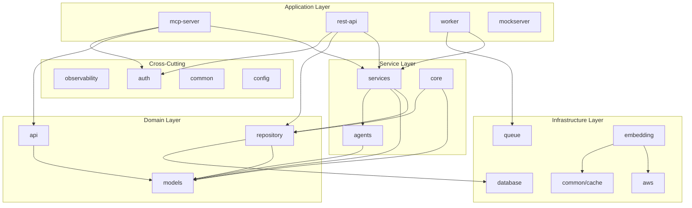

<!-- SOURCE VERIFICATION
Last Verified: 2025-08-11 14:36:17
Verification Script: update-docs-parallel.sh
Batch: aa
-->

# Package Dependencies

## Overview

This document maps the dependency relationships between packages in the Developer Mesh codebase. Understanding these dependencies is crucial for maintaining clean architecture and avoiding circular dependencies.

## Dependency Principles

1. **Unidirectional Flow**: Dependencies flow from apps → pkg, never reverse
2. **No Circular Dependencies**: Packages must not have circular imports
3. **Interface Segregation**: Define interfaces where they're used, not where implemented
4. **Minimal Dependencies**: Each package should depend on the minimum necessary

## Core Package Hierarchy



## Package Dependency Matrix

**Note**: The pkg/ directory contains 33 packages. This section covers the main packages and their relationships.

### Application Dependencies

| Package | Direct Dependencies | Purpose |
|---------|-------------------|----------|
| **mcp-server** | api, auth, services, websocket, observability | WebSocket server for AI agents | <!-- Source: pkg/models/websocket/binary.go -->
| **rest-api** | api, auth, repository, services, observability | REST API gateway |
| **worker** | queue, services, events, observability | Async task processing |
| **mockserver** | common | Testing mock server |

### Service Layer Dependencies

| Package | Direct Dependencies | Purpose |
|---------|-------------------|----------|
| **services** | models, repository, agents, cache, observability | Business logic orchestration |
| **agents** | models, observability | Agent management interfaces |
| **core** | models, repository, adapters | Core MCP engine |

### Domain Layer Dependencies

| Package | Direct Dependencies | Purpose |
|---------|-------------------|----------|
| **models** | (none) | Pure domain entities |
| **repository** | models, database, cache | Data access layer |
| **api** | models, auth | API types and contracts |

### Infrastructure Dependencies

| Package | Direct Dependencies | Purpose |
|---------|-------------------|----------|
| **aws** | config, observability | AWS service clients |
| **database** | config, observability | Database connections |
| **common/cache** | config, observability | Caching implementations |
| **queue** | redis, models, observability | Redis Streams event processing |
| **embedding** | aws, cache, models, resilience | Vector embeddings |
| **collaboration** | models, observability | CRDT implementations |

### Cross-Cutting Dependencies

| Package | Direct Dependencies | Purpose |
|---------|-------------------|----------|
| **observability** | (none) | Logging, metrics, tracing |
| **auth** | models, cache | Authentication/authorization |
| **common** | (none) | Shared utilities |
| **config** | (none) | Configuration management |
| **resilience** | observability | Circuit breakers, retries |

## Critical Dependency Paths

### 1. AI Agent Registration Path
```
mcp-server → api/websocket → services → agents → repository → database <!-- Source: pkg/models/websocket/binary.go -->
                                     ↓
                                  models
```

### 2. Task Assignment Path
```
rest-api → api → services → repository → cache
                    ↓           ↓
                 agents      models
```

### 3. Embedding Generation Path
```
rest-api → services → embedding → aws (Bedrock)
                         ↓          ↓
                      cache      resilience
```

### 4. Async Processing Path
```
worker → queue → redis (Streams)
    ↓       ↓
services  events
```

## Package Interfaces

### Key Interface Definitions

```go
// pkg/services/
- AssignmentStrategy (in assignment_engine.go) <!-- Source: pkg/services/assignment_engine.go -->
- NotificationService (in notification_service.go)
- AgentService (in task_service.go)
- WorkflowService (in workflow_service.go)

// pkg/repository/interfaces.go
- Repository[T]
- AgentRepository
- TaskRepository
- VectorRepository

// pkg/agents/interfaces.go
- AgentManager
- AgentRegistry

// pkg/embedding/interfaces.go
- Embedder
- Provider
- Router
```

## Dependency Anti-Patterns to Avoid

### 1. Circular Dependencies
❌ **Bad**: repository → services → repository
✅ **Good**: services → repository

### 2. Cross-Layer Dependencies
❌ **Bad**: models → services
✅ **Good**: services → models

### 3. Infrastructure in Domain
❌ **Bad**: models → database
✅ **Good**: repository → database

### 4. Direct AWS Dependencies
❌ **Bad**: services → AWS SDK
✅ **Good**: services → aws package → AWS SDK

## Managing Dependencies

### Adding New Dependencies

1. **Check Layer**: Ensure dependency respects layer boundaries
2. **Check Cycles**: Run `go mod graph | grep -E "pkg/.*pkg/"` to detect cycles
3. **Minimize Scope**: Import only what's needed
4. **Use Interfaces**: Depend on interfaces, not concrete types

### Refactoring Dependencies

When circular dependencies are detected:

1. **Extract Interface**: Move interface to consumer package
2. **Introduce Mediator**: Add intermediate package
3. **Invert Dependency**: Use dependency injection
4. **Split Package**: Separate concerns into multiple packages

### Testing Dependencies

```bash
# Visualize dependencies
go mod graph | grep "^github.com/developer-mesh/developer-mesh"

# Check for circular dependencies
go list -f '{{.ImportPath}} -> {{join .Imports " "}}' ./... | grep -E "pkg/.* -> .*pkg/"

# Analyze package coupling
go list -f '{{.ImportPath}} {{len .Imports}}' ./pkg/... | sort -k2 -n
```

## Package Metrics

### Most Depended Upon
1. **models** - Core domain entities
2. **observability** - Cross-cutting logging/metrics
3. **common** - Shared utilities and cache
4. **config** - Configuration management

### Most Dependencies
1. **services** - Depends on 8+ packages
2. **embedding** - Depends on 6+ packages
3. **repository** - Depends on 4+ packages

### Zero Dependencies
1. **models** - Pure domain objects
2. **common** - Utility functions
3. **config** - Configuration types
4. **observability** - Logging/metrics interfaces

## Future Considerations

### Planned Refactoring
1. **Split services package**: Separate into domain-specific services
2. **Extract agent SDK**: Move agent interfaces to separate module
3. **Standardize repositories**: Consistent generic repository pattern

### Dependency Optimization
1. **Reduce service dependencies**: Extract more focused interfaces
2. **Cache abstraction**: Remove direct Redis dependencies
3. **Event bus abstraction**: Decouple from specific queue implementation

## References

- [Go Workspace Structure](go-workspace-structure.md)
- [System Architecture](system-overview.md)
