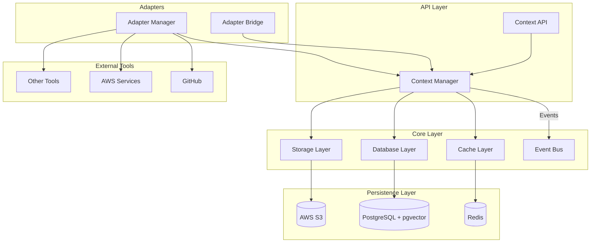
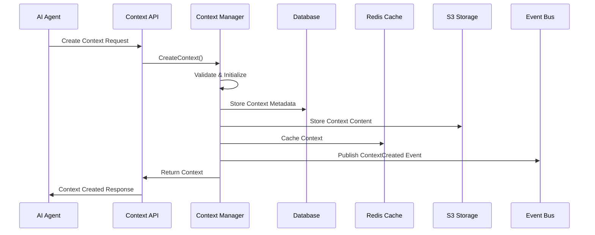
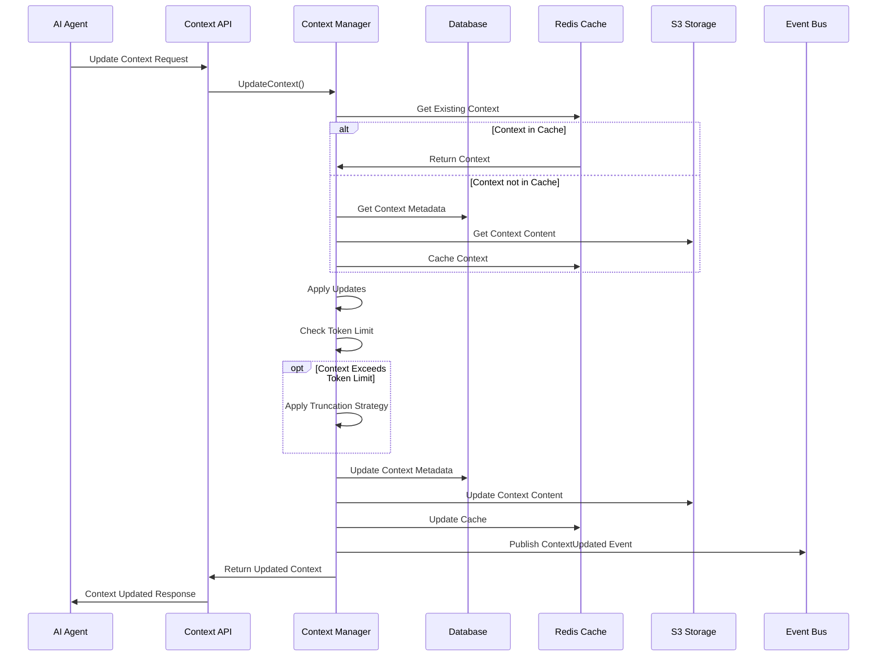

# Context Management Architecture

## Overview

The Context Management architecture enables AI agents to maintain conversation histories and relevant state across interactions. This document explains the architecture, storage patterns, and integration points of the context management system.

## Architecture Diagram

## Components

### Context Manager

The Context Manager is the central component responsible for:

- Creating, retrieving, updating, and deleting contexts
- Managing context content (messages, events)
- Implementing token counting and context window management
- Handling context truncation strategies
- Publishing events for context changes

### Storage Strategy

The context management system uses a tiered storage approach:

1. **Redis Cache**: For fast access to frequently used contexts
   - TTL-based caching to optimize memory usage
   - Used for context metadata and recent content

2. **PostgreSQL Database**: For structured storage of context metadata
   - Stores context metadata and references
   - Uses pgvector extension for semantic search capabilities
   - Enables efficient querying by agent ID, session ID, etc.

3. **S3 Storage**: For large context data
   - Stores complete conversation histories
   - Used for contexts that exceed a certain size threshold
   - Provides durability for long-term storage

### Context Structure

Each context consists of:

- Metadata (agent ID, model ID, session ID, token counts, etc.)
- A sequence of context items (messages, events, tool operations)
- Optional vector embeddings for semantic search

### Integration with Adapters

Adapters interact with the Context Manager to:

- Record tool operations in contexts
- Store webhook events
- Retrieve contextual information for tool operations

### Authentication and Authorization

- Uses AWS IAM Roles for Service Accounts (IRSA) for AWS service access
- Implements role-based access control for context operations
- Ensures isolation between contexts of different agents

## Sequence Diagrams

### Creating a Context

### Updating a Context

## Truncation Strategies

The Context Manager implements multiple truncation strategies:

1. **Oldest First**: Removes the oldest context items first
2. **Preserving User**: Prioritizes removing assistant responses while preserving user messages
3. **Relevance Based**: Uses vector embeddings to remove less relevant context items (planned for future)

## Authentication with AWS Services

The MCP Server uses IAM Roles for Service Accounts (IRSA) to authenticate with AWS services:

1. **S3 Access**: For storing and retrieving context data
2. **RDS Access**: For connecting to Aurora PostgreSQL with IAM authentication
3. **Secrets Manager**: For managing database credentials and other secrets

## Observability

The context management system includes:

- Structured logging for all operations
- Metrics for context operations (creation, update, deletion, etc.)
- Tracing for tracking context operations across components
