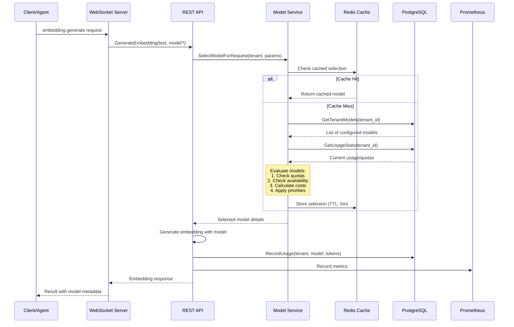
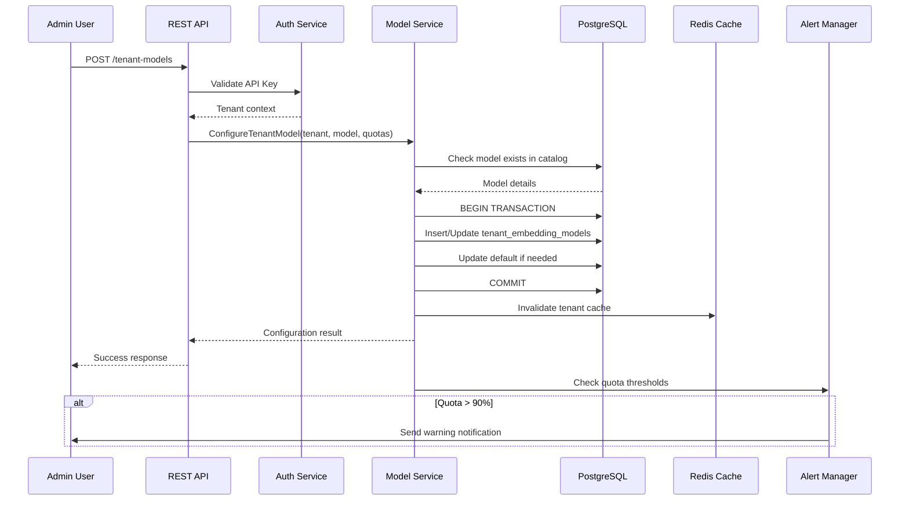
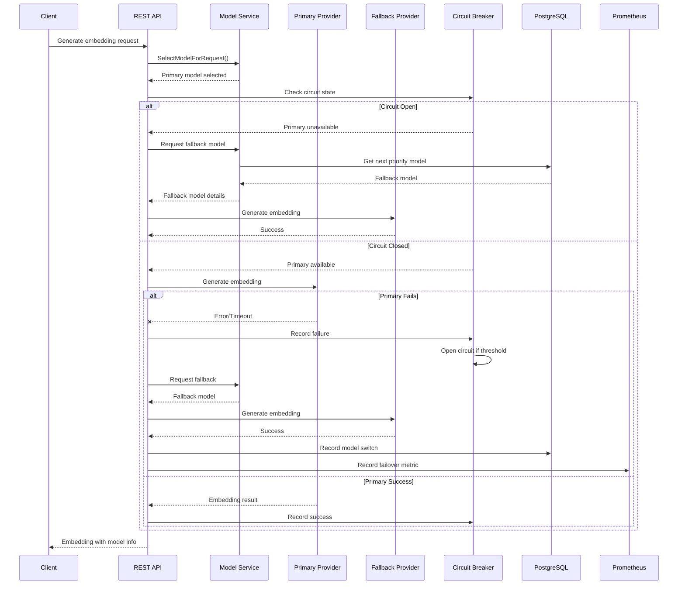
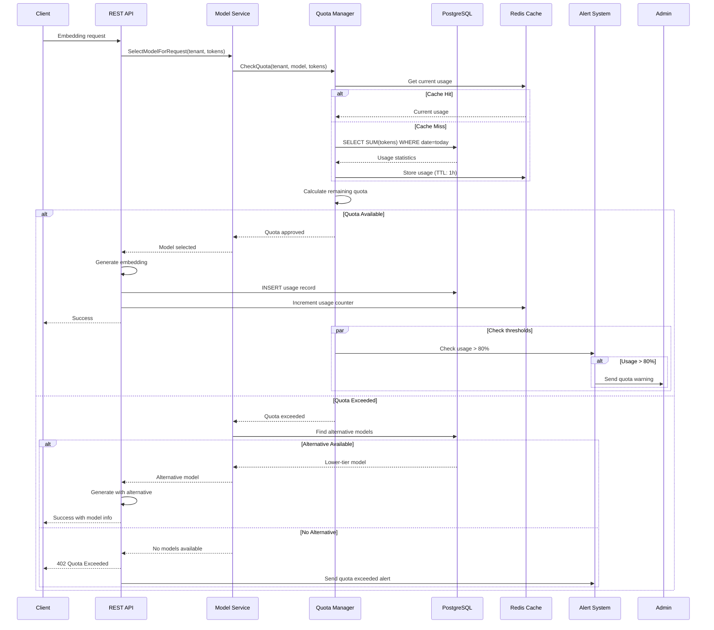
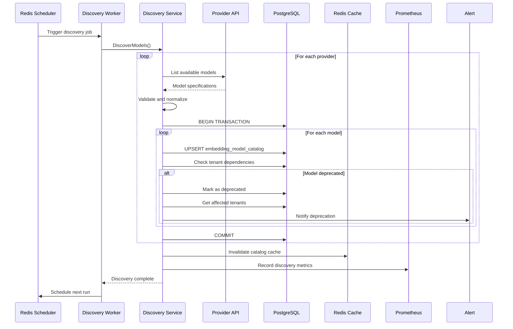
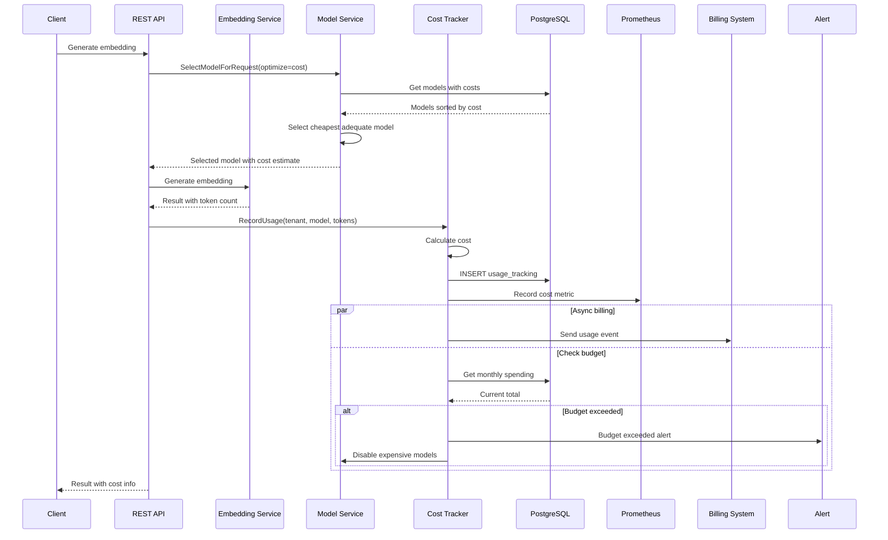
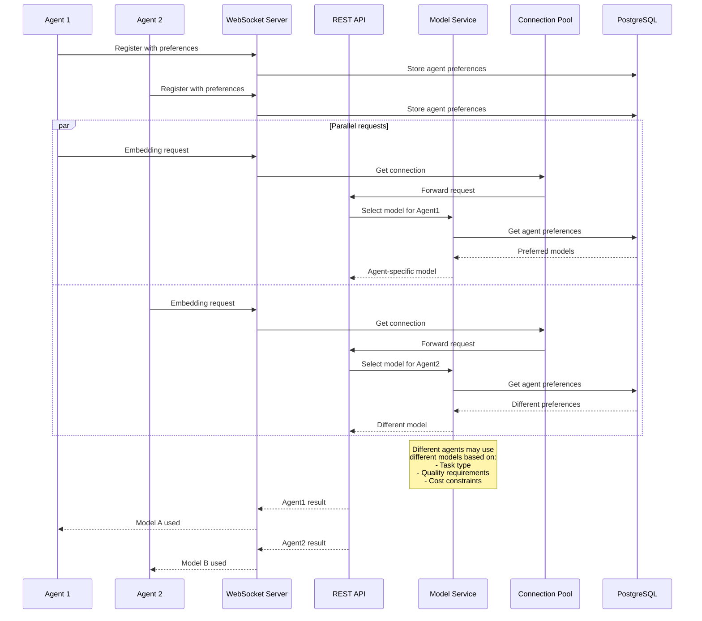
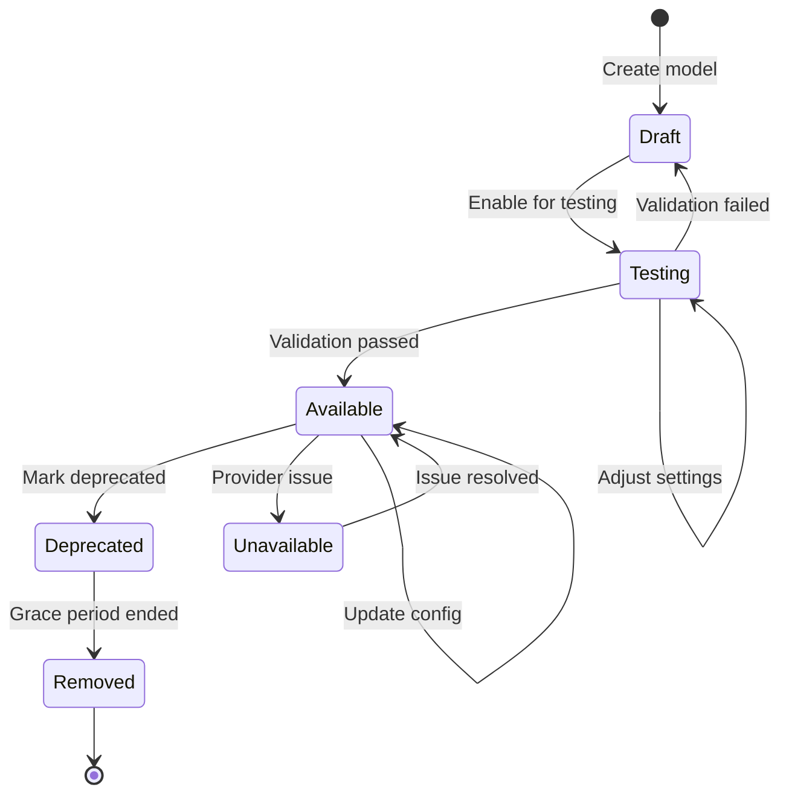
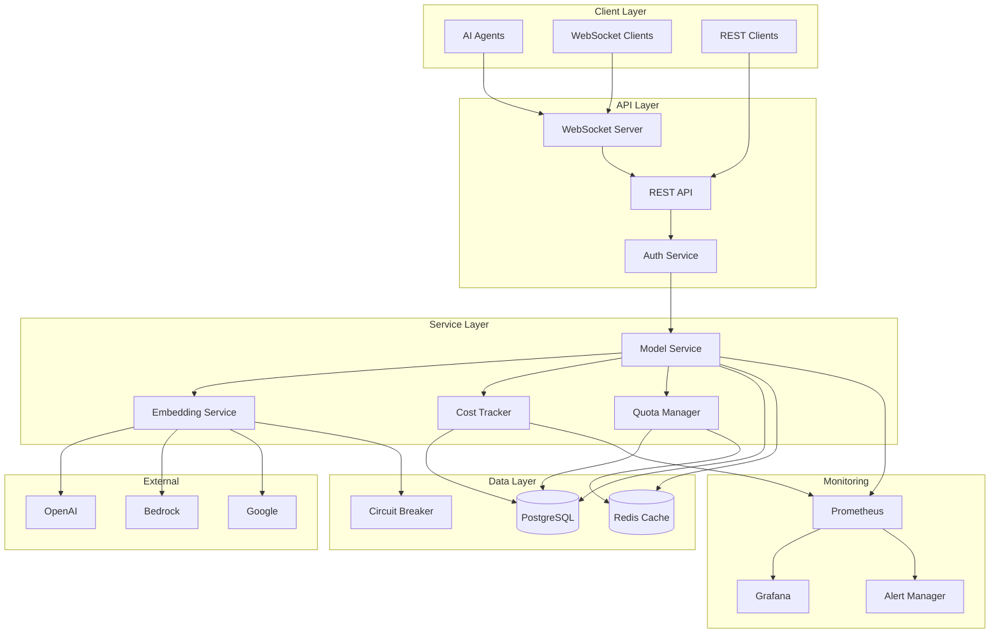
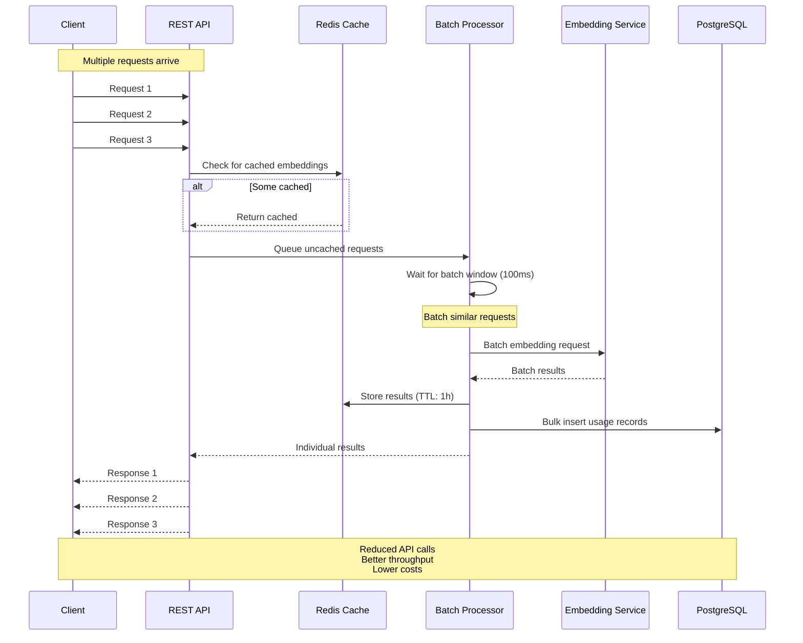

# Embedding Model Management - Sequence Diagrams

## 1. Model Selection Flow



## 2. Tenant Model Configuration Flow



## 3. Automatic Model Failover Flow



## 4. Quota Management and Enforcement Flow



## 5. Model Discovery and Catalog Update Flow



## 6. Cost Tracking and Optimization Flow



## 7. Multi-Agent Coordination Flow



## State Diagrams

### Model Lifecycle States



### Tenant Model Configuration States

```mermaid
stateDiagram-v2
    [*] --> Configured: Add model
    Configured --> Enabled: Enable model
    Enabled --> Default: Set as default
    Enabled --> Disabled: Disable temporarily
    Disabled --> Enabled: Re-enable
    Default --> Enabled: Change default
    Enabled --> QuotaExceeded: Hit quota
    QuotaExceeded --> Enabled: Quota reset
    Enabled --> Removed: Remove model
    Removed --> [*]
```

## Data Flow Diagram



## Performance Optimization Flow

