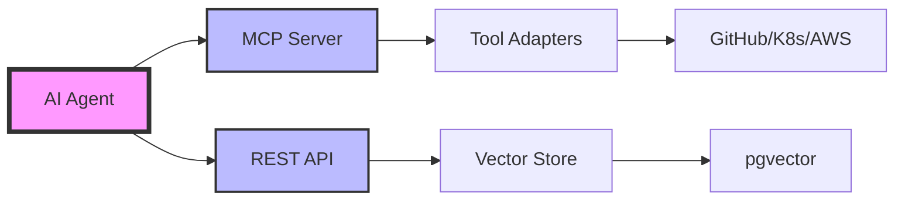

# AI Agent Integration

This guide demonstrates how to integrate AI agents (LLMs, assistants, copilots) with the DevOps MCP platform to enable intelligent DevOps automation.

## Overview

The DevOps MCP platform provides a production-ready interface for AI agents to:

- **🧠 Context Management**: Store and retrieve conversation history with vector embeddings
- **🔍 Semantic Search**: Find relevant information across all stored contexts
- **🔧 Tool Execution**: Perform operations on DevOps tools (GitHub, Kubernetes, AWS, etc.)
- **📡 Real-time Updates**: Receive webhooks and process events asynchronously
- **🎯 Multi-Model Support**: Use different embedding models (OpenAI, Anthropic, Bedrock)

## Architecture



## Quick Start Example

### 1. Initialize Client

```python
from devops_mcp import MCPClient, VectorClient
import os

# Initialize clients with environment configuration
mcp_client = MCPClient(
    base_url=os.getenv("MCP_BASE_URL", "http://localhost:8080/api/v1"),
    api_key=os.getenv("MCP_API_KEY"),
    timeout=30
)

vector_client = VectorClient(
    base_url=os.getenv("VECTOR_API_URL", "http://localhost:8081/api/v1"),
    api_key=os.getenv("MCP_API_KEY"),
    model_id="text-embedding-3-small"  # or "claude-3-haiku", "voyage-2"
)
```

### 2. Context Management

```python
from datetime import datetime
from typing import Dict, Any

async def create_conversation_context(user_id: str, session_id: str) -> str:
    """Create a new conversation context for an AI session"""
    
    context = await mcp_client.create_context({
        "id": f"conv-{session_id}",
        "user_id": user_id,
        "metadata": {
            "type": "ai_conversation",
            "model": "gpt-4-turbo",
            "created_at": datetime.utcnow().isoformat(),
            "session_id": session_id
        }
    })
    
    return context.id

async def append_to_conversation(context_id: str, role: str, content: str):
    """Append a message to the conversation context"""
    
    current = await mcp_client.get_context(context_id)
    messages = current.metadata.get("messages", [])
    
    messages.append({
        "role": role,
        "content": content,
        "timestamp": datetime.utcnow().isoformat()
    })
    
    await mcp_client.update_context(context_id, {
        "metadata": {**current.metadata, "messages": messages}
    })
```

### 3. Vector Embeddings with Multi-Model Support

```python
from typing import List, Optional

class ConversationIndexer:
    """Index conversations with vector embeddings for semantic search"""
    
    def __init__(self, vector_client: VectorClient):
        self.vector_client = vector_client
        self.chunk_size = 1000  # characters per chunk
        self.chunk_overlap = 200
    
    async def index_conversation(self, context_id: str, messages: List[Dict[str, str]]):
        """Index an entire conversation with smart chunking"""
        
        # Convert messages to searchable chunks
        chunks = self._create_chunks(messages)
        
        # Store each chunk with its embedding
        for idx, chunk in enumerate(chunks):
            await self.vector_client.create_embedding({
                "context_id": context_id,
                "content_index": idx,
                "text": chunk["text"],
                "metadata": {
                    "message_range": chunk["message_range"],
                    "speakers": chunk["speakers"],
                    "chunk_type": "conversation"
                }
            })
    
    def _create_chunks(self, messages: List[Dict[str, str]]) -> List[Dict[str, Any]]:
        """Create overlapping chunks from messages"""
        chunks = []
        current_chunk = ""
        current_speakers = set()
        message_start = 0
        
        for i, msg in enumerate(messages):
            speaker = msg["role"]
            content = f"{speaker}: {msg['content']}\n\n"
            
            if len(current_chunk) + len(content) > self.chunk_size:
                # Save current chunk
                chunks.append({
                    "text": current_chunk.strip(),
                    "message_range": [message_start, i-1],
                    "speakers": list(current_speakers)
                })
                
                # Start new chunk with overlap
                overlap_start = max(0, i - 2)
                current_chunk = self._get_overlap(messages[overlap_start:i])
                current_speakers = {m["role"] for m in messages[overlap_start:i]}
                message_start = overlap_start
            
            current_chunk += content
            current_speakers.add(speaker)
        
        # Don't forget the last chunk
        if current_chunk:
            chunks.append({
                "text": current_chunk.strip(),
                "message_range": [message_start, len(messages)-1],
                "speakers": list(current_speakers)
            })
        
        return chunks
    
    def _get_overlap(self, messages: List[Dict[str, str]]) -> str:
        """Create overlap text from messages"""
        return "".join([f"{m['role']}: {m['content']}\n\n" for m in messages])
```

### 4. Intelligent Semantic Search

```python
class ContextSearcher:
    """Search across conversation contexts with advanced filtering"""
    
    def __init__(self, vector_client: VectorClient):
        self.vector_client = vector_client
    
    async def search_conversations(
        self,
        query: str,
        context_ids: Optional[List[str]] = None,
        limit: int = 10,
        filters: Optional[Dict[str, Any]] = None
    ) -> List[Dict[str, Any]]:
        """Search across one or more conversation contexts"""
        
        results = await self.vector_client.search({
            "query": query,
            "context_ids": context_ids,
            "limit": limit,
            "similarity_threshold": 0.75,
            "filters": filters or {}
        })
        
        # Enrich results with conversation context
        enriched_results = []
        for result in results:
            context = await mcp_client.get_context(result["context_id"])
            
            enriched_results.append({
                "text": result["text"],
                "similarity": result["similarity"],
                "context_id": result["context_id"],
                "message_range": result["metadata"]["message_range"],
                "conversation_metadata": context.metadata,
                "relevance_explanation": self._explain_relevance(query, result)
            })
        
        return enriched_results
    
    def _explain_relevance(self, query: str, result: Dict[str, Any]) -> str:
        """Generate explanation for why this result is relevant"""
        similarity = result["similarity"]
        
        if similarity > 0.9:
            return "Very high relevance - nearly exact match"
        elif similarity > 0.8:
            return "High relevance - strong topical match"
        elif similarity > 0.75:
            return "Good relevance - related concepts"
        else:
            return "Moderate relevance - tangentially related"
    
    async def find_similar_conversations(
        self,
        reference_context_id: str,
        user_id: Optional[str] = None
    ) -> List[str]:
        """Find conversations similar to a reference conversation"""
        
        # Get embeddings from reference conversation
        ref_embeddings = await self.vector_client.list_embeddings({
            "context_id": reference_context_id,
            "limit": 5  # Top 5 most representative chunks
        })
        
        # Search using each embedding and aggregate results
        all_similar_contexts = set()
        
        for emb in ref_embeddings:
            results = await self.vector_client.search_by_embedding({
                "embedding": emb["embedding"],
                "model_id": emb["model_id"],
                "limit": 20,
                "filters": {"user_id": user_id} if user_id else {}
            })
            
            for result in results:
                if result["context_id"] != reference_context_id:
                    all_similar_contexts.add(result["context_id"])
        
        return list(all_similar_contexts)
```

### 5. Tool Execution with MCP

```python
class DevOpsToolExecutor:
    """Execute DevOps operations through MCP tool interface"""
    
    def __init__(self, mcp_client: MCPClient):
        self.mcp = mcp_client
    
    async def create_github_issue(
        self,
        repo: str,
        title: str,
        body: str,
        labels: List[str] = None,
        assignees: List[str] = None
    ) -> Dict[str, Any]:
        """Create a GitHub issue with full metadata"""
        
        result = await self.mcp.execute_tool("github.create_issue", {
            "repository": repo,
            "title": title,
            "body": body,
            "labels": labels or [],
            "assignees": assignees or []
        })
        
        return {
            "success": result.success,
            "issue_url": result.data.get("html_url"),
            "issue_number": result.data.get("number"),
            "created_at": result.data.get("created_at")
        }
    
    async def search_github_code(
        self,
        query: str,
        repo: Optional[str] = None,
        language: Optional[str] = None
    ) -> List[Dict[str, Any]]:
        """Search GitHub code with filters"""
        
        search_params = {"q": query}
        if repo:
            search_params["q"] += f" repo:{repo}"
        if language:
            search_params["q"] += f" language:{language}"
        
        result = await self.mcp.execute_tool("github.search_code", search_params)
        
        return [{
            "file_path": item["path"],
            "repository": item["repository"]["full_name"],
            "content_preview": item.get("text_matches", [{}])[0].get("fragment", ""),
            "url": item["html_url"]
        } for item in result.data.get("items", [])]
    
    async def deploy_to_kubernetes(
        self,
        deployment_name: str,
        image: str,
        namespace: str = "default"
    ) -> Dict[str, Any]:
        """Deploy application to Kubernetes"""
        
        result = await self.mcp.execute_tool("kubernetes.apply", {
            "manifest": {
                "apiVersion": "apps/v1",
                "kind": "Deployment",
                "metadata": {
                    "name": deployment_name,
                    "namespace": namespace
                },
                "spec": {
                    "replicas": 3,
                    "selector": {
                        "matchLabels": {"app": deployment_name}
                    },
                    "template": {
                        "metadata": {
                            "labels": {"app": deployment_name}
                        },
                        "spec": {
                            "containers": [{
                                "name": deployment_name,
                                "image": image,
                                "ports": [{"containerPort": 8080}]
                            }]
                        }
                    }
                }
            }
        })
        
        return {
            "success": result.success,
            "deployment": deployment_name,
            "namespace": namespace,
            "status": result.data.get("status")
        }
```

### 6. Complete AI Assistant Implementation

```python
import asyncio
from typing import Optional, List, Dict, Any
from dataclasses import dataclass
import json

@dataclass
class ConversationState:
    context_id: str
    session_id: str
    user_id: str
    messages: List[Dict[str, str]]
    tool_history: List[Dict[str, Any]]

class DevOpsAIAssistant:
    """Production-ready AI assistant with DevOps capabilities"""
    
    def __init__(
        self,
        mcp_client: MCPClient,
        vector_client: VectorClient,
        llm_client: Any  # Your LLM client (OpenAI, Anthropic, etc.)
    ):
        self.mcp = mcp_client
        self.vector = vector_client
        self.llm = llm_client
        self.indexer = ConversationIndexer(vector_client)
        self.searcher = ContextSearcher(vector_client)
        self.tools = DevOpsToolExecutor(mcp_client)
        self.active_sessions: Dict[str, ConversationState] = {}
    
    async def start_session(self, user_id: str) -> str:
        """Start a new conversation session"""
        session_id = str(uuid.uuid4())
        context_id = await create_conversation_context(user_id, session_id)
        
        self.active_sessions[session_id] = ConversationState(
            context_id=context_id,
            session_id=session_id,
            user_id=user_id,
            messages=[],
            tool_history=[]
        )
        
        return session_id
    
    async def process_message(
        self,
        session_id: str,
        message: str,
        use_tools: bool = True
    ) -> Dict[str, Any]:
        """Process a user message and return AI response with any tool results"""
        
        state = self.active_sessions.get(session_id)
        if not state:
            raise ValueError(f"Session {session_id} not found")
        
        # Add user message to state
        state.messages.append({"role": "user", "content": message})
        
        # Search for relevant context
        relevant_context = await self._get_relevant_context(state, message)
        
        # Prepare LLM prompt with context
        system_prompt = self._build_system_prompt(relevant_context)
        
        # Get LLM response with tool use
        if use_tools:
            response = await self._get_llm_response_with_tools(
                system_prompt,
                state.messages,
                message
            )
        else:
            response = await self._get_llm_response(
                system_prompt,
                state.messages
            )
        
        # Add assistant response to state
        state.messages.append({"role": "assistant", "content": response["content"]})
        
        # Update context in MCP
        await append_to_conversation(
            state.context_id,
            "assistant",
            response["content"]
        )
        
        # Index the conversation for future search
        await self.indexer.index_conversation(
            state.context_id,
            state.messages[-4:]  # Index last 4 messages for efficiency
        )
        
        return {
            "content": response["content"],
            "tool_results": response.get("tool_results", []),
            "session_id": session_id,
            "context_id": state.context_id
        }
    
    async def _get_relevant_context(
        self,
        state: ConversationState,
        query: str
    ) -> List[Dict[str, Any]]:
        """Retrieve relevant context for the query"""
        
        # Search current session
        current_results = await self.searcher.search_conversations(
            query=query,
            context_ids=[state.context_id],
            limit=3
        )
        
        # Search user's historical conversations
        historical_results = await self.searcher.search_conversations(
            query=query,
            filters={"user_id": state.user_id, "type": "ai_conversation"},
            limit=5
        )
        
        # Search tool execution history
        tool_context = [
            tool for tool in state.tool_history
            if any(keyword in str(tool).lower() for keyword in query.lower().split())
        ][:3]
        
        return {
            "current_session": current_results,
            "historical": historical_results,
            "tools": tool_context
        }
    
    def _build_system_prompt(self, context: Dict[str, Any]) -> str:
        """Build system prompt with relevant context"""
        prompt = """You are a DevOps AI assistant with access to various tools.
        You can help with GitHub operations, Kubernetes deployments, AWS resources, and more.
        
        Relevant context from current session:
        """
        
        for ctx in context["current_session"]:
            prompt += f"\n- {ctx['text'][:200]}..."
        
        if context["historical"]:
            prompt += "\n\nRelevant historical context:"
            for ctx in context["historical"][:2]:
                prompt += f"\n- From {ctx['conversation_metadata']['created_at']}: {ctx['text'][:150]}..."
        
        if context["tools"]:
            prompt += "\n\nRecent tool executions:"
            for tool in context["tools"]:
                prompt += f"\n- {tool['tool']}: {tool['result']['success']}"
        
        return prompt
    
    async def _get_llm_response_with_tools(
        self,
        system_prompt: str,
        messages: List[Dict[str, str]],
        user_message: str
    ) -> Dict[str, Any]:
        """Get LLM response with tool execution capability"""
        
        # Define available tools for the LLM
        tools = [
            {
                "type": "function",
                "function": {
                    "name": "create_github_issue",
                    "description": "Create a GitHub issue",
                    "parameters": {
                        "type": "object",
                        "properties": {
                            "repo": {"type": "string"},
                            "title": {"type": "string"},
                            "body": {"type": "string"},
                            "labels": {"type": "array", "items": {"type": "string"}}
                        },
                        "required": ["repo", "title", "body"]
                    }
                }
            },
            {
                "type": "function",
                "function": {
                    "name": "search_github_code",
                    "description": "Search for code in GitHub",
                    "parameters": {
                        "type": "object",
                        "properties": {
                            "query": {"type": "string"},
                            "repo": {"type": "string"},
                            "language": {"type": "string"}
                        },
                        "required": ["query"]
                    }
                }
            }
        ]
        
        # Call LLM with tools
        llm_response = await self.llm.chat.completions.create(
            model="gpt-4-turbo",
            messages=[
                {"role": "system", "content": system_prompt},
                *messages
            ],
            tools=tools,
            tool_choice="auto"
        )
        
        response_content = llm_response.choices[0].message.content
        tool_results = []
        
        # Execute any tool calls
        if llm_response.choices[0].message.tool_calls:
            for tool_call in llm_response.choices[0].message.tool_calls:
                tool_name = tool_call.function.name
                tool_args = json.loads(tool_call.function.arguments)
                
                # Execute the tool
                if tool_name == "create_github_issue":
                    result = await self.tools.create_github_issue(**tool_args)
                elif tool_name == "search_github_code":
                    result = await self.tools.search_github_code(**tool_args)
                else:
                    result = {"error": f"Unknown tool: {tool_name}"}
                
                tool_results.append({
                    "tool": tool_name,
                    "args": tool_args,
                    "result": result
                })
                
                # Add to tool history
                session_id = next(sid for sid, s in self.active_sessions.items() if s.messages == messages)
                self.active_sessions[session_id].tool_history.append({
                    "tool": tool_name,
                    "args": tool_args,
                    "result": result,
                    "timestamp": datetime.utcnow().isoformat()
                })
        
        return {
            "content": response_content,
            "tool_results": tool_results
        }
```

### 7. Usage Example

```python
# Initialize clients and assistant
async def main():
    # Setup clients
    mcp_client = MCPClient(base_url="http://localhost:8080/api/v1")
    vector_client = VectorClient(base_url="http://localhost:8081/api/v1")
    openai_client = OpenAI()  # or Anthropic, Bedrock, etc.
    
    # Create assistant
    assistant = DevOpsAIAssistant(mcp_client, vector_client, openai_client)
    
    # Start a session
    session_id = await assistant.start_session(user_id="user123")
    
    # Process messages
    response1 = await assistant.process_message(
        session_id,
        "Hi, I need help with my GitHub project devops-mcp"
    )
    print(f"Assistant: {response1['content']}")
    
    response2 = await assistant.process_message(
        session_id,
        "Can you search for TODO comments in the codebase?"
    )
    print(f"Assistant: {response2['content']}")
    print(f"Tool Results: {response2['tool_results']}")
    
    response3 = await assistant.process_message(
        session_id,
        "Create an issue to track the TODO items we found"
    )
    print(f"Assistant: {response3['content']}")
    print(f"Created Issue: {response3['tool_results'][0]['result']['issue_url']}")

# Run the example
asyncio.run(main())
```

**Example Output:**
```
Assistant: Hello! I'd be happy to help with your devops-mcp GitHub project. This looks like an interesting DevOps tool integration platform. What would you like to do?

Assistant: I'll search for TODO comments in your devops-mcp repository.
Tool Results: [{'tool': 'search_github_code', 'args': {'query': 'TODO', 'repo': 'S-Corkum/devops-mcp'}, 'result': [...]}]

Assistant: I've created an issue to track the TODO items we found in your codebase.
Created Issue: https://github.com/S-Corkum/devops-mcp/issues/42
```

## Advanced Integrations

### OpenAI Assistants API Integration

```python
from openai import OpenAI
from typing import List, Dict, Any
import asyncio

class MCPOpenAIAssistant:
    """OpenAI Assistant with DevOps MCP integration"""
    
    def __init__(self, mcp_client: MCPClient, openai_key: str):
        self.mcp = mcp_client
        self.client = OpenAI(api_key=openai_key)
        self.assistant = None
        self.thread_contexts = {}  # Map thread_id to context_id
    
    async def setup_assistant(self) -> str:
        """Create an OpenAI assistant with MCP tools"""
        
        # Get available tools from MCP
        available_tools = await self.mcp.list_tools()
        
        # Convert MCP tools to OpenAI function format
        openai_tools = []
        for tool in available_tools:
            openai_tools.append({
                "type": "function",
                "function": {
                    "name": tool["name"],
                    "description": tool["description"],
                    "parameters": tool["input_schema"]
                }
            })
        
        # Create assistant
        self.assistant = self.client.beta.assistants.create(
            name="DevOps MCP Assistant",
            instructions="""You are a DevOps assistant powered by MCP.
            You have access to various DevOps tools including GitHub, Kubernetes, AWS, and more.
            Always provide clear explanations of what you're doing.
            Store important information in context for future reference.""",
            model="gpt-4-turbo",
            tools=openai_tools[:20]  # OpenAI limit
        )
        
        return self.assistant.id
    
    async def process_thread_message(
        self,
        thread_id: str,
        message: str,
        user_id: str
    ) -> Dict[str, Any]:
        """Process a message in an OpenAI thread with MCP context"""
        
        # Create or get context for this thread
        if thread_id not in self.thread_contexts:
            context_id = await create_conversation_context(user_id, thread_id)
            self.thread_contexts[thread_id] = context_id
        else:
            context_id = self.thread_contexts[thread_id]
        
        # Store message in MCP context
        await append_to_conversation(context_id, "user", message)
        
        # Add message to thread
        self.client.beta.threads.messages.create(
            thread_id=thread_id,
            role="user",
            content=message
        )
        
        # Run assistant
        run = self.client.beta.threads.runs.create(
            thread_id=thread_id,
            assistant_id=self.assistant.id
        )
        
        # Wait for completion with tool handling
        completed_run = await self._wait_and_handle_tools(thread_id, run.id)
        
        # Get assistant's response
        messages = self.client.beta.threads.messages.list(
            thread_id=thread_id,
            order="desc",
            limit=1
        )
        
        assistant_message = messages.data[0].content[0].text.value
        
        # Store assistant response in MCP
        await append_to_conversation(context_id, "assistant", assistant_message)
        
        return {
            "response": assistant_message,
            "thread_id": thread_id,
            "context_id": context_id,
            "tools_used": completed_run.get("tools_used", [])
        }
    
    async def _wait_and_handle_tools(
        self,
        thread_id: str,
        run_id: str
    ) -> Dict[str, Any]:
        """Wait for run completion and handle tool calls"""
        
        tools_used = []
        
        while True:
            run = self.client.beta.threads.runs.retrieve(
                thread_id=thread_id,
                run_id=run_id
            )
            
            if run.status == "completed":
                return {"status": "completed", "tools_used": tools_used}
            
            elif run.status == "requires_action":
                # Handle tool calls
                tool_outputs = []
                
                for tool_call in run.required_action.submit_tool_outputs.tool_calls:
                    # Execute tool through MCP
                    result = await self.mcp.execute_tool(
                        tool_call.function.name,
                        json.loads(tool_call.function.arguments)
                    )
                    
                    tool_outputs.append({
                        "tool_call_id": tool_call.id,
                        "output": json.dumps(result.data)
                    })
                    
                    tools_used.append({
                        "name": tool_call.function.name,
                        "args": json.loads(tool_call.function.arguments),
                        "result": result.success
                    })
                
                # Submit tool outputs
                self.client.beta.threads.runs.submit_tool_outputs(
                    thread_id=thread_id,
                    run_id=run_id,
                    tool_outputs=tool_outputs
                )
            
            elif run.status == "failed":
                raise Exception(f"Run failed: {run.last_error}")
            
            await asyncio.sleep(1)  # Poll every second
```

### Anthropic Claude Integration

```python
from anthropic import Anthropic

class MCPClaudeAssistant:
    """Claude assistant with DevOps MCP integration"""
    
    def __init__(self, mcp_client: MCPClient, anthropic_key: str):
        self.mcp = mcp_client
        self.claude = Anthropic(api_key=anthropic_key)
    
    async def process_with_tools(
        self,
        message: str,
        context_id: str
    ) -> Dict[str, Any]:
        """Process message with Claude and MCP tools"""
        
        # Get available tools
        tools = await self.mcp.list_tools()
        
        # Create tool descriptions for Claude
        tool_descriptions = self._format_tools_for_claude(tools)
        
        # Create prompt with tool instructions
        system_prompt = f"""You are a DevOps assistant with access to these tools:
        
{tool_descriptions}

When you need to use a tool, respond with:
<tool_use>
<tool_name>tool_name_here</tool_name>
<parameters>
{{"param1": "value1", "param2": "value2"}}
</parameters>
</tool_use>

After I provide the tool result, continue with your response."""
        
        # Get Claude's response
        response = self.claude.messages.create(
            model="claude-3-opus-20240229",
            max_tokens=4096,
            system=system_prompt,
            messages=[{"role": "user", "content": message}]
        )
        
        # Process any tool uses
        final_response = await self._handle_claude_tools(response.content)
        
        return {
            "response": final_response,
            "context_id": context_id
        }
```

## Best Practices

### 1. Context Management
- **Chunk Strategically**: Use overlapping chunks for better context retention
- **Index Incrementally**: Don't re-index entire conversations, just new messages
- **Expire Old Contexts**: Implement TTL for contexts to manage storage

### 2. Vector Search Optimization
- **Multi-Model Strategy**: Use different models for different content types
- **Hybrid Search**: Combine vector search with keyword filters
- **Cache Embeddings**: Cache frequently accessed embeddings in Redis

### 3. Tool Execution Safety
- **Validate Inputs**: Always validate tool parameters before execution
- **Implement Guardrails**: Add safety checks for destructive operations
- **Audit Trail**: Log all tool executions with full context

### 4. Performance & Scalability
```python
# Use connection pooling
class MCPConnectionPool:
    def __init__(self, size: int = 10):
        self.pool = asyncio.Queue(maxsize=size)
        for _ in range(size):
            client = MCPClient()
            self.pool.put_nowait(client)
    
    @contextmanager
    async def get_client(self):
        client = await self.pool.get()
        try:
            yield client
        finally:
            await self.pool.put(client)
```

### 5. Error Handling
```python
from tenacity import retry, stop_after_attempt, wait_exponential

class ResilientMCPClient:
    @retry(
        stop=stop_after_attempt(3),
        wait=wait_exponential(multiplier=1, min=4, max=10)
    )
    async def execute_with_retry(self, tool_name: str, params: Dict):
        try:
            return await self.mcp.execute_tool(tool_name, params)
        except Exception as e:
            logger.error(f"Tool execution failed: {e}")
            raise
```

## Production Deployment

### Environment Configuration
```yaml
# config/production.yaml
api:
  mcp_server:
    url: https://mcp.your-domain.com
    timeout: 30
    retry_attempts: 3
  
  vector_api:
    url: https://vector.your-domain.com
    connection_pool_size: 20

embedding:
  default_model: "text-embedding-3-small"
  batch_size: 100
  cache_ttl: 3600

security:
  api_key_rotation_days: 90
  encrypt_contexts: true
  audit_logging: true

performance:
  max_context_size_mb: 10
  vector_search_timeout: 5
  concurrent_tool_executions: 5
```

### Monitoring & Observability
```python
from opentelemetry import trace
from prometheus_client import Counter, Histogram

# Metrics
tool_executions = Counter('mcp_tool_executions_total', 'Total tool executions')
search_latency = Histogram('mcp_search_duration_seconds', 'Search latency')

# Tracing
tracer = trace.get_tracer(__name__)

class MonitoredAssistant(DevOpsAIAssistant):
    async def process_message(self, session_id: str, message: str):
        with tracer.start_as_current_span("process_message") as span:
            span.set_attribute("session.id", session_id)
            span.set_attribute("message.length", len(message))
            
            result = await super().process_message(session_id, message)
            
            span.set_attribute("tools.used", len(result.get("tool_results", [])))
            return result
```

## Next Steps

1. **Explore More Examples**: Check out other examples in this directory
2. **API Reference**: See the [API documentation](../api-reference/)
3. **Deploy to Production**: Follow the [deployment guide](../operations/)
4. **Contribute**: Join our community and contribute to the project

---

*For questions and support, please open an issue on [GitHub](https://github.com/S-Corkum/devops-mcp)*
