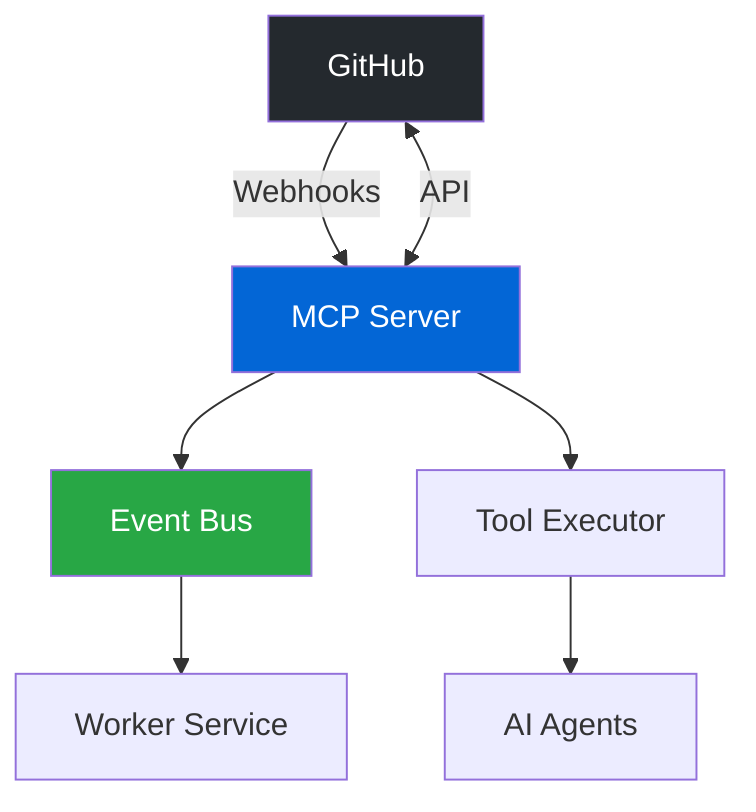

# GitHub Integration Guide

This guide demonstrates how to leverage Developer Mesh's production-ready GitHub adapter for repository automation, webhook processing, and AI-powered workflows.

## Overview

The Developer Mesh GitHub integration provides:

- **🔧 Comprehensive API Coverage**: Issues, PRs, branches, commits, workflows, and more
- **📡 Real-time Webhooks**: Process GitHub events with automatic retry and idempotency
- **🤖 AI Integration**: Connect GitHub operations with LLM agents
- **🔒 Enterprise Security**: OAuth, GitHub Apps, fine-grained permissions
- **⚡ High Performance**: Connection pooling, caching, and batch operations

## Architecture



## Prerequisites

- GitHub personal access token or GitHub App installation
- Developer Mesh deployment (Docker or Kubernetes)
- (Optional) AI service credentials for intelligent automation

## Quick Start

### 1. Initialize GitHub Client

```python
from devops_mcp import MCPClient, GitHubAdapter
from devops_mcp.github import GitHubConfig
import os

# Initialize MCP client
mcp = MCPClient(
    base_url=os.getenv("MCP_BASE_URL", "http://localhost:8080/api/v1"),
    api_key=os.getenv("MCP_API_KEY")
)

# Configure GitHub adapter
github_config = GitHubConfig(
    token=os.getenv("GITHUB_TOKEN"),
    app_id=os.getenv("GITHUB_APP_ID"),  # Optional: for GitHub App
    private_key=os.getenv("GITHUB_PRIVATE_KEY"),
    webhook_secret=os.getenv("GITHUB_WEBHOOK_SECRET")
)

# Initialize GitHub adapter
github = GitHubAdapter(mcp, github_config)
```

### 2. Core GitHub Operations

```python
from typing import List, Dict, Any, Optional
from datetime import datetime

class GitHubOperations:
    """High-level GitHub operations with error handling and retries"""
    
    def __init__(self, github_adapter: GitHubAdapter):
        self.github = github_adapter
        self.retry_policy = RetryPolicy(
            max_attempts=3,
            backoff_factor=2.0
        )
    
    ## Secure GitHub Webhook Authentication

### Setting up Webhook Authentication
```go
// Example: Validating GitHub webhooks with enhanced auth
package main

import (
    "crypto/hmac"
    "crypto/sha256"
    "encoding/hex"
    "net/http"
)

func validateGitHubWebhook(r *http.Request, secret string) bool {
    signature := r.Header.Get("X-Hub-Signature-256")
    if signature == "" {
        return false
    }
    
    body, _ := io.ReadAll(r.Body)
    r.Body = io.NopCloser(bytes.NewBuffer(body))
    
    mac := hmac.New(sha256.New, []byte(secret))
    mac.Write(body)
    expectedMAC := hex.EncodeToString(mac.Sum(nil))
    expectedSignature := "sha256=" + expectedMAC
    
    return hmac.Equal([]byte(signature), []byte(expectedSignature))
}

// Configure in your application
webhookConfig := map[string]interface{}{
    "github": map[string]interface{}{
        "enabled": true,
        "secret": os.Getenv("GITHUB_WEBHOOK_SECRET"),
        "ip_validation": true,
        "allowed_events": []string{"push", "pull_request", "issues"},
    },
}
```

### Using OAuth2 for GitHub Apps
```yaml
# config.yaml
auth:
  oauth2:
    github:
      client_id: ${GITHUB_CLIENT_ID}
      client_secret: ${GITHUB_CLIENT_SECRET}
      redirect_url: "https://api.example.com/auth/github/callback"
      scopes: ["repo", "user:email"]
```
    
    async def create_issue(
        self,
        repo: str,
        title: str,
        body: str,
        labels: List[str] = None,
        assignees: List[str] = None,
        milestone: Optional[int] = None
    ) -> Dict[str, Any]:
        """Create an issue with rich metadata"""
        
        # Format body with metadata
        enriched_body = f"{body}\n\n---\n_Created via Developer Mesh at {datetime.utcnow().isoformat()}_"
        
        result = await self.github.execute_tool("github.create_issue", {
            "repository": repo,
            "title": title,
            "body": enriched_body,
            "labels": labels or [],
            "assignees": assignees or [],
            "milestone": milestone
        })
        
        # Store in context for future reference
        await self.github.store_context({
            "type": "github_issue",
            "issue_number": result["number"],
            "repository": repo,
            "created_at": datetime.utcnow().isoformat()
        })
        
        return result
    
    async def search_issues(
        self,
        query: str,
        repo: Optional[str] = None,
        labels: List[str] = None,
        state: str = "open",
        sort: str = "created",
        limit: int = 100
    ) -> List[Dict[str, Any]]:
        """Advanced issue search with filtering"""
        
        # Build search query
        search_parts = [query]
        if repo:
            search_parts.append(f"repo:{repo}")
        if labels:
            for label in labels:
                search_parts.append(f'label:"{label}"')
        search_parts.append(f"state:{state}")
        
        result = await self.github.execute_tool("github.search_issues", {
            "q": " ".join(search_parts),
            "sort": sort,
            "per_page": min(limit, 100)
        })
        
        return result["items"]
    
    async def create_pull_request(
        self,
        repo: str,
        title: str,
        body: str,
        head: str,
        base: str = "main",
        draft: bool = False,
        maintainer_can_modify: bool = True
    ) -> Dict[str, Any]:
        """Create a pull request with advanced options"""
        
        # Generate PR template if available
        pr_body = await self._generate_pr_body(repo, title, body)
        
        result = await self.github.execute_tool("github.create_pull_request", {
            "repository": repo,
            "title": title,
            "body": pr_body,
            "head": head,
            "base": base,
            "draft": draft,
            "maintainer_can_modify": maintainer_can_modify
        })
        
        # Auto-assign reviewers based on CODEOWNERS
        if result and not draft:
            await self._assign_reviewers(repo, result["number"])
        
        return result
    
    async def _generate_pr_body(self, repo: str, title: str, description: str) -> str:
        """Generate PR body with template and metadata"""
        template = """
## Description
{description}

## Type of Change
- [ ] Bug fix (non-breaking change which fixes an issue)
- [ ] New feature (non-breaking change which adds functionality)
- [ ] Breaking change (fix or feature that would cause existing functionality to not work as expected)
- [ ] Documentation update

## Testing
- [ ] Unit tests pass locally
- [ ] Integration tests pass
- [ ] Manual testing completed

## Checklist
- [ ] My code follows the style guidelines
- [ ] I have performed a self-review
- [ ] I have commented my code, particularly in hard-to-understand areas
- [ ] I have made corresponding changes to the documentation

---
_Generated via Developer Mesh_
"""
        return template.format(description=description)
    
    async def manage_pull_request(
        self,
        repo: str,
        pr_number: int,
        action: str,
        **kwargs
    ) -> Dict[str, Any]:
        """Manage PR lifecycle: review, merge, close, etc."""
        
        actions = {
            "approve": self._approve_pr,
            "request_changes": self._request_changes,
            "merge": self._merge_pr,
            "close": self._close_pr,
            "reopen": self._reopen_pr
        }
        
        handler = actions.get(action)
        if not handler:
            raise ValueError(f"Unknown action: {action}")
        
        return await handler(repo, pr_number, **kwargs)
    
    async def batch_file_operations(
        self,
        repo: str,
        branch: str,
        operations: List[Dict[str, Any]],
        commit_message: str
    ) -> Dict[str, Any]:
        """Perform multiple file operations in a single commit"""
        
        # Get current tree
        tree_sha = await self.github.execute_tool("github.get_branch", {
            "repository": repo,
            "branch": branch
        })
        
        # Build new tree with all changes
        tree_items = []
        for op in operations:
            if op["action"] == "create" or op["action"] == "update":
                blob = await self.github.execute_tool("github.create_blob", {
                    "repository": repo,
                    "content": op["content"],
                    "encoding": "utf-8"
                })
                
                tree_items.append({
                    "path": op["path"],
                    "mode": "100644",
                    "type": "blob",
                    "sha": blob["sha"]
                })
            elif op["action"] == "delete":
                tree_items.append({
                    "path": op["path"],
                    "mode": "100644",
                    "type": "blob",
                    "sha": None  # Deletion
                })
        
        # Create new tree
        new_tree = await self.github.execute_tool("github.create_tree", {
            "repository": repo,
            "tree": tree_items,
            "base_tree": tree_sha["commit"]["tree"]["sha"]
        })
        
        # Create commit
        commit = await self.github.execute_tool("github.create_commit", {
            "repository": repo,
            "message": commit_message,
            "tree": new_tree["sha"],
            "parents": [tree_sha["commit"]["sha"]]
        })
        
        # Update branch reference
        await self.github.execute_tool("github.update_ref", {
            "repository": repo,
            "ref": f"refs/heads/{branch}",
            "sha": commit["sha"]
        })
        
        return commit
```

### 3. Automated Workflows

#### Intelligent PR Creation
```python
class AutomatedWorkflows:
    """Production-ready automated GitHub workflows"""
    
    def __init__(self, github_ops: GitHubOperations, ai_client=None):
        self.github = github_ops
        self.ai = ai_client  # Optional AI integration
    
    async def create_feature_branch_and_pr(
        self,
        repo: str,
        feature_name: str,
        changes: List[Dict[str, Any]],
        use_ai: bool = True
    ) -> Dict[str, Any]:
        """Create feature branch with changes and open PR"""
        
        # Generate branch name
        branch_name = self._sanitize_branch_name(f"feature/{feature_name}")
        
        # Create branch from main
        await self.github.execute_tool("github.create_branch", {
            "repository": repo,
            "branch": branch_name,
            "from_branch": "main"
        })
        
        # Apply changes in single commit
        commit = await self.github.batch_file_operations(
            repo=repo,
            branch=branch_name,
            operations=changes,
            commit_message=f"feat: implement {feature_name}"
        )
        
        # Generate PR description
        if use_ai and self.ai:
            pr_description = await self._generate_ai_pr_description(
                feature_name,
                changes,
                commit
            )
        else:
            pr_description = self._generate_standard_pr_description(
                feature_name,
                changes
            )
        
        # Create pull request
        pr = await self.github.create_pull_request(
            repo=repo,
            title=f"feat: {feature_name}",
            body=pr_description,
            head=branch_name,
            base="main"
        )
        
        # Run automated checks
        await self._run_pr_checks(repo, pr["number"])
        
        return {
            "branch": branch_name,
            "commit": commit["sha"],
            "pr_number": pr["number"],
            "pr_url": pr["html_url"]
        }
    
    async def _generate_ai_pr_description(
        self,
        feature_name: str,
        changes: List[Dict[str, Any]],
        commit: Dict[str, Any]
    ) -> str:
        """Use AI to generate comprehensive PR description"""
        
        prompt = f"""
        Generate a pull request description for the following feature:
        Feature: {feature_name}
        
        Files changed:
        {self._format_changes(changes)}
        
        Commit: {commit['message']}
        
        Include:
        1. Summary of changes
        2. Why these changes were made
        3. Testing considerations
        4. Potential impacts
        """
        
        ai_response = await self.ai.generate(prompt)
        
        return f"{ai_response}\n\n---\n_Generated with AI assistance via Developer Mesh_"
    
    def _sanitize_branch_name(self, name: str) -> str:
        """Sanitize branch name to be Git-compliant"""
        import re
        # Replace invalid characters
        name = re.sub(r'[^a-zA-Z0-9/_-]', '-', name)
        # Remove multiple consecutive dashes
        name = re.sub(r'-+', '-', name)
        # Trim to reasonable length
        return name[:63].strip('-')
```

#### AI-Powered Bug Fix Workflow
```python
class IntelligentBugFixer:
    """AI-powered bug fixing workflow"""
    
    async def fix_bug_from_issue(
        self,
        repo: str,
        issue_number: int
    ) -> Dict[str, Any]:
        """Analyze issue and attempt automated fix"""
        
        # Get issue details
        issue = await self.github.execute_tool("github.get_issue", {
            "repository": repo,
            "issue_number": issue_number
        })
        
        # Analyze issue with AI
        analysis = await self.ai.analyze({
            "type": "bug_report",
            "title": issue["title"],
            "body": issue["body"],
            "labels": [l["name"] for l in issue["labels"]]
        })
        
        if not analysis["fixable"]:
            return {
                "success": False,
                "reason": analysis["reason"]
            }
        
        # Search for relevant code
        code_results = await self._search_relevant_code(
            repo,
            analysis["search_terms"]
        )
        
        # Generate fix
        fix_proposal = await self.ai.generate_fix({
            "issue": issue,
            "analysis": analysis,
            "code_context": code_results
        })
        
        # Create fix branch and PR
        result = await self.create_feature_branch_and_pr(
            repo=repo,
            feature_name=f"fix-issue-{issue_number}",
            changes=fix_proposal["changes"],
            use_ai=True
        )
        
        # Link PR to issue
        await self.github.execute_tool("github.create_issue_comment", {
            "repository": repo,
            "issue_number": issue_number,
            "body": f"I've created PR #{result['pr_number']} to fix this issue: {result['pr_url']}\n\nProposed changes:\n{fix_proposal['summary']}"
        })
        
        return {
            "success": True,
            "pr_number": result["pr_number"],
            "pr_url": result["pr_url"],
            "fix_summary": fix_proposal["summary"]
        }

# Example usage
async def main():
    # Initialize components
    mcp = MCPClient(base_url="http://localhost:8080/api/v1")
    github_ops = GitHubOperations(GitHubAdapter(mcp, github_config))
    ai_client = AIClient()  # Your AI service
    
    workflows = AutomatedWorkflows(github_ops, ai_client)
    bug_fixer = IntelligentBugFixer(github_ops, ai_client)
    
    # Fix a bug from issue
    result = await bug_fixer.fix_bug_from_issue(
        repo="S-Corkum/developer-mesh",
        issue_number=42
    )
    
    if result["success"]:
        print(f"Successfully created fix: {result['pr_url']}")
    else:
        print(f"Could not auto-fix: {result['reason']}")
```

### 4. Advanced Issue Management

```python
class IssueManager:
    """Comprehensive issue tracking and automation"""
    
    async def triage_new_issue(
        self,
        repo: str,
        issue_number: int
    ) -> Dict[str, Any]:
        """Automatically triage and categorize new issues"""
        
        issue = await self.github.execute_tool("github.get_issue", {
            "repository": repo,
            "issue_number": issue_number
        })
        
        # Analyze issue content
        analysis = await self._analyze_issue(issue)
        
        # Apply labels
        labels = self._determine_labels(analysis)
        await self.github.execute_tool("github.add_issue_labels", {
            "repository": repo,
            "issue_number": issue_number,
            "labels": labels
        })
        
        # Assign to appropriate team member
        assignee = await self._determine_assignee(analysis, labels)
        if assignee:
            await self.github.execute_tool("github.assign_issue", {
                "repository": repo,
                "issue_number": issue_number,
                "assignees": [assignee]
            })
        
        # Set priority and milestone
        priority = self._determine_priority(analysis)
        milestone = await self._get_appropriate_milestone(repo, priority)
        
        if milestone:
            await self.github.execute_tool("github.update_issue", {
                "repository": repo,
                "issue_number": issue_number,
                "milestone": milestone["number"]
            })
        
        # Add triage comment
        comment = self._generate_triage_comment(labels, assignee, priority)
        await self.github.execute_tool("github.create_issue_comment", {
            "repository": repo,
            "issue_number": issue_number,
            "body": comment
        })
        
        return {
            "labels": labels,
            "assignee": assignee,
            "priority": priority,
            "milestone": milestone["title"] if milestone else None
        }
    
    async def link_duplicate_issues(
        self,
        repo: str,
        issue_number: int
    ) -> List[int]:
        """Find and link duplicate issues"""
        
        issue = await self.github.execute_tool("github.get_issue", {
            "repository": repo,
            "issue_number": issue_number
        })
        
        # Search for similar issues
        similar_issues = await self.github.search_issues(
            query=issue["title"],
            repo=repo,
            state="all",
            limit=20
        )
        
        duplicates = []
        for similar in similar_issues:
            if similar["number"] == issue_number:
                continue
            
            similarity = await self._calculate_similarity(issue, similar)
            if similarity > 0.85:
                duplicates.append(similar["number"])
        
        # Link duplicates
        if duplicates:
            comment = f"This issue appears to be related to: {', '.join([f'#{n}' for n in duplicates])}"
            await self.github.execute_tool("github.create_issue_comment", {
                "repository": repo,
                "issue_number": issue_number,
                "body": comment
            })
        
        return duplicates
```

### 5. Webhook Processing

```python
from typing import Callable, Dict, Any
import hmac
import hashlib

class GitHubWebhookProcessor:
    """Secure webhook processing with event routing"""
    
    def __init__(self, webhook_secret: str, event_bus):
        self.webhook_secret = webhook_secret
        self.event_bus = event_bus
        self.handlers: Dict[str, List[Callable]] = {}
    
    def verify_signature(self, payload: bytes, signature: str) -> bool:
        """Verify GitHub webhook signature"""
        expected_signature = 'sha256=' + hmac.new(
            self.webhook_secret.encode(),
            payload,
            hashlib.sha256
        ).hexdigest()
        
        return hmac.compare_digest(expected_signature, signature)
    
    async def process_webhook(
        self,
        event_type: str,
        payload: Dict[str, Any],
        delivery_id: str
    ) -> Dict[str, Any]:
        """Process webhook with idempotency"""
        
        # Check if already processed
        if await self._is_duplicate(delivery_id):
            return {"status": "duplicate", "delivery_id": delivery_id}
        
        # Record delivery
        await self._record_delivery(delivery_id)
        
        # Route to handlers
        handlers = self.handlers.get(event_type, [])
        results = []
        
        for handler in handlers:
            try:
                result = await handler(payload)
                results.append({
                    "handler": handler.__name__,
                    "status": "success",
                    "result": result
                })
            except Exception as e:
                results.append({
                    "handler": handler.__name__,
                    "status": "error",
                    "error": str(e)
                })
        
        # Publish to event bus for async processing
        await self.event_bus.publish({
            "type": f"github.{event_type}",
            "payload": payload,
            "delivery_id": delivery_id,
            "timestamp": datetime.utcnow().isoformat()
        })
        
        return {
            "status": "processed",
            "delivery_id": delivery_id,
            "handlers_executed": len(results),
            "results": results
        }
    
    def register_handler(self, event_type: str, handler: Callable):
        """Register webhook event handler"""
        if event_type not in self.handlers:
            self.handlers[event_type] = []
        self.handlers[event_type].append(handler)
    
    # Example handlers
    async def handle_issue_opened(self, payload: Dict[str, Any]):
        """Auto-triage new issues"""
        issue = payload["issue"]
        repo = payload["repository"]["full_name"]
        
        # Triage the issue
        triage_result = await IssueManager().triage_new_issue(
            repo=repo,
            issue_number=issue["number"]
        )
        
        return triage_result
    
    async def handle_pr_opened(self, payload: Dict[str, Any]):
        """Auto-review new PRs"""
        pr = payload["pull_request"]
        repo = payload["repository"]["full_name"]
        
        # Run automated checks
        checks = await self._run_pr_checks(repo, pr["number"])
        
        # Add size label
        size_label = self._calculate_pr_size(pr)
        await self.github.execute_tool("github.add_pr_labels", {
            "repository": repo,
            "pr_number": pr["number"],
            "labels": [f"size/{size_label}"]
        })
        
        return {"checks": checks, "size": size_label}
```

### 6. Complete Production Example

```python
import asyncio
from fastapi import FastAPI, Request, HTTPException
from fastapi.responses import JSONResponse

app = FastAPI(title="Developer Mesh GitHub Integration")

class GitHubIntegrationService:
    """Production GitHub integration service"""
    
    def __init__(self, config: Dict[str, Any]):
        # Initialize components
        self.mcp = MCPClient(
            base_url=config["mcp_base_url"],
            api_key=config["mcp_api_key"]
        )
        
        self.github_config = GitHubConfig(
            token=config["github_token"],
            app_id=config.get("github_app_id"),
            private_key=config.get("github_private_key"),
            webhook_secret=config["github_webhook_secret"]
        )
        
        self.github_adapter = GitHubAdapter(self.mcp, self.github_config)
        self.github_ops = GitHubOperations(self.github_adapter)
        
        # Initialize processors
        self.webhook_processor = GitHubWebhookProcessor(
            webhook_secret=config["github_webhook_secret"],
            event_bus=self.mcp.event_bus
        )
        
        self.issue_manager = IssueManager(self.github_ops)
        self.workflows = AutomatedWorkflows(self.github_ops)
        
        # Register webhook handlers
        self._register_handlers()
    
    def _register_handlers(self):
        """Register all webhook handlers"""
        self.webhook_processor.register_handler(
            "issues",
            self._handle_issue_event
        )
        self.webhook_processor.register_handler(
            "pull_request",
            self._handle_pr_event
        )
        self.webhook_processor.register_handler(
            "issue_comment",
            self._handle_comment_event
        )
    
    async def _handle_issue_event(self, payload: Dict[str, Any]):
        """Handle issue events with automation"""
        action = payload["action"]
        issue = payload["issue"]
        repo = payload["repository"]["full_name"]
        
        if action == "opened":
            # Auto-triage
            await self.issue_manager.triage_new_issue(repo, issue["number"])
            
            # Check for duplicates
            duplicates = await self.issue_manager.link_duplicate_issues(
                repo,
                issue["number"]
            )
            
            # Check if auto-fixable
            labels = [l["name"] for l in issue["labels"]]
            if "bug" in labels and "auto-fix" in labels:
                await self._attempt_auto_fix(repo, issue)
        
        elif action == "labeled":
            # Handle new labels
            label = payload["label"]["name"]
            if label == "needs-reproduction":
                await self._request_reproduction_steps(repo, issue["number"])
    
    async def _handle_pr_event(self, payload: Dict[str, Any]):
        """Handle PR events with automation"""
        action = payload["action"]
        pr = payload["pull_request"]
        repo = payload["repository"]["full_name"]
        
        if action == "opened" or action == "synchronize":
            # Run automated checks
            await self._run_pr_automation(repo, pr)
        
        elif action == "review_requested":
            # Notify reviewers with context
            await self._notify_reviewers_with_context(repo, pr)
    
    async def _run_pr_automation(self, repo: str, pr: Dict[str, Any]):
        """Run comprehensive PR automation"""
        tasks = [
            self._check_pr_compliance(repo, pr),
            self._run_security_scan(repo, pr),
            self._check_test_coverage(repo, pr),
            self._validate_documentation(repo, pr)
        ]
        
        results = await asyncio.gather(*tasks, return_exceptions=True)
        
        # Post status comment
        status_comment = self._generate_pr_status_comment(results)
        await self.github_ops.execute_tool("github.create_pr_comment", {
            "repository": repo,
            "pr_number": pr["number"],
            "body": status_comment
        })

# FastAPI webhook endpoint
@app.post("/webhooks/github")
async def github_webhook(
    request: Request,
    x_github_event: str = Header(None),
    x_hub_signature_256: str = Header(None),
    x_github_delivery: str = Header(None)
):
    # Get payload
    payload = await request.body()
    
    # Verify signature
    if not service.webhook_processor.verify_signature(payload, x_hub_signature_256):
        raise HTTPException(status_code=401, detail="Invalid signature")
    
    # Process webhook
    result = await service.webhook_processor.process_webhook(
        event_type=x_github_event,
        payload=await request.json(),
        delivery_id=x_github_delivery
    )
    
    return JSONResponse(content=result)

# Initialize service
service = GitHubIntegrationService({
    "mcp_base_url": os.getenv("MCP_BASE_URL"),
    "mcp_api_key": os.getenv("MCP_API_KEY"),
    "github_token": os.getenv("GITHUB_TOKEN"),
    "github_webhook_secret": os.getenv("GITHUB_WEBHOOK_SECRET")
})

if __name__ == "__main__":
    import uvicorn
    uvicorn.run(app, host="0.0.0.0", port=8000)
```

## Best Practices

### 1. Security
```yaml
# security-config.yaml
github:
  auth:
    method: app  # 'token' or 'app'
    token_rotation_days: 30
    permissions:
      issues: write
      pull_requests: write
      contents: read
      webhooks: admin
  
  webhook:
    secret_rotation_days: 90
    allowed_events:
      - issues
      - pull_request
      - issue_comment
      - push
    ip_whitelist:
      - 140.82.112.0/20  # GitHub webhook IPs
```

### 2. Rate Limiting & Caching
```python
from functools import lru_cache
from datetime import datetime, timedelta

class RateLimitedGitHub:
    def __init__(self, github_ops: GitHubOperations):
        self.github = github_ops
        self.rate_limiter = RateLimiter(
            calls_per_hour=5000,  # GitHub's limit
            burst_size=100
        )
    
    @lru_cache(maxsize=1000)
    async def get_cached_issue(self, repo: str, issue_number: int):
        """Cache issue data for 5 minutes"""
        return await self.github.get_issue(repo, issue_number)
```

### 3. Error Handling
```python
class GitHubErrorHandler:
    @staticmethod
    async def with_retry(operation, max_retries=3):
        """Retry with exponential backoff"""
        for attempt in range(max_retries):
            try:
                return await operation()
            except GitHubRateLimitError:
                wait_time = 2 ** attempt * 60  # Exponential backoff
                await asyncio.sleep(wait_time)
            except GitHubAPIError as e:
                if e.status_code >= 500:  # Server errors
                    await asyncio.sleep(2 ** attempt)
                else:
                    raise  # Don't retry client errors
        
        raise MaxRetriesExceeded()
```

## Monitoring & Observability

```python
from prometheus_client import Counter, Histogram, Gauge

# Metrics
github_api_calls = Counter('github_api_calls_total', 'Total GitHub API calls', ['operation', 'status'])
github_api_latency = Histogram('github_api_duration_seconds', 'GitHub API call latency', ['operation'])
github_rate_limit = Gauge('github_rate_limit_remaining', 'Remaining GitHub API calls')
webhook_events = Counter('github_webhook_events_total', 'Total webhook events', ['event_type', 'status'])

# Health check
@app.get("/health")
async def health_check():
    rate_limit = await github.get_rate_limit()
    
    return {
        "status": "healthy",
        "github_connected": True,
        "rate_limit": {
            "remaining": rate_limit["remaining"],
            "reset_at": rate_limit["reset"]
        },
        "webhook_deliveries_24h": await get_webhook_delivery_count()
    }
```

## Common Use Cases

1. **🤖 AI-Powered Development**: Automatically generate fixes for bugs
2. **🔍 Code Quality Gates**: Enforce standards on every PR
3. **📦 Dependency Management**: Auto-update and test dependencies
4. **📊 Analytics & Insights**: Track development metrics
5. **🚀 Continuous Deployment**: Deploy on merge to main

## Next Steps

1. **Explore More Examples**: Check out the [AI Agent Integration](ai-agent-integration.md)
2. **API Reference**: See [GitHub Tools API](../api-reference/github-tools.md)
3. **Deploy to Production**: Follow the [deployment guide](../operations/deployment.md)
4. **Contribute**: Add new GitHub tools to the platform

---

*For support, join our [Discord community](https://discord.gg/developer-mesh) or open an issue on [GitHub](https://github.com/S-Corkum/developer-mesh)*
