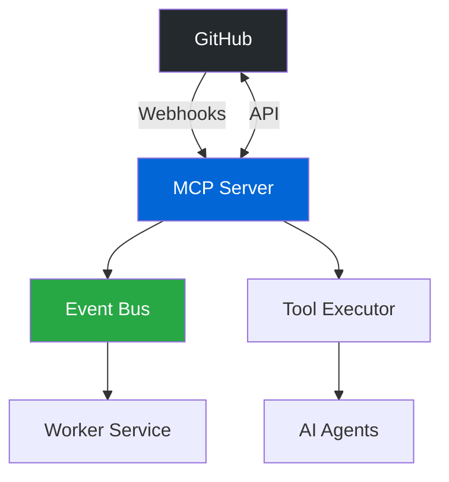

<!-- SOURCE VERIFICATION
Last Verified: 2025-08-11 14:35:57
Verification Script: update-docs-parallel.sh
Batch: ab
-->

# GitHub Integration Guide

This guide demonstrates how to leverage Developer Mesh's production-ready GitHub adapter for repository automation, webhook processing, and AI-powered workflows.

## Overview

The Developer Mesh GitHub integration provides:

- **🔧 Comprehensive API Coverage**: Issues, PRs, branches, commits, workflows, and more
- **📡 Real-time Webhooks**: Process GitHub events with automatic retry and idempotency
- **🤖 AI Integration**: Connect GitHub operations with LLM agents
- **🔒 Enterprise Security**: OAuth, GitHub Apps, fine-grained permissions
- **⚡ High Performance**: Connection pooling, caching, and batch operations

## Architecture



## Prerequisites

- GitHub personal access token or GitHub App installation
- Developer Mesh deployment (Docker or Kubernetes)
- (Optional) AI service credentials for intelligent automation

## Quick Start

### 1. Initialize GitHub Client

```go
package main

import (
    "context"
    "os"
    
    "github.com/developer-mesh/developer-mesh/pkg/adapters/github"
    "github.com/developer-mesh/developer-mesh/pkg/client"
    "github.com/developer-mesh/developer-mesh/pkg/observability"
)

func main() {
    // Initialize MCP client
    mcp := client.NewMCPClient(
        os.Getenv("MCP_BASE_URL"),
        os.Getenv("MCP_API_KEY"),
    )
    
    // Configure GitHub adapter
    githubConfig := &github.Config{
        Token:         os.Getenv("GITHUB_TOKEN"),
        AppID:         os.Getenv("GITHUB_APP_ID"),
        PrivateKey:    os.Getenv("GITHUB_PRIVATE_KEY"),
        WebhookSecret: os.Getenv("GITHUB_WEBHOOK_SECRET"),
    }
    
    // Initialize GitHub adapter with logger
    logger := observability.NewLogger("github-integration")
    githubAdapter := github.NewAdapter(githubConfig, logger)
    
    // Use the adapter
    ctx := context.Background()
    // Example operations follow...
}
```

### 2. Core GitHub Operations

```go
package operations

import (
    "context"
    "fmt"
    "time"
    
    "github.com/developer-mesh/developer-mesh/pkg/adapters/github"
    "github.com/developer-mesh/developer-mesh/pkg/resilience"
)

type GitHubOperations struct {
    github      *github.Adapter
    retryPolicy *resilience.RetryPolicy
}

func NewGitHubOperations(adapter *github.Adapter) *GitHubOperations {
    return &GitHubOperations{
        github: adapter,
        retryPolicy: &resilience.RetryPolicy{
            MaxAttempts:   3,
            BackoffFactor: 2.0,
        },
    }
}

// CreateIssue creates a new GitHub issue with retry logic
func (g *GitHubOperations) CreateIssue(ctx context.Context, repo, title, body string) error {
    return g.retryPolicy.Execute(func() error {
        return g.github.CreateIssue(ctx, repo, title, body)
    })
}
```

## Secure GitHub Webhook Authentication

### Setting up Webhook Authentication
```go
// Example: Validating GitHub webhooks with enhanced auth
package main

import (
    "crypto/hmac"
    "crypto/sha256"
    "encoding/hex"
    "net/http"
)

func validateGitHubWebhook(r *http.Request, secret string) bool {
    signature := r.Header.Get("X-Hub-Signature-256")
    if signature == "" {
        return false
    }
    
    body, _ := io.ReadAll(r.Body)
    r.Body = io.NopCloser(bytes.NewBuffer(body))
    
    mac := hmac.New(sha256.New, []byte(secret))
    mac.Write(body)
    expectedMAC := hex.EncodeToString(mac.Sum(nil))
    expectedSignature := "sha256=" + expectedMAC
    
    return hmac.Equal([]byte(signature), []byte(expectedSignature))
}

// Configure in your application
webhookConfig := map[string]interface{}{
    "github": map[string]interface{}{
        "enabled": true,
        "secret": os.Getenv("GITHUB_WEBHOOK_SECRET"),
        "ip_validation": true,
        "allowed_events": []string{"push", "pull_request", "issues"},
    },
}
```

### Using OAuth2 for GitHub Apps
```yaml
# config.yaml
auth:
  oauth2:
    github:
      client_id: ${GITHUB_CLIENT_ID}
      client_secret: ${GITHUB_CLIENT_SECRET}
      redirect_url: "https://api.example.com/auth/github/callback"
      scopes: ["repo", "user:email"]
### 3. Working with Issues

```go
package github

import (
    "context"
    "fmt"
    "time"
)

// CreateIssue creates a GitHub issue with metadata
func (g *GitHubOperations) CreateIssue(
    ctx context.Context,
    repo, title, body string,
    labels []string,
    assignees []string,
) (*Issue, error) {
    // Enrich body with metadata
    enrichedBody := fmt.Sprintf("%s\n\n---\n_Created via Developer Mesh at %s_",
        body, time.Now().UTC().Format(time.RFC3339))
    
    issue := &IssueRequest{
        Title:     title,
        Body:      enrichedBody,
        Labels:    labels,
        Assignees: assignees,
    }
    
    result, err := g.github.CreateIssue(ctx, repo, issue)
    if err != nil {
        return nil, fmt.Errorf("failed to create issue: %w", err)
    }
    
    // Store in context for future reference
    _ = g.storeContext(ctx, map[string]interface{}{
        "type":        "github_issue",
        "issue_number": result.Number,
        "repository":   repo,
        "created_at":   time.Now().UTC(),
    })
    
    return result, nil
}

// SearchIssues performs advanced issue search with filtering
func (g *GitHubOperations) SearchIssues(
    ctx context.Context,
    query string,
    repo string,
    labels []string,
    state string,
) ([]*Issue, error) {
    // Build search query
    searchParts := []string{query}
    if repo != "" {
        searchParts = append(searchParts, fmt.Sprintf("repo:%s", repo))
    }
    for _, label := range labels {
        searchParts = append(searchParts, fmt.Sprintf(`label:"%s"`, label))
    }
    if state != "" {
        searchParts = append(searchParts, fmt.Sprintf("state:%s", state))
    }
    
    searchQuery := strings.Join(searchParts, " ")
    return g.github.SearchIssues(ctx, searchQuery)
}
```

### 4. Working with Pull Requests

```go
// CreatePullRequest creates a pull request with advanced options
func (g *GitHubOperations) CreatePullRequest(
    ctx context.Context,
    repo, title, body, head, base string,
    draft bool,
) (*PullRequest, error) {
    // Generate PR template
    prBody := g.generatePRBody(title, body)
    
    pr := &PullRequestRequest{
        Title: title,
        Body:  prBody,
        Head:  head,
        Base:  base,
        Draft: draft,
    }
    
    result, err := g.github.CreatePullRequest(ctx, repo, pr)
    if err != nil {
        return nil, fmt.Errorf("failed to create pull request: %w", err)
    }
    
    // Auto-assign reviewers if not a draft
    if !draft && result.Number > 0 {
        _ = g.assignReviewers(ctx, repo, result.Number)
    }
    
    return result, nil
}

// generatePRBody creates a formatted PR description
func (g *GitHubOperations) generatePRBody(title, description string) string {
    template := `## Description
%s

## Type of Change
- [ ] Bug fix (non-breaking change which fixes an issue)
- [ ] New feature (non-breaking change which adds functionality)
- [ ] Breaking change (fix or feature that would cause existing functionality to not work as expected)
- [ ] Documentation update

## Testing
- [ ] Unit tests pass locally
- [ ] Integration tests pass
- [ ] Manual testing completed

## Checklist
- [ ] My code follows the style guidelines
- [ ] I have performed a self-review
- [ ] I have commented my code, particularly in hard-to-understand areas
- [ ] I have made corresponding changes to the documentation

---
_Generated via Developer Mesh_
    return fmt.Sprintf(template, description)
}
```

### 5. Batch File Operations

```go
// BatchFileOperation represents a single file operation
type BatchFileOperation struct {
    Action  string // "create", "update", "delete"
    Path    string
    Content string
}

// BatchFileOperations performs multiple file operations in a single commit
func (g *GitHubOperations) BatchFileOperations(
    ctx context.Context,
    repo, branch string,
    operations []BatchFileOperation,
    commitMessage string,
) (*Commit, error) {
    // Implementation would use GitHub's Tree API
    // to create all changes in a single commit
    return g.github.CreateCommit(ctx, repo, branch, operations, commitMessage)
}
```

### 6. Automated Workflows

#### Intelligent PR Creation
```go
package workflows

import (
    "context"
    "fmt"
    "strings"
    
    "github.com/developer-mesh/developer-mesh/pkg/adapters/github"
)

type AutomatedWorkflows struct {
    github *github.GitHubOperations
    ai     AIClient // Optional AI integration
}

// CreateFeatureBranchAndPR creates a feature branch with changes and opens a PR
func (w *AutomatedWorkflows) CreateFeatureBranchAndPR(
    ctx context.Context,
    repo, featureName string,
    changes []BatchFileOperation,
) (*PullRequest, error) {
    // Generate branch name
    branchName := w.sanitizeBranchName(fmt.Sprintf("feature/%s", featureName))
    
    // Create branch from main
    err := w.github.CreateBranch(ctx, repo, branchName, "main")
    if err != nil {
        return nil, fmt.Errorf("failed to create branch: %w", err)
    }
    
    // Apply changes in single commit
    commitMsg := fmt.Sprintf("feat: implement %s", featureName)
    _, err = w.github.BatchFileOperations(ctx, repo, branchName, changes, commitMsg)
    if err != nil {
        return nil, fmt.Errorf("failed to commit changes: %w", err)
    }
    
    // Generate PR description
    prDescription := w.generatePRDescription(featureName, changes)
    
    // Create pull request
    pr, err := w.github.CreatePullRequest(
        ctx, repo,
        fmt.Sprintf("feat: %s", featureName),
        prDescription,
        branchName,
        "main",
        false, // not a draft
    )
    if err != nil {
        return nil, fmt.Errorf("failed to create PR: %w", err)
    }
    
    // Run automated checks
    _ = w.runPRChecks(ctx, repo, pr.Number)
    
    return pr, nil
}

// sanitizeBranchName ensures branch name is valid
func (w *AutomatedWorkflows) sanitizeBranchName(name string) string {
    // Replace spaces and special chars with hyphens
    name = strings.ReplaceAll(name, " ", "-")
    name = strings.ToLower(name)
    // Remove any non-alphanumeric characters except hyphens and slashes
    // Implementation details...
    return name
}
```
        
        return {
            "branch": branch_name,
            "commit": commit["sha"],
            "pr_number": pr["number"],
            "pr_url": pr["html_url"]
        }
    
    async def _generate_ai_pr_description(
        self,
        feature_name: str,
        changes: List[Dict[str, Any]],
        commit: Dict[str, Any]
    ) -> str:
        """Use AI to generate comprehensive PR description"""
        
        prompt = f"""
        Generate a pull request description for the following feature:
        Feature: {feature_name}
        
        Files changed:
        {self._format_changes(changes)}
        
        Commit: {commit['message']}
        
        Include:
        1. Summary of changes
        2. Why these changes were made
        3. Testing considerations
        4. Potential impacts
        """
        
        ai_response = await self.ai.generate(prompt)
        
        return f"{ai_response}\n\n---\n_Generated with AI assistance via Developer Mesh_"
    
    def _sanitize_branch_name(self, name: str) -> str:
        """Sanitize branch name to be Git-compliant"""
        import re
        # Replace invalid characters
        name = re.sub(r'[^a-zA-Z0-9/_-]', '-', name)
        # Remove multiple consecutive dashes
        name = re.sub(r'-+', '-', name)
        # Trim to reasonable length
        return name[:63].strip('-')
```

#### AI-Powered Bug Fix Workflow
```python
class IntelligentBugFixer:
    """AI-powered bug fixing workflow"""
    
    async def fix_bug_from_issue(
        self,
        repo: str,
        issue_number: int
    ) -> Dict[str, Any]:
        """Analyze issue and attempt automated fix"""
        
        # Get issue details
        issue = await self.github.execute_tool("github.get_issue", {
            "repository": repo,
            "issue_number": issue_number
        })
        
        # Analyze issue with AI
        analysis = await self.ai.analyze({
            "type": "bug_report",
            "title": issue["title"],
            "body": issue["body"],
            "labels": [l["name"] for l in issue["labels"]]
        })
        
        if not analysis["fixable"]:
            return {
                "success": False,
                "reason": analysis["reason"]
            }
        
        # Search for relevant code
        code_results = await self._search_relevant_code(
            repo,
            analysis["search_terms"]
        )
        
        # Generate fix
        fix_proposal = await self.ai.generate_fix({
            "issue": issue,
            "analysis": analysis,
            "code_context": code_results
        })
        
        # Create fix branch and PR
        result = await self.create_feature_branch_and_pr(
            repo=repo,
            feature_name=f"fix-issue-{issue_number}",
            changes=fix_proposal["changes"],
            use_ai=True
        )
        
        # Link PR to issue
        await self.github.execute_tool("github.create_issue_comment", {
            "repository": repo,
            "issue_number": issue_number,
            "body": f"I've created PR #{result['pr_number']} to fix this issue: {result['pr_url']}\n\nProposed changes:\n{fix_proposal['summary']}"
        })
        
        return {
            "success": True,
            "pr_number": result["pr_number"],
            "pr_url": result["pr_url"],
            "fix_summary": fix_proposal["summary"]
        }

# Example usage
async def main():
    # Initialize components
    mcp = MCPClient(base_url="http://localhost:8081/api/v1")
    github_ops = GitHubOperations(GitHubAdapter(mcp, github_config))
    ai_client = AIClient()  # Your AI service
    
    workflows = AutomatedWorkflows(github_ops, ai_client)
    bug_fixer = IntelligentBugFixer(github_ops, ai_client)
    
    # Fix a bug from issue
    result = await bug_fixer.fix_bug_from_issue(
        repo="developer-mesh/developer-mesh",
        issue_number=42
    )
    
    if result["success"]:
        print(f"Successfully created fix: {result['pr_url']}")
    else:
        print(f"Could not auto-fix: {result['reason']}")
```

### 4. Advanced Issue Management

```python
class IssueManager:
    """Comprehensive issue tracking and automation"""
    
    async def triage_new_issue(
        self,
        repo: str,
        issue_number: int
    ) -> Dict[str, Any]:
        """Automatically triage and categorize new issues"""
        
        issue = await self.github.execute_tool("github.get_issue", {
            "repository": repo,
            "issue_number": issue_number
        })
        
        # Analyze issue content
        analysis = await self._analyze_issue(issue)
        
        # Apply labels
        labels = self._determine_labels(analysis)
        await self.github.execute_tool("github.add_issue_labels", {
            "repository": repo,
            "issue_number": issue_number,
            "labels": labels
        })
        
        # Assign to appropriate team member
        assignee = await self._determine_assignee(analysis, labels)
        if assignee:
            await self.github.execute_tool("github.assign_issue", {
                "repository": repo,
                "issue_number": issue_number,
                "assignees": [assignee]
            })
        
        # Set priority and milestone
        priority = self._determine_priority(analysis)
        milestone = await self._get_appropriate_milestone(repo, priority)
        
        if milestone:
            await self.github.execute_tool("github.update_issue", {
                "repository": repo,
                "issue_number": issue_number,
                "milestone": milestone["number"]
            })
        
        # Add triage comment
        comment = self._generate_triage_comment(labels, assignee, priority)
        await self.github.execute_tool("github.create_issue_comment", {
            "repository": repo,
            "issue_number": issue_number,
            "body": comment
        })
        
        return {
            "labels": labels,
            "assignee": assignee,
            "priority": priority,
            "milestone": milestone["title"] if milestone else None
        }
    
    async def link_duplicate_issues(
        self,
        repo: str,
        issue_number: int
    ) -> List[int]:
        """Find and link duplicate issues"""
        
        issue = await self.github.execute_tool("github.get_issue", {
            "repository": repo,
            "issue_number": issue_number
        })
        
        # Search for similar issues
        similar_issues = await self.github.search_issues(
            query=issue["title"],
            repo=repo,
            state="all",
            limit=20
        )
        
        duplicates = []
        for similar in similar_issues:
            if similar["number"] == issue_number:
                continue
            
            similarity = await self._calculate_similarity(issue, similar)
            if similarity > 0.85:
                duplicates.append(similar["number"])
        
        # Link duplicates
        if duplicates:
            comment = f"This issue appears to be related to: {', '.join([f'#{n}' for n in duplicates])}"
            await self.github.execute_tool("github.create_issue_comment", {
                "repository": repo,
                "issue_number": issue_number,
                "body": comment
            })
        
        return duplicates
```

### 5. Webhook Processing

```python
from typing import Callable, Dict, Any
import hmac
import hashlib

class GitHubWebhookProcessor:
    """Secure webhook processing with event routing"""
    
    def __init__(self, webhook_secret: str, event_bus):
        self.webhook_secret = webhook_secret
        self.event_bus = event_bus
        self.handlers: Dict[str, List[Callable]] = {}
    
    def verify_signature(self, payload: bytes, signature: str) -> bool:
        """Verify GitHub webhook signature"""
        expected_signature = 'sha256=' + hmac.new(
            self.webhook_secret.encode(),
            payload,
            hashlib.sha256
        ).hexdigest()
        
        return hmac.compare_digest(expected_signature, signature)
    
    async def process_webhook(
        self,
        event_type: str,
        payload: Dict[str, Any],
        delivery_id: str
    ) -> Dict[str, Any]:
        """Process webhook with idempotency"""
        
        # Check if already processed
        if await self._is_duplicate(delivery_id):
            return {"status": "duplicate", "delivery_id": delivery_id}
        
        # Record delivery
        await self._record_delivery(delivery_id)
        
        # Route to handlers
        handlers = self.handlers.get(event_type, [])
        results = []
        
        for handler in handlers:
            try:
                result = await handler(payload)
                results.append({
                    "handler": handler.__name__,
                    "status": "success",
                    "result": result
                })
            except Exception as e:
                results.append({
                    "handler": handler.__name__,
                    "status": "error",
                    "error": str(e)
                })
        
        # Publish to event bus for async processing
        await self.event_bus.publish({
            "type": f"github.{event_type}",
            "payload": payload,
            "delivery_id": delivery_id,
            "timestamp": datetime.utcnow().isoformat()
        })
        
        return {
            "status": "processed",
            "delivery_id": delivery_id,
            "handlers_executed": len(results),
            "results": results
        }
    
    def register_handler(self, event_type: str, handler: Callable):
        """Register webhook event handler"""
        if event_type not in self.handlers:
            self.handlers[event_type] = []
        self.handlers[event_type].append(handler)
    
    # Example handlers
    async def handle_issue_opened(self, payload: Dict[str, Any]):
        """Auto-triage new issues"""
        issue = payload["issue"]
        repo = payload["repository"]["full_name"]
        
        # Triage the issue
        triage_result = await IssueManager().triage_new_issue(
            repo=repo,
            issue_number=issue["number"]
        )
        
        return triage_result
    
    async def handle_pr_opened(self, payload: Dict[str, Any]):
        """Auto-review new PRs"""
        pr = payload["pull_request"]
        repo = payload["repository"]["full_name"]
        
        # Run automated checks
        checks = await self._run_pr_checks(repo, pr["number"])
        
        # Add size label
        size_label = self._calculate_pr_size(pr)
        await self.github.execute_tool("github.add_pr_labels", {
            "repository": repo,
            "pr_number": pr["number"],
            "labels": [f"size/{size_label}"]
        })
        
        return {"checks": checks, "size": size_label}
```

### 6. Complete Production Example

```python
import asyncio
from fastapi import FastAPI, Request, HTTPException
from fastapi.responses import JSONResponse

app = FastAPI(title="Developer Mesh GitHub Integration")

class GitHubIntegrationService:
    """Production GitHub integration service"""
    
    def __init__(self, config: Dict[str, Any]):
        # Initialize components
        self.mcp = MCPClient(
            base_url=config["mcp_base_url"],
            api_key=config["mcp_api_key"]
        )
        
        self.github_config = GitHubConfig(
            token=config["github_token"],
            app_id=config.get("github_app_id"),
            private_key=config.get("github_private_key"),
            webhook_secret=config["github_webhook_secret"]
        )
        
        self.github_adapter = GitHubAdapter(self.mcp, self.github_config)
        self.github_ops = GitHubOperations(self.github_adapter)
        
        # Initialize processors
        self.webhook_processor = GitHubWebhookProcessor(
            webhook_secret=config["github_webhook_secret"],
            event_bus=self.mcp.event_bus
        )
        
        self.issue_manager = IssueManager(self.github_ops)
        self.workflows = AutomatedWorkflows(self.github_ops)
        
        # Register webhook handlers
        self._register_handlers()
    
    def _register_handlers(self):
        """Register all webhook handlers"""
        self.webhook_processor.register_handler(
            "issues",
            self._handle_issue_event
        )
        self.webhook_processor.register_handler(
            "pull_request",
            self._handle_pr_event
        )
        self.webhook_processor.register_handler(
            "issue_comment",
            self._handle_comment_event
        )
    
    async def _handle_issue_event(self, payload: Dict[str, Any]):
        """Handle issue events with automation"""
        action = payload["action"]
        issue = payload["issue"]
        repo = payload["repository"]["full_name"]
        
        if action == "opened":
            # Auto-triage
            await self.issue_manager.triage_new_issue(repo, issue["number"])
            
            # Check for duplicates
            duplicates = await self.issue_manager.link_duplicate_issues(
                repo,
                issue["number"]
            )
            
            # Check if auto-fixable
            labels = [l["name"] for l in issue["labels"]]
            if "bug" in labels and "auto-fix" in labels:
                await self._attempt_auto_fix(repo, issue)
        
        elif action == "labeled":
            # Handle new labels
            label = payload["label"]["name"]
            if label == "needs-reproduction":
                await self._request_reproduction_steps(repo, issue["number"])
    
    async def _handle_pr_event(self, payload: Dict[str, Any]):
        """Handle PR events with automation"""
        action = payload["action"]
        pr = payload["pull_request"]
        repo = payload["repository"]["full_name"]
        
        if action == "opened" or action == "synchronize":
            # Run automated checks
            await self._run_pr_automation(repo, pr)
        
        elif action == "review_requested":
            # Notify reviewers with context
            await self._notify_reviewers_with_context(repo, pr)
    
    async def _run_pr_automation(self, repo: str, pr: Dict[str, Any]):
        """Run comprehensive PR automation"""
        tasks = [
            self._check_pr_compliance(repo, pr),
            self._run_security_scan(repo, pr),
            self._check_test_coverage(repo, pr),
            self._validate_documentation(repo, pr)
        ]
        
        results = await asyncio.gather(*tasks, return_exceptions=True)
        
        # Post status comment
        status_comment = self._generate_pr_status_comment(results)
        await self.github_ops.execute_tool("github.create_pr_comment", {
            "repository": repo,
            "pr_number": pr["number"],
            "body": status_comment
        })

# FastAPI webhook endpoint
@app.post("/webhooks/github")
async def github_webhook(
    request: Request,
    x_github_event: str = Header(None),
    x_hub_signature_256: str = Header(None),
    x_github_delivery: str = Header(None)
):
    # Get payload
    payload = await request.body()
    
    # Verify signature
    if not service.webhook_processor.verify_signature(payload, x_hub_signature_256):
        raise HTTPException(status_code=401, detail="Invalid signature")
    
    # Process webhook
    result = await service.webhook_processor.process_webhook(
        event_type=x_github_event,
        payload=await request.json(),
        delivery_id=x_github_delivery
    )
    
    return JSONResponse(content=result)

# Initialize service
service = GitHubIntegrationService({
    "mcp_base_url": os.getenv("MCP_BASE_URL"),
    "mcp_api_key": os.getenv("MCP_API_KEY"),
    "github_token": os.getenv("GITHUB_TOKEN"),
    "github_webhook_secret": os.getenv("GITHUB_WEBHOOK_SECRET")
})

if __name__ == "__main__":
    import uvicorn
    uvicorn.run(app, host="0.0.0.0", port=8000)
```

## Best Practices

### 1. Security
```yaml
# security-config.yaml
github:
  auth:
    method: app  # 'token' or 'app'
    token_rotation_days: 30
    permissions:
      issues: write
      pull_requests: write
      contents: read
      webhooks: admin
  
  webhook:
    secret_rotation_days: 90
    allowed_events:
      - issues
      - pull_request
      - issue_comment
      - push
    ip_whitelist:
      - 140.82.112.0/20  # GitHub webhook IPs
```

### 2. Rate Limiting & Caching
```python
from functools import lru_cache
from datetime import datetime, timedelta

class RateLimitedGitHub:
    def __init__(self, github_ops: GitHubOperations):
        self.github = github_ops
        self.rate_limiter = RateLimiter(
            calls_per_hour=5000,  # GitHub's limit
            burst_size=100
        )
    
    @lru_cache(maxsize=1000)
    async def get_cached_issue(self, repo: str, issue_number: int):
        """Cache issue data for 5 minutes"""
        return await self.github.get_issue(repo, issue_number)
```

### 3. Error Handling
```python
class GitHubErrorHandler:
    @staticmethod
    async def with_retry(operation, max_retries=3):
        """Retry with exponential backoff"""
        for attempt in range(max_retries):
            try:
                return await operation()
            except GitHubRateLimitError:
                wait_time = 2 ** attempt * 60  # Exponential backoff
                await asyncio.sleep(wait_time)
            except GitHubAPIError as e:
                if e.status_code >= 500:  # Server errors
                    await asyncio.sleep(2 ** attempt)
                else:
                    raise  # Don't retry client errors
        
        raise MaxRetriesExceeded()
```

## Monitoring & Observability

```python
from prometheus_client import Counter, Histogram, Gauge

# Metrics
github_api_calls = Counter('github_api_calls_total', 'Total GitHub API calls', ['operation', 'status'])
github_api_latency = Histogram('github_api_duration_seconds', 'GitHub API call latency', ['operation'])
github_rate_limit = Gauge('github_rate_limit_remaining', 'Remaining GitHub API calls')
webhook_events = Counter('github_webhook_events_total', 'Total webhook events', ['event_type', 'status'])

# Health check
@app.get("/health")
async def health_check():
    rate_limit = await github.get_rate_limit()
    
    return {
        "status": "healthy",
        "github_connected": True,
        "rate_limit": {
            "remaining": rate_limit["remaining"],
            "reset_at": rate_limit["reset"]
        },
        "webhook_deliveries_24h": await get_webhook_delivery_count()
    }
```

## Common Use Cases

1. **🤖 AI-Powered Development**: Automatically generate fixes for bugs
2. **🔍 Code Quality Gates**: Enforce standards on every PR
3. **📦 Dependency Management**: Auto-update and test dependencies
4. **📊 Analytics & Insights**: Track development metrics
5. **🚀 Continuous Deployment**: Deploy on merge to main

## Next Steps

1. **Explore More Examples**: Check out the [AI Agent Integration](ai-agent-integration.md)
2. **API Reference**: See [GitHub Tools API](../api-reference/github-tools.md)
3. **Deploy to Production**: Follow the [deployment guide](../operations/deployment.md)
4. **Contribute**: Add new GitHub tools to the platform

---

*For support, join our [Discord community](https://discord.gg/developer-mesh) or open an issue on [GitHub](https://github.com/developer-mesh/developer-mesh)*
