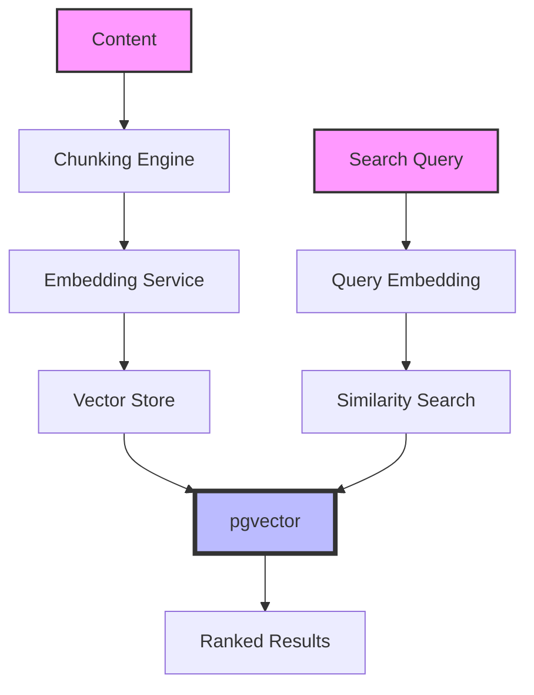

# Vector Search Implementation

This guide demonstrates how to implement production-ready semantic vector search using DevOps MCP's multi-model embedding support and pgvector integration.

## Overview

The DevOps MCP platform provides state-of-the-art vector search capabilities:

- **🚀 Multi-Model Support**: OpenAI, Anthropic Claude, AWS Bedrock, and open-source models
- **⚡ High Performance**: pgvector with optimized indexing (IVFFlat, HNSW)
- **🎯 Smart Chunking**: Language-aware chunking for 15+ programming languages
- **📊 Hybrid Search**: Combine vector similarity with metadata filtering
- **🔄 Real-time Updates**: Automatic re-indexing on content changes

## Architecture



## Use Cases

- **📚 Knowledge Base Search**: Semantic search across documentation
- **🐛 Issue Deduplication**: Find similar bugs and feature requests
- **💬 Conversation Context**: Retrieve relevant chat history for AI agents
- **🔍 Code Search**: Find semantically similar code patterns
- **📝 Content Recommendations**: Suggest related documents or resources

## Quick Start

### 1. Initialize Vector Client

```python
from devops_mcp import VectorClient, EmbeddingModel
from devops_mcp.chunking import SmartChunker
import os

# Initialize client with your preferred embedding model
vector_client = VectorClient(
    base_url=os.getenv("VECTOR_API_URL", "http://localhost:8081/api/v1"),
    api_key=os.getenv("MCP_API_KEY"),
    model=EmbeddingModel.OPENAI_3_SMALL  # or CLAUDE_3_HAIKU, VOYAGE_2, etc.
)

# Initialize smart chunker for code-aware chunking
chunker = SmartChunker(
    chunk_size=1000,
    chunk_overlap=200,
    language_aware=True  # Enables language-specific chunking
)
```

### 2. Multi-Model Embedding Support

```python
from devops_mcp.embeddings import EmbeddingFactory, ModelConfig
from typing import List, Dict, Any

class MultiModelEmbedder:
    """Support multiple embedding models for different use cases"""
    
    def __init__(self):
        self.models = {
            "fast": EmbeddingFactory.create(
                ModelConfig(
                    provider="openai",
                    model="text-embedding-3-small",
                    dimensions=1536
                )
            ),
            "accurate": EmbeddingFactory.create(
                ModelConfig(
                    provider="anthropic",
                    model="claude-3-haiku",
                    dimensions=1024
                )
            ),
            "multilingual": EmbeddingFactory.create(
                ModelConfig(
                    provider="voyage",
                    model="voyage-2",
                    dimensions=1024
                )
            )
        }
    
    async def embed_with_model(self, text: str, model_type: str = "fast") -> List[float]:
        """Generate embedding with specified model type"""
        model = self.models.get(model_type, self.models["fast"])
        return await model.embed(text)
    
    async def embed_batch(self, texts: List[str], model_type: str = "fast") -> List[List[float]]:
        """Batch embed multiple texts for efficiency"""
        model = self.models.get(model_type, self.models["fast"])
        return await model.embed_batch(texts)
```

### 3. Smart Document Processing

```python
from datetime import datetime
from typing import Optional
import hashlib

class DocumentProcessor:
    """Process and store documents with intelligent chunking"""
    
    def __init__(self, vector_client: VectorClient, chunker: SmartChunker):
        self.vector_client = vector_client
        self.chunker = chunker
        self.embedder = MultiModelEmbedder()
    
    async def process_document(
        self,
        context_id: str,
        content: str,
        metadata: Dict[str, Any],
        language: Optional[str] = None
    ) -> List[str]:
        """Process a document with smart chunking and embedding"""
        
        # Detect language if not provided
        if not language and metadata.get("file_path"):
            language = self._detect_language(metadata["file_path"])
        
        # Smart chunking based on content type
        chunks = self.chunker.chunk(
            content,
            language=language,
            preserve_structure=True
        )
        
        # Process each chunk
        embedding_ids = []
        for idx, chunk in enumerate(chunks):
            # Generate content hash for deduplication
            content_hash = hashlib.sha256(chunk.text.encode()).hexdigest()[:16]
            
            # Check if already processed
            existing = await self.vector_client.find_by_hash(content_hash)
            if existing:
                embedding_ids.append(existing.id)
                continue
            
            # Generate embedding
            embedding = await self.embedder.embed_with_model(
                chunk.text,
                model_type="accurate" if chunk.is_important else "fast"
            )
            
            # Store embedding
            result = await self.vector_client.create_embedding({
                "context_id": context_id,
                "content_index": idx,
                "text": chunk.text,
                "embedding": embedding,
                "metadata": {
                    **metadata,
                    "chunk_type": chunk.type,
                    "chunk_metadata": chunk.metadata,
                    "content_hash": content_hash,
                    "language": language,
                    "processed_at": datetime.utcnow().isoformat()
                }
            })
            
            embedding_ids.append(result.id)
        
        return embedding_ids
    
    def _detect_language(self, file_path: str) -> Optional[str]:
        """Detect programming language from file extension"""
        ext_map = {
            ".py": "python",
            ".js": "javascript",
            ".ts": "typescript",
            ".go": "go",
            ".rs": "rust",
            ".java": "java",
            ".kt": "kotlin",
            ".rb": "ruby",
            ".cpp": "cpp",
            ".c": "c",
            ".cs": "csharp",
            ".php": "php",
            ".swift": "swift",
            ".scala": "scala",
            ".r": "r"
        }
        
        ext = os.path.splitext(file_path)[1].lower()
        return ext_map.get(ext)
```

### 4. Batch Processing with Progress Tracking

```python
import asyncio
from concurrent.futures import ThreadPoolExecutor
from tqdm.asyncio import tqdm

class BatchProcessor:
    """Efficient batch processing with concurrency control"""
    
    def __init__(self, vector_client: VectorClient, max_concurrent: int = 10):
        self.vector_client = vector_client
        self.processor = DocumentProcessor(vector_client, SmartChunker())
        self.max_concurrent = max_concurrent
    
    async def process_directory(
        self,
        directory: str,
        context_id: str,
        file_patterns: List[str] = None
    ) -> Dict[str, Any]:
        """Process all files in a directory with pattern matching"""
        
        # Default patterns for code files
        if not file_patterns:
            file_patterns = [
                "**/*.py", "**/*.js", "**/*.ts", "**/*.go",
                "**/*.java", "**/*.md", "**/*.yaml", "**/*.json"
            ]
        
        # Collect files
        files_to_process = []
        for pattern in file_patterns:
            files_to_process.extend(glob.glob(
                os.path.join(directory, pattern),
                recursive=True
            ))
        
        # Remove duplicates and sort
        files_to_process = sorted(set(files_to_process))
        
        # Process with concurrency control
        semaphore = asyncio.Semaphore(self.max_concurrent)
        results = {"success": [], "failed": [], "skipped": []}
        
        async def process_file(file_path: str):
            async with semaphore:
                try:
                    # Skip if file too large
                    if os.path.getsize(file_path) > 1_000_000:  # 1MB
                        results["skipped"].append({
                            "file": file_path,
                            "reason": "File too large"
                        })
                        return
                    
                    # Read file content
                    with open(file_path, 'r', encoding='utf-8') as f:
                        content = f.read()
                    
                    # Process document
                    embedding_ids = await self.processor.process_document(
                        context_id=context_id,
                        content=content,
                        metadata={
                            "file_path": file_path,
                            "file_size": os.path.getsize(file_path),
                            "modified_at": datetime.fromtimestamp(
                                os.path.getmtime(file_path)
                            ).isoformat()
                        }
                    )
                    
                    results["success"].append({
                        "file": file_path,
                        "embeddings": len(embedding_ids)
                    })
                    
                except Exception as e:
                    results["failed"].append({
                        "file": file_path,
                        "error": str(e)
                    })
        
        # Process all files with progress bar
        tasks = [process_file(f) for f in files_to_process]
        
        with tqdm(total=len(tasks), desc="Processing files") as pbar:
            for coro in asyncio.as_completed(tasks):
                await coro
                pbar.update(1)
        
        return {
            "total_files": len(files_to_process),
            "processed": len(results["success"]),
            "failed": len(results["failed"]),
            "skipped": len(results["skipped"]),
            "details": results
        }
```

### 5. Advanced Search Capabilities

```python
from enum import Enum
from dataclasses import dataclass

class SearchMode(Enum):
    SEMANTIC = "semantic"
    HYBRID = "hybrid"
    FILTERED = "filtered"

@dataclass
class SearchFilters:
    file_types: Optional[List[str]] = None
    date_range: Optional[Tuple[datetime, datetime]] = None
    languages: Optional[List[str]] = None
    metadata: Optional[Dict[str, Any]] = None

class AdvancedSearcher:
    """Advanced search with multiple strategies"""
    
    def __init__(self, vector_client: VectorClient):
        self.vector_client = vector_client
        self.embedder = MultiModelEmbedder()
    
    async def search(
        self,
        query: str,
        context_ids: Optional[List[str]] = None,
        mode: SearchMode = SearchMode.HYBRID,
        filters: Optional[SearchFilters] = None,
        limit: int = 10,
        rerank: bool = True
    ) -> List[Dict[str, Any]]:
        """Perform advanced search with multiple strategies"""
        
        # Generate query embedding
        query_embedding = await self.embedder.embed_with_model(
            query,
            model_type="accurate"  # Use accurate model for queries
        )
        
        # Build search request
        search_params = {
            "query": query,
            "query_embedding": query_embedding,
            "context_ids": context_ids,
            "limit": limit * 2 if rerank else limit,  # Get more for reranking
            "mode": mode.value
        }
        
        # Apply filters
        if filters:
            search_params["filters"] = self._build_filters(filters)
        
        # Execute search
        results = await self.vector_client.search(search_params)
        
        # Post-process results
        processed_results = []
        for result in results:
            processed = {
                "id": result["id"],
                "text": result["text"],
                "similarity_score": result["similarity"],
                "metadata": result["metadata"],
                "highlights": self._generate_highlights(query, result["text"]),
                "explanation": self._explain_match(query, result)
            }
            processed_results.append(processed)
        
        # Rerank if requested
        if rerank and len(processed_results) > limit:
            processed_results = await self._rerank_results(
                query,
                processed_results,
                limit
            )
        
        return processed_results[:limit]
    
    def _build_filters(self, filters: SearchFilters) -> Dict[str, Any]:
        """Build filter criteria for search"""
        filter_dict = {}
        
        if filters.file_types:
            filter_dict["file_extension"] = {"$in": filters.file_types}
        
        if filters.date_range:
            filter_dict["modified_at"] = {
                "$gte": filters.date_range[0].isoformat(),
                "$lte": filters.date_range[1].isoformat()
            }
        
        if filters.languages:
            filter_dict["language"] = {"$in": filters.languages}
        
        if filters.metadata:
            filter_dict.update(filters.metadata)
        
        return filter_dict
    
    def _generate_highlights(self, query: str, text: str, context_size: int = 50) -> List[str]:
        """Generate highlighted snippets around query matches"""
        highlights = []
        query_terms = query.lower().split()
        text_lower = text.lower()
        
        for term in query_terms:
            if term in text_lower:
                pos = text_lower.find(term)
                start = max(0, pos - context_size)
                end = min(len(text), pos + len(term) + context_size)
                
                highlight = text[start:end]
                if start > 0:
                    highlight = "..." + highlight
                if end < len(text):
                    highlight = highlight + "..."
                
                highlights.append(highlight)
        
        return highlights[:3]  # Return top 3 highlights
    
    def _explain_match(self, query: str, result: Dict[str, Any]) -> str:
        """Generate explanation for why this result matches"""
        similarity = result.get("similarity", 0)
        
        if similarity > 0.95:
            return "Nearly exact semantic match"
        elif similarity > 0.85:
            return "Very strong topical alignment"
        elif similarity > 0.75:
            return "Good conceptual match"
        else:
            return "Related content"
    
    async def _rerank_results(
        self,
        query: str,
        results: List[Dict[str, Any]],
        limit: int
    ) -> List[Dict[str, Any]]:
        """Rerank results using cross-encoder or other techniques"""
        # Simple reranking based on multiple factors
        for result in results:
            # Calculate composite score
            semantic_score = result["similarity_score"]
            
            # Boost for exact matches
            exact_match_boost = 0.1 if query.lower() in result["text"].lower() else 0
            
            # Boost for recent content
            recency_boost = 0
            if "modified_at" in result["metadata"]:
                mod_date = datetime.fromisoformat(result["metadata"]["modified_at"])
                days_old = (datetime.utcnow() - mod_date).days
                recency_boost = max(0, 0.05 * (1 - days_old / 365))
            
            # Combine scores
            result["composite_score"] = (
                semantic_score * 0.7 +
                exact_match_boost * 0.2 +
                recency_boost * 0.1
            )
        
        # Sort by composite score
        results.sort(key=lambda x: x["composite_score"], reverse=True)
        
        return results
```

### 6. Complete Example: Production Search System

```python
import asyncio
from typing import Optional, List, Dict, Any
import logging

class ProductionSearchSystem:
    """Production-ready search system with caching and monitoring"""
    
    def __init__(self, config: Dict[str, Any]):
        self.vector_client = VectorClient(
            base_url=config["vector_api_url"],
            api_key=config["api_key"],
            timeout=config.get("timeout", 30)
        )
        
        self.batch_processor = BatchProcessor(
            self.vector_client,
            max_concurrent=config.get("max_concurrent", 10)
        )
        
        self.searcher = AdvancedSearcher(self.vector_client)
        self.cache = RedisCache(config.get("redis_url"))
        self.logger = logging.getLogger(__name__)
    
    async def initialize_knowledge_base(self, source_directory: str) -> str:
        """Initialize a new knowledge base from a directory"""
        
        # Create context
        context_id = f"kb-{datetime.utcnow().strftime('%Y%m%d-%H%M%S')}"
        
        self.logger.info(f"Initializing knowledge base: {context_id}")
        
        # Process all files
        results = await self.batch_processor.process_directory(
            directory=source_directory,
            context_id=context_id,
            file_patterns=[
                "**/*.md",
                "**/*.py",
                "**/*.yaml",
                "**/*.json",
                "**/*.go",
                "**/*.js",
                "**/*.ts"
            ]
        )
        
        self.logger.info(
            f"Processed {results['processed']} files, "
            f"failed: {results['failed']}, "
            f"skipped: {results['skipped']}"
        )
        
        # Store metadata
        await self.vector_client.update_context_metadata(context_id, {
            "type": "knowledge_base",
            "source_directory": source_directory,
            "created_at": datetime.utcnow().isoformat(),
            "statistics": results
        })
        
        return context_id
    
    async def search(
        self,
        query: str,
        context_id: Optional[str] = None,
        filters: Optional[SearchFilters] = None,
        use_cache: bool = True
    ) -> List[Dict[str, Any]]:
        """Search with caching and monitoring"""
        
        # Check cache
        cache_key = f"search:{hashlib.md5(f'{query}:{context_id}:{filters}'.encode()).hexdigest()}"
        
        if use_cache:
            cached = await self.cache.get(cache_key)
            if cached:
                self.logger.debug(f"Cache hit for query: {query}")
                return cached
        
        # Perform search
        start_time = time.time()
        
        try:
            results = await self.searcher.search(
                query=query,
                context_ids=[context_id] if context_id else None,
                mode=SearchMode.HYBRID,
                filters=filters,
                limit=10,
                rerank=True
            )
            
            # Log performance
            search_time = time.time() - start_time
            self.logger.info(
                f"Search completed in {search_time:.2f}s: "
                f"query='{query}', results={len(results)}"
            )
            
            # Cache results
            if use_cache and results:
                await self.cache.set(cache_key, results, ttl=300)  # 5 min TTL
            
            return results
            
        except Exception as e:
            self.logger.error(f"Search failed: {e}")
            raise
    
    async def get_similar_documents(
        self,
        document_id: str,
        limit: int = 5
    ) -> List[Dict[str, Any]]:
        """Find documents similar to a given document"""
        
        # Get the document
        doc = await self.vector_client.get_embedding(document_id)
        if not doc:
            raise ValueError(f"Document {document_id} not found")
        
        # Search using its embedding
        return await self.vector_client.search_by_embedding({
            "embedding": doc["embedding"],
            "model_id": doc["model_id"],
            "exclude_ids": [document_id],
            "limit": limit
        })

# Example usage
async def main():
    # Configuration
    config = {
        "vector_api_url": "http://localhost:8081/api/v1",
        "api_key": os.getenv("MCP_API_KEY"),
        "redis_url": "redis://localhost:6379",
        "max_concurrent": 20
    }
    
    # Initialize system
    search_system = ProductionSearchSystem(config)
    
    # Initialize knowledge base from documentation
    context_id = await search_system.initialize_knowledge_base("./docs")
    
    # Example searches
    queries = [
        "How does the adapter pattern work in Go?",
        "What are Go workspaces?",
        "pgvector performance optimization",
        "Vector search implementation"
    ]
    
    for query in queries:
        print(f"\n🔍 Searching: {query}")
        results = await search_system.search(query, context_id)
        
        for i, result in enumerate(results[:3], 1):
            print(f"\n{i}. Score: {result['similarity_score']:.3f}")
            print(f"   File: {result['metadata'].get('file_path', 'Unknown')}")
            print(f"   Preview: {result['text'][:150]}...")
            print(f"   Match: {result['explanation']}")

# Run the example
if __name__ == "__main__":
    asyncio.run(main())
```

### 7. Real-World Use Cases

#### Code Search System
```python
class CodeSearchSystem:
    """Semantic code search across repositories"""
    
    async def index_repository(self, repo_path: str, repo_name: str):
        """Index a Git repository for code search"""
        
        context_id = f"repo-{repo_name}-{datetime.utcnow().strftime('%Y%m%d')}"
        
        # Index with language-aware chunking
        results = await self.batch_processor.process_directory(
            directory=repo_path,
            context_id=context_id,
            file_patterns=[
                "**/*.py", "**/*.go", "**/*.js", "**/*.ts",
                "**/*.java", "**/*.cpp", "**/*.rs"
            ]
        )
        
        # Extract and index function signatures
        await self._index_code_symbols(repo_path, context_id)
        
        return context_id
    
    async def search_code(
        self,
        query: str,
        language: Optional[str] = None,
        repo_name: Optional[str] = None
    ):
        """Search for code with language filtering"""
        
        filters = SearchFilters(
            languages=[language] if language else None,
            metadata={"repo_name": repo_name} if repo_name else None
        )
        
        return await self.searcher.search(
            query=query,
            mode=SearchMode.HYBRID,
            filters=filters,
            limit=20
        )
```

#### Support Ticket Deduplication
```python
class TicketDeduplicationSystem:
    """Find duplicate support tickets using semantic similarity"""
    
    async def check_duplicate_ticket(
        self,
        title: str,
        description: str,
        threshold: float = 0.85
    ) -> List[Dict[str, Any]]:
        """Check if a ticket is duplicate before creation"""
        
        # Combine title and description for better matching
        query = f"{title}\n\n{description}"
        
        # Search existing tickets
        results = await self.searcher.search(
            query=query,
            mode=SearchMode.SEMANTIC,
            filters=SearchFilters(
                metadata={
                    "status": {"$in": ["open", "in_progress"]},
                    "type": "support_ticket"
                }
            ),
            limit=5
        )
        
        # Filter by similarity threshold
        duplicates = [
            r for r in results
            if r["similarity_score"] > threshold
        ]
        
        return duplicates
```

#### Documentation Assistant
```python
class DocumentationAssistant:
    """AI-powered documentation search and Q&A"""
    
    async def answer_question(
        self,
        question: str,
        context_id: str
    ) -> Dict[str, Any]:
        """Answer questions using documentation context"""
        
        # Search relevant documentation
        docs = await self.searcher.search(
            query=question,
            context_ids=[context_id],
            mode=SearchMode.HYBRID,
            limit=5
        )
        
        # Build context for LLM
        context = "\n\n".join([
            f"Source: {d['metadata']['file_path']}\n{d['text']}"
            for d in docs
        ])
        
        # Generate answer using LLM
        answer = await self.llm.generate(
            prompt=f"""Based on the following documentation, answer this question: {question}
            
            Documentation:
            {context}
            
            Answer:""",
            max_tokens=500
        )
        
        return {
            "question": question,
            "answer": answer,
            "sources": [d['metadata']['file_path'] for d in docs],
            "confidence": sum(d['similarity_score'] for d in docs) / len(docs)
        }
```

## Performance Optimization

### 1. Indexing Strategies
```yaml
# pgvector index configuration
indexes:
  ivfflat:
    lists: 100  # Number of clusters
    probes: 10  # Clusters to search
    
  hnsw:
    m: 16  # Number of connections per layer
    ef_construction: 64  # Size of dynamic candidate list
    ef_search: 40  # Size of dynamic candidate list for search
```

### 2. Embedding Model Selection
| Model | Dimensions | Speed | Quality | Best For |
|-------|------------|-------|---------|----------|
| OpenAI text-embedding-3-small | 1536 | Fast | Good | General purpose |
| OpenAI text-embedding-3-large | 3072 | Medium | Excellent | High accuracy |
| Claude 3 Haiku | 1024 | Fast | Very Good | Conversations |
| Voyage-2 | 1024 | Fast | Excellent | Multilingual |
| BGE-large | 1024 | Medium | Good | Open source |

### 3. Chunking Best Practices
```python
# Optimal chunking configuration
chunking_config = {
    "chunk_size": 1000,  # Characters
    "chunk_overlap": 200,  # 20% overlap
    "min_chunk_size": 100,
    "max_chunk_size": 2000,
    "preserve_sentences": True,
    "preserve_code_blocks": True,
    "language_specific": True
}
```

### 4. Caching Strategy
```python
class VectorCacheStrategy:
    def __init__(self):
        self.embedding_cache = LRUCache(maxsize=10000)
        self.search_cache = TTLCache(maxsize=1000, ttl=300)
    
    async def get_or_compute_embedding(self, text: str, model: str):
        cache_key = hashlib.sha256(f"{text}:{model}".encode()).hexdigest()
        
        if cache_key in self.embedding_cache:
            return self.embedding_cache[cache_key]
        
        embedding = await compute_embedding(text, model)
        self.embedding_cache[cache_key] = embedding
        
        return embedding
```

## Understanding Similarity Scores

### Score Interpretation
| Score Range | Interpretation | Use Case |
|------------|----------------|----------|
| 0.95-1.0 | Nearly identical | Exact duplicates, quotes |
| 0.90-0.95 | Very similar | Same topic, paraphrases |
| 0.80-0.90 | Similar | Related concepts |
| 0.70-0.80 | Related | Same domain |
| < 0.70 | Weakly related | May not be useful |

### Distance Metrics
```python
class DistanceMetric(Enum):
    COSINE = "cosine"  # Default, normalized
    EUCLIDEAN = "euclidean"  # Absolute distance
    DOT_PRODUCT = "dot_product"  # For normalized vectors

# Configure per use case
search_config = {
    "similarity_metric": DistanceMetric.COSINE,
    "similarity_threshold": 0.75,
    "normalize_embeddings": True
}
```

## Production Deployment

### Environment Setup
```yaml
# docker-compose.yml
services:
  postgres:
    image: pgvector/pgvector:pg16
    environment:
      POSTGRES_DB: vectors
      POSTGRES_USER: vector_user
    command: |
      postgres
      -c shared_preload_libraries=pgvector
      -c max_connections=200
      -c shared_buffers=1GB
      -c effective_cache_size=3GB
      -c maintenance_work_mem=512MB
      -c work_mem=32MB

  vector-api:
    image: devops-mcp/vector-api:latest
    environment:
      DATABASE_URL: postgresql://vector_user@postgres/vectors
      EMBEDDING_CACHE_SIZE: 10000
      SEARCH_CACHE_TTL: 300
      MAX_BATCH_SIZE: 100
```

### Monitoring & Observability
```python
from prometheus_client import Counter, Histogram, Gauge

# Metrics
embedding_operations = Counter('vector_embeddings_total', 'Total embeddings created')
search_operations = Counter('vector_searches_total', 'Total searches performed')
search_latency = Histogram('vector_search_duration_seconds', 'Search latency')
index_size = Gauge('vector_index_size', 'Number of vectors in index')

# Health check endpoint
@app.get("/health")
async def health_check():
    return {
        "status": "healthy",
        "index_size": await get_index_size(),
        "cache_hit_rate": calculate_cache_hit_rate(),
        "avg_search_latency": get_avg_search_latency()
    }
```

### Security Best Practices
1. **API Key Rotation**: Rotate embedding API keys regularly
2. **Rate Limiting**: Implement per-user rate limits
3. **Input Validation**: Sanitize text before embedding
4. **Access Control**: Use context-based permissions

```python
class SecureVectorClient:
    def __init__(self):
        self.rate_limiter = RateLimiter(calls=100, period=60)
        self.input_validator = InputValidator()
    
    async def create_embedding(self, text: str, user_id: str):
        # Rate limiting
        if not await self.rate_limiter.allow(user_id):
            raise RateLimitExceeded()
        
        # Input validation
        sanitized_text = self.input_validator.sanitize(text)
        
        # Process embedding
        return await self._process_embedding(sanitized_text)
```

## Next Steps

1. **Explore Examples**: Check out the AI agent integration guide
2. **API Reference**: See detailed [Vector API documentation](../api-reference/vector-search-api.md)
3. **Performance Tuning**: Read the operations guide for optimization tips
4. **Contributing**: Help improve vector search capabilities

---

*For support, visit our [GitHub Discussions](https://github.com/S-Corkum/devops-mcp/discussions)*
