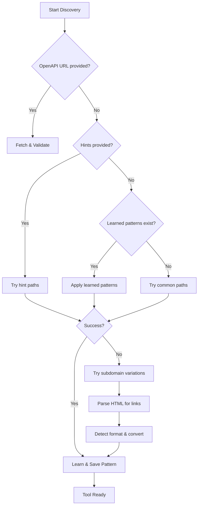

<!-- SOURCE VERIFICATION
Last Verified: 2025-08-11 14:39:05
Verification Script: update-docs-parallel.sh
Batch: ab
-->

# Enhanced Dynamic Tool Discovery

The Developer Mesh platform features an intelligent discovery system that can automatically find, understand, and integrate any API-based tool without requiring custom code or adapters.

## Overview

Traditional integration platforms require you to write custom adapters for each tool. Developer Mesh's enhanced discovery system eliminates this by:

1. **Automatically detecting** API documentation formats
2. **Converting** non-standard formats to OpenAPI 3.0
3. **Learning** from successful discoveries
4. **Accepting hints** to speed up discovery

## Key Features

### 🔍 Format Detection

The system automatically detects various API documentation formats:

- **OpenAPI 3.x** (JSON/YAML)
- **Swagger/OpenAPI 2.0**
- **Custom JSON** formats (e.g., SonarQube's webservices)
- **RAML** (detection only)
<!-- REMOVED: - **Postman Collections** (coming soon) (unimplemented feature) -->
<!-- REMOVED: - **GraphQL** schemas (coming soon) (unimplemented feature) -->

### 🔄 Format Conversion

When a non-OpenAPI format is detected, the system automatically converts it:

```json
// SonarQube's custom format
{
  "webServices": [
    {
      "path": "/api/issues",
      "actions": [
        {
          "key": "search",
          "description": "Search for issues"
        }
      ]
    }
  ]
}

// Automatically converted to OpenAPI 3.0
{
  "openapi": "3.0.3",
  "paths": {
    "/api/issues/search": {
      "post": {
        "summary": "Search for issues",
        "operationId": "search"
      }
    }
  }
}
```

### 🧠 Learning System

The discovery system learns from each successful discovery:

1. **Pattern Recognition**: Remembers successful paths for domains
2. **Auth Method Memory**: Recalls working authentication methods
3. **Format Detection**: Improves format detection accuracy
4. **Cross-Domain Learning**: Applies patterns from similar tools

### 💡 Discovery Hints

Speed up discovery by providing hints:

```json
{
  "name": "custom-api",
  "base_url": "https://api.example.com",
  "discovery_hints": {
    // Direct path to OpenAPI spec
    "openapi_url": "https://api.example.com/swagger.json",
    
    // Custom paths to try
    "custom_paths": ["/api/v2/spec", "/docs/api.json"],
    
    // API format if known
    "api_format": "swagger",
    
    // Example endpoint that works
    "example_endpoint": "/api/v1/users",
    "example_method": "GET",
    "example_headers": {
      "X-API-Key": "example-key"
    },
    
    // Authentication details
    "api_key_name": "X-API-Key",
    "api_key_in": "header",
    
    // Documentation URL for manual reference
    "documentation_url": "https://docs.example.com/api"
  }
}
```

## How It Works

### Discovery Process

1. **Direct URL Check**: If `openapi_url` is provided, try it first
2. **Hint-Based Discovery**: Use any provided hints
3. **Learned Patterns**: Apply patterns from previous successful discoveries
4. **Common Paths**: Try standard OpenAPI paths (`/swagger.json`, `/openapi.yaml`, etc.)
5. **Subdomain Variations**: Check common API subdomains (`api.`, `docs.`, etc.)
6. **HTML Parsing**: Parse main page for API documentation links
7. **Format Detection**: Detect and convert non-OpenAPI formats

### Discovery Strategies

The system uses multiple strategies in order:



## Examples

### Example 1: GitHub (Standard OpenAPI)

```bash
curl -X POST http://localhost:8081/api/v1/tools \
  -H "Authorization: Bearer $TOKEN" \
  -d '{
    "name": "github",
    "base_url": "https://api.github.com"
  }'
```

Discovery finds `/swagger.json` automatically.

### Example 2: SonarQube (Custom Format)

```bash
curl -X POST http://localhost:8081/api/v1/tools \
  -H "Authorization: Bearer $TOKEN" \
  -d '{
    "name": "sonarqube",
    "base_url": "https://sonar.example.com",
    "discovery_hints": {
      "api_format": "custom_json",
      "custom_paths": ["/api/webservices/list"]
    }
  }'
```

System detects custom format and converts to OpenAPI.

### Example 3: Private API (With Authentication)

```bash
curl -X POST http://localhost:8081/api/v1/tools \
  -H "Authorization: Bearer $TOKEN" \
  -d '{
    "name": "internal-api",
    "base_url": "https://internal.company.com",
    "discovery_hints": {
      "example_endpoint": "/api/v1/health",
      "example_headers": {
        "X-Company-Token": "internal-token-123"
      },
      "custom_paths": ["/api/specification"]
    },
    "credentials": {
      "type": "header",
      "header_name": "X-Company-Token",
      "token": "internal-token-123"
    }
  }'
```

### Example 4: Learning from Previous Discovery

When you add a second SonarQube instance:

```bash
curl -X POST http://localhost:8081/api/v1/tools \
  -H "Authorization: Bearer $TOKEN" \
  -d '{
    "name": "sonarqube-prod",
    "base_url": "https://sonar-prod.example.com"
  }'
```

The system automatically tries `/api/webservices/list` based on previous success.

## Configuration

### Discovery Timeouts

Configure discovery timeouts in your environment:

```env
DISCOVERY_TIMEOUT=30s
DISCOVERY_MAX_REDIRECTS=5
DISCOVERY_MAX_SIZE=10MB
```

### Pattern Storage

Discovery patterns are stored in the database and can be managed:

```sql
-- View learned patterns
SELECT * FROM tool_discovery_patterns;

-- Clear patterns for a domain
DELETE FROM tool_discovery_patterns WHERE domain = 'api.example.com';
```

## Best Practices

1. **Provide Direct URLs**: If you know the OpenAPI URL, provide it for fastest discovery
2. **Use Discovery Hints**: Hints significantly speed up discovery for non-standard APIs
3. **Test with Examples**: Provide working endpoint examples for better detection
4. **Document Custom Formats**: For internal APIs, document the format in hints
5. **Monitor Discovery**: Check logs for discovery attempts and optimize hints

## Troubleshooting

### Discovery Failed

If discovery fails, check:

1. **Network Access**: Ensure the API is reachable from your server
2. **Authentication**: Verify credentials are correct
3. **Format Support**: Check if the API format is supported
4. **Hints**: Add more specific hints about the API

### Slow Discovery

To speed up discovery:

1. Provide `openapi_url` directly
2. Add `custom_paths` hints
3. Specify `api_format`
4. Use learned patterns from similar tools

### Format Not Detected

For unsupported formats:

1. Open an issue with format details
2. Use manual tool configuration as workaround
3. Consider converting to OpenAPI format

## API Reference

