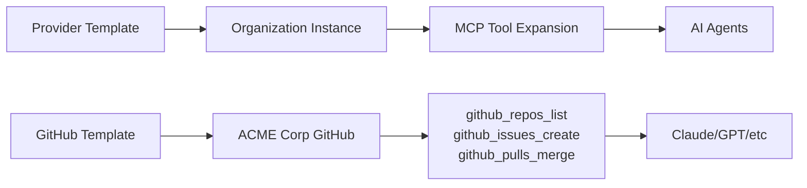

# Standard Tools Integration

## Overview

Developer Mesh provides pre-built integrations with industry-standard DevOps tools, eliminating the complexity of dynamic discovery for well-known services with massive OpenAPI specifications. These integrations are production-ready with enterprise-grade resilience patterns.

## Supported Providers

### Currently Available
- **GitHub**: Full GitHub API v3 integration with automatic operation expansion
- **GitLab** (Coming Soon): Complete GitLab API support
- **Jira/Confluence** (Coming Soon): Atlassian Cloud integration
- **Harness.io** (Coming Soon): CI/CD pipeline management

## Architecture

### Provider Template System



### Key Components

1. **Tool Templates** (`tool_templates` table)
   - Pre-defined provider configurations
   - Default settings and operation mappings
   - AI-optimized tool definitions

2. **Organization Tools** (`organization_tools` table)
   - Organization-specific instances
   - Encrypted credentials storage
   - Custom configuration overrides

3. **OrganizationToolAdapter**
   - Bridges templates with MCP protocol
   - Implements resilience patterns
   - Handles permission filtering

## Resilience Patterns

### Circuit Breaker
Prevents cascading failures when external services are down:
- Opens after 5 consecutive failures (configurable)
- Half-open state after 60 seconds
- Automatic recovery when service is healthy

### Bulkhead Pattern
Isolates failures to prevent system-wide impact:
- Maximum 100 concurrent requests per provider
- Queue size of 1000 for excess requests
- Graceful degradation under load

### Request Coalescing
Deduplicates identical concurrent requests:
- Uses singleflight pattern
- Shares results among waiting callers
- Reduces load on external APIs

## Configuration

### Registering a GitHub Tool

```bash
# Via REST API
curl -X POST http://localhost:8081/api/v1/organizations/{org-id}/tools \
  -H "Authorization: Bearer YOUR_TOKEN" \
  -H "Content-Type: application/json" \
  -d '{
    "provider": "github",
    "instance_name": "github-main",
    "display_name": "GitHub Main Account",
    "config": {
      "base_url": "https://api.github.com",
      "rate_limits": {
        "requests_per_hour": 5000
      }
    },
    "credentials": {
      "token": "ghp_your_github_token"
    }
  }'
```

### Feature Flags

Enable standard tools features via environment variables:

```bash
# Enable standard tools integration
export FEATURE_ENABLE_STANDARD_TOOLS=true

# Enable permission caching for performance
export FEATURE_ENABLE_PERMISSION_CACHING=true

# Enable tool expansion for MCP
export FEATURE_ENABLE_TOOL_EXPANSION=true

# Enable async permission discovery
export FEATURE_ENABLE_ASYNC_PERMISSION_DISCOVERY=true
```

## Tool Expansion

A single provider (e.g., GitHub) automatically expands into multiple granular MCP tools:

| Provider | Expanded Tools | Description |
|----------|---------------|-------------|
| GitHub | `github_repos_list` | List repositories |
| | `github_repos_get` | Get repository details |
| | `github_repos_create` | Create new repository |
| | `github_issues_list` | List issues |
| | `github_issues_create` | Create new issue |
| | `github_issues_update` | Update existing issue |
| | `github_pulls_list` | List pull requests |
| | `github_pulls_create` | Create pull request |
| | `github_pulls_merge` | Merge pull request |
| | `github_actions_list` | List workflow runs |
| | ... | (100+ operations total) |

## Permission Filtering

Tools are automatically filtered based on the user's access token permissions:

1. **Token Validation**: Checks token scopes with provider API
2. **Operation Filtering**: Only shows operations the token can execute
3. **Caching**: Permissions cached for 15 minutes (configurable)
4. **Async Discovery**: Optional async permission discovery for performance

## Metrics and Monitoring

### Available Metrics

| Metric | Description | Labels |
|--------|-------------|--------|
| `organization_tools.get` | Tool retrieval latency | `org_id` |
| `organization_tools.count` | Number of tools per org | `org_id` |
| `tool_execution` | Tool execution latency | `org_id`, `tool_id` |
| `permission_cache.hit` | Cache hit rate | `provider` |
| `permission_cache.miss` | Cache miss rate | `provider` |
| `circuit_breaker.state` | Circuit breaker state (0=closed, 1=open, 2=half-open) | `provider` |
| `circuit_breaker.state_change` | State change events | `provider`, `from`, `to` |
| `bulkhead.rejected` | Requests rejected due to overload | `reason` |
| `singleflight.shared` | Coalesced duplicate requests | `operation` |

### Health Monitoring

Check provider health status:

```bash
# Get health status for all providers
curl http://localhost:8081/api/v1/organizations/{org-id}/tools/health

# Response
{
  "github": {
    "provider": "github",
    "circuit_state": "closed",
    "total_requests": 1523,
    "total_failures": 2,
    "consecutive_failures": 0,
    "last_checked": "2025-08-25T10:00:00Z"
  }
}
```

## Database Schema

### tool_templates
Stores provider templates with default configurations:
- `provider_name`: Unique provider identifier
- `default_config`: Default provider configuration
- `operation_mappings`: OpenAPI operation mappings
- `ai_definitions`: AI-optimized tool definitions

### organization_tools
Organization-specific tool instances:
- `organization_id`: Organization UUID
- `template_id`: Reference to tool template
- `credentials_encrypted`: Encrypted credentials
- `instance_config`: Instance-specific configuration
- `health_status`: Current health status

## Security

### Credential Encryption
- AES-256-GCM encryption for all credentials
- Per-organization encryption keys
- Automatic key rotation support

### Token Security
- Tokens never logged or exposed
- SHA-256 hashing for cache keys
- Automatic token expiration handling

## Best Practices

1. **Use Templates**: Always use pre-built templates when available
2. **Monitor Circuit Breakers**: Set up alerts for circuit breaker state changes
3. **Configure Rate Limits**: Set appropriate rate limits per provider
4. **Enable Caching**: Use permission caching for better performance
5. **Test Failover**: Regularly test circuit breaker failover behavior
6. **Review Metrics**: Monitor bulkhead rejections and adjust limits

## Troubleshooting

### Circuit Breaker Open
- Check provider health endpoint
- Review error logs for failure reasons
- Wait for automatic recovery or manually reset

### High Cache Miss Rate
- Verify cache configuration
- Check Redis connectivity
- Review TTL settings

### Permission Filtering Issues
- Verify token has required scopes
- Check permission discovery logs
- Clear permission cache if needed

## API Reference

### Organization Tools API

#### Register Tool
```
POST /api/v1/organizations/{org-id}/tools
```

#### List Tools
```
GET /api/v1/organizations/{org-id}/tools
```

#### Get Tool
```
GET /api/v1/organizations/{org-id}/tools/{tool-id}
```

#### Update Tool
```
PUT /api/v1/organizations/{org-id}/tools/{tool-id}
```

#### Delete Tool
```
DELETE /api/v1/organizations/{org-id}/tools/{tool-id}
```

#### Get Health Status
```
GET /api/v1/organizations/{org-id}/tools/health
```

## MCP Integration

Tools are automatically exposed via MCP protocol:

```json
// List expanded tools
{
  "jsonrpc": "2.0",
  "id": 1,
  "method": "tools/list"
}

// Execute tool
{
  "jsonrpc": "2.0",
  "id": 2,
  "method": "tools/call",
  "params": {
    "name": "github_repos_list",
    "arguments": {
      "org": "developer-mesh"
    }
  }
}
```

## Future Enhancements

- [ ] GitLab provider implementation
- [ ] Jira/Confluence integration
- [ ] Harness.io support
- [ ] Custom provider SDK
- [ ] Provider marketplace
- [ ] Automatic provider updates
- [ ] Cost tracking per operation
- [ ] SLA monitoring