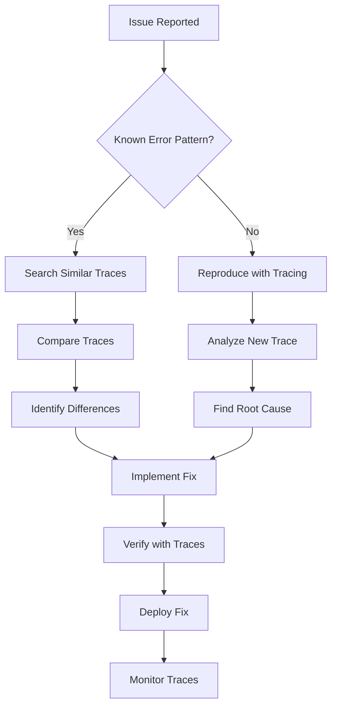

# Trace-Based Debugging Guide

> **Purpose**: Practical guide for using distributed traces to debug complex issues in production
> **Audience**: Developers, SREs, and support engineers debugging the Developer Mesh platform
> **Scope**: Real-world debugging scenarios using traces with Jaeger and OpenTelemetry

## Table of Contents

1. [Overview](#overview)
2. [Prerequisites](#prerequisites)
3. [Accessing Trace Data](#accessing-trace-data)
4. [Understanding Trace Anatomy](#understanding-trace-anatomy)
5. [Common Debugging Scenarios](#common-debugging-scenarios)
6. [Advanced Debugging Techniques](#advanced-debugging-techniques)
7. [Correlation with Logs and Metrics](#correlation-with-logs-and-metrics)
8. [Performance Analysis](#performance-analysis)
9. [Error Investigation](#error-investigation)
10. [Best Practices](#best-practices)

## Overview

Distributed tracing provides end-to-end visibility into request flows across multiple services, making it invaluable for debugging complex issues in microservice architectures.

### When to Use Trace-Based Debugging

- **Latency Issues**: Finding bottlenecks in request processing
- **Error Propagation**: Understanding how errors cascade through services
- **Integration Problems**: Debugging issues between services
- **Performance Regression**: Identifying what changed
- **Complex Workflows**: Understanding multi-service interactions

## Prerequisites

### Required Access

```bash
# Jaeger UI
open http://localhost:16686

# Or production Jaeger
open https://jaeger.mcp.example.com
```

### Trace Context Headers

```bash
# Force tracing for a specific request
curl -H "X-B3-Sampled: 1" \
     -H "X-Request-ID: debug-123" \
     https://api.mcp.example.com/v1/contexts
```

## Accessing Trace Data

### Finding Traces

#### By Trace ID

```bash
# Direct link to trace
open http://localhost:16686/trace/{traceId}

# From logs
grep "trace_id" /var/log/mcp/mcp-server.log | tail -1
# {"trace_id":"4bf92f3577b34da6a3ce929d0e0e4736","msg":"Request processed"}
```

#### By Service and Operation

```
Service: mcp-server
Operation: POST /api/v1/agents
Tags: error=true
Timeframe: Last hour
```

#### By Custom Tags

```
agent.id = "production-claude"
task.type = "code_analysis"
cost.exceeded = true
```

## Understanding Trace Anatomy

### Trace Components

```
Trace
├── Span 1: HTTP POST /api/v1/tasks (mcp-server)
│   ├── Span 2: ValidateRequest
│   ├── Span 3: AuthorizeUser
│   ├── Span 4: CreateTask (database)
│   ├── Span 5: PublishToQueue (SQS)
│   └── Span 6: NotifyAgents (WebSocket)
│       ├── Span 7: SelectAgent
│       └── Span 8: SendMessage
└── Span 9: ProcessTask (worker)
    ├── Span 10: FetchFromQueue
    ├── Span 11: ExecuteTask
    └── Span 12: StoreResult
```

### Key Span Attributes

```json
{
  "trace_id": "4bf92f3577b34da6a3ce929d0e0e4736",
  "span_id": "a3ce929d0e0e4736",
  "operation": "CreateTask",
  "service": "mcp-server",
  "duration": 45.3,
  "tags": {
    "user.id": "user-123",
    "task.type": "embedding_generation",
    "agent.id": "production-claude",
    "cost.estimated": 0.05,
    "db.statement": "INSERT INTO tasks...",
    "error": false
  }
}
```

## Common Debugging Scenarios

### Scenario 1: Slow API Response

**Symptom**: Users report slow task creation

**Investigation Steps**:

1. **Find the slow trace**:
```
Service: mcp-server
Operation: POST /api/v1/tasks
Min Duration: 5s
```

2. **Analyze span waterfall**:
```
POST /api/v1/tasks (5.2s)
├── ValidateRequest (10ms) ✓
├── AuthorizeUser (200ms) ✓
├── CreateTask (4.8s) ⚠️ SLOW
│   └── db.statement: "INSERT INTO tasks..."
├── PublishToQueue (150ms) ✓
└── NotifyAgents (40ms) ✓
```

3. **Deep dive into slow span**:
```json
{
  "span": "CreateTask",
  "duration": 4800,
  "tags": {
    "db.system": "postgresql",
    "db.statement": "INSERT INTO tasks (id, type, payload, embedding_vector) VALUES ($1, $2, $3, $4)",
    "db.rows_affected": 1,
    "embedding.size": 1536,
    "embedding.dimension": 3072
  }
}
```

**Root Cause**: Large embedding vector insert without proper indexing

**Solution**:
```sql
-- Add partial index for embedding inserts
CREATE INDEX CONCURRENTLY idx_tasks_embedding_partial 
ON tasks USING ivfflat (embedding_vector vector_cosine_ops) 
WHERE embedding_vector IS NOT NULL;
```

### Scenario 2: WebSocket Message Loss

**Symptom**: Agents intermittently miss task assignments

**Investigation Steps**:

1. **Search for WebSocket traces**:
```
Service: mcp-server
Operation: HandleWebSocketMessage
Tags: ws.message_type=TaskAssignment
```

2. **Compare successful vs failed**:

**Successful Trace**:
```
HandleWebSocketMessage (120ms)
├── ParseMessage (5ms) ✓
├── ValidateAgent (10ms) ✓
├── RouteTask (50ms) ✓
│   ├── SelectAgent (30ms)
│   └── AssignTask (20ms)
└── SendMessage (55ms) ✓
    ├── CompressPayload (10ms)
    └── WriteToConnection (45ms)
```

**Failed Trace**:
```
HandleWebSocketMessage (75ms)
├── ParseMessage (5ms) ✓
├── ValidateAgent (10ms) ✓
├── RouteTask (50ms) ✓
└── SendMessage (10ms) ❌ ERROR
    └── error: "write tcp 10.0.1.5:8080->10.0.2.10:54321: write: broken pipe"
```

3. **Check connection lifecycle**:
```
Tags: ws.connection_id=conn-abc123
```

**Root Cause**: Connection closed during message send

**Solution**:
```go
// Add connection health check before send
func (h *WebSocketHandler) SendMessage(ctx context.Context, conn *websocket.Conn, msg *Message) error {
    span := trace.SpanFromContext(ctx)
    
    // Check connection state
    if err := conn.Ping(ctx); err != nil {
        span.RecordError(err)
        span.SetAttributes(attribute.String("connection.state", "closed"))
        return fmt.Errorf("connection closed: %w", err)
    }
    
    // Send with retry
    return h.sendWithRetry(ctx, conn, msg)
}
```

### Scenario 3: Cross-Service Error Propagation

**Symptom**: Task failures with unclear error messages

**Investigation Steps**:

1. **Find error traces**:
```
Tags: error=true
Service: ANY
```

2. **Follow error propagation**:
```
POST /api/v1/tasks (Failed)
├── mcp-server: CreateTask ✓
├── mcp-server: PublishToQueue ✓
└── worker: ProcessTask ❌
    ├── FetchFromQueue ✓
    ├── ExecuteTask ❌
    │   ├── CallBedrock ❌
    │   │   └── error: "ThrottlingException: Rate exceeded"
    │   └── Retry (3 attempts) ❌
    └── PublishError ✓
```

3. **Examine error details**:
```json
{
  "span": "CallBedrock",
  "error": true,
  "tags": {
    "error.type": "ThrottlingException",
    "error.message": "Rate exceeded",
    "bedrock.model": "claude-3-opus",
    "bedrock.request_id": "req-123",
    "retry.attempt": 3,
    "retry.max": 3
  }
}
```

**Root Cause**: Bedrock rate limiting

**Solution**:
```go
// Implement exponential backoff with jitter
func (c *BedrockClient) CallWithBackoff(ctx context.Context, request *Request) (*Response, error) {
    span := trace.SpanFromContext(ctx)
    
    for attempt := 0; attempt <= maxRetries; attempt++ {
        span.SetAttributes(attribute.Int("retry.attempt", attempt))
        
        resp, err := c.call(ctx, request)
        if err == nil {
            return resp, nil
        }
        
        if !isRetryable(err) {
            span.RecordError(err)
            return nil, err
        }
        
        backoff := calculateBackoff(attempt)
        span.AddEvent("Retrying after backoff", 
            trace.WithAttributes(attribute.Int64("backoff.ms", backoff.Milliseconds())))
        
        select {
        case <-time.After(backoff):
            continue
        case <-ctx.Done():
            return nil, ctx.Err()
        }
    }
    
    return nil, fmt.Errorf("max retries exceeded")
}
```

### Scenario 4: Memory Leak Investigation

**Symptom**: Worker memory usage growing over time

**Investigation Steps**:

1. **Compare trace patterns over time**:
```
Service: worker
Operation: ProcessTask
Timeframe: Compare "1 hour ago" vs "now"
```

2. **Look for growing spans**:
```
1 hour ago:
ProcessTask (500ms)
├── LoadContext (100ms) - 10MB
├── ExecuteTask (300ms)
└── Cleanup (100ms)

Now:
ProcessTask (2000ms)
├── LoadContext (1500ms) - 500MB ⚠️
├── ExecuteTask (400ms)
└── Cleanup (100ms)
```

3. **Examine memory-related attributes**:
```json
{
  "span": "LoadContext",
  "tags": {
    "context.size_bytes": 524288000,
    "context.embeddings_count": 50000,
    "cache.hit": false,
    "memory.allocated": 512000000,
    "memory.gc_runs": 0
  }
}
```

**Root Cause**: Context cache not being evicted

**Solution**:
```go
// Add cache eviction
func (w *Worker) LoadContext(ctx context.Context, contextID string) (*Context, error) {
    span := trace.SpanFromContext(ctx)
    
    // Check cache size
    if w.cache.Size() > maxCacheSize {
        evicted := w.cache.EvictLRU(cacheEvictionCount)
        span.AddEvent("Cache eviction", 
            trace.WithAttributes(attribute.Int("evicted_count", evicted)))
    }
    
    span.SetAttributes(
        attribute.Int64("cache.size_bytes", w.cache.Size()),
        attribute.Int("cache.entries", w.cache.Count()),
    )
    
    return w.cache.LoadOrFetch(ctx, contextID)
}
```

## Advanced Debugging Techniques

### Custom Trace Queries

```python
# Jaeger Python client for analysis
from jaeger_client import Config
import pandas as pd

def analyze_p99_latency(service, operation, hours=24):
    """Analyze P99 latency trends"""
    
    config = Config(
        config={
            'sampler': {'type': 'const', 'param': 1},
            'logging': True,
        },
        service_name='trace-analyzer'
    )
    
    tracer = config.initialize_tracer()
    
    # Query traces
    traces = jaeger_client.query_traces(
        service=service,
        operation=operation,
        start_time=datetime.now() - timedelta(hours=hours),
        limit=10000
    )
    
    # Extract durations
    durations = [span.duration for trace in traces 
                 for span in trace.spans 
                 if span.operation_name == operation]
    
    # Calculate percentiles
    df = pd.DataFrame(durations, columns=['duration_ms'])
    p99 = df['duration_ms'].quantile(0.99)
    
    print(f"P99 latency for {operation}: {p99}ms")
    
    # Find outliers
    outliers = df[df['duration_ms'] > p99 * 2]
    print(f"Found {len(outliers)} outlier requests")
    
    return outliers
```

### Trace Comparison

```go
// Compare trace patterns
func CompareTraces(ctx context.Context, goodTraceID, badTraceID string) {
    goodTrace := jaeger.GetTrace(ctx, goodTraceID)
    badTrace := jaeger.GetTrace(ctx, badTraceID)
    
    // Compare span counts
    fmt.Printf("Good trace spans: %d\n", len(goodTrace.Spans))
    fmt.Printf("Bad trace spans: %d\n", len(badTrace.Spans))
    
    // Find missing operations
    goodOps := extractOperations(goodTrace)
    badOps := extractOperations(badTrace)
    
    missing := difference(goodOps, badOps)
    fmt.Printf("Missing operations: %v\n", missing)
    
    // Compare timings
    for op, goodDuration := range goodOps {
        if badDuration, exists := badOps[op]; exists {
            ratio := badDuration / goodDuration
            if ratio > 2.0 {
                fmt.Printf("Operation %s is %.1fx slower\n", op, ratio)
            }
        }
    }
}
```

## Correlation with Logs and Metrics

### Log Correlation

```bash
# Find all logs for a trace
trace_id="4bf92f3577b34da6a3ce929d0e0e4736"

# Using Loki
logcli query '{service="mcp-server"} |= "'$trace_id'"' --limit=1000

# Using CloudWatch Insights
fields @timestamp, @message
| filter trace_id = "4bf92f3577b34da6a3ce929d0e0e4736"
| sort @timestamp asc
```

### Metric Correlation

```promql
# Find metrics during trace timeframe
# Trace time: 2024-01-10 14:30:00 - 14:30:05

# Request rate during incident
rate(http_requests_total{service="mcp-server"}[5m])
  [@1704896400]

# Error rate
rate(http_requests_total{service="mcp-server",status=~"5.."}[5m])
  [@1704896400]

# Database connections
mysql_connections_active{service="mcp-server"}
  [@1704896400]
```

### Combined Analysis Dashboard

```json
{
  "dashboard": "Trace Investigation",
  "panels": [
    {
      "title": "Trace Timeline",
      "type": "trace",
      "datasource": "Jaeger",
      "query": "trace:{{traceId}}"
    },
    {
      "title": "Related Logs",
      "type": "logs",
      "datasource": "Loki",
      "query": "{service=\"$service\"} |= \"$traceId\""
    },
    {
      "title": "Service Metrics",
      "type": "graph",
      "datasource": "Prometheus",
      "query": "rate(http_requests_total{service=\"$service\"}[5m])"
    }
  ]
}
```

## Performance Analysis

### Identifying Bottlenecks

```python
def find_bottlenecks(trace_id):
    """Identify performance bottlenecks in a trace"""
    
    trace = get_trace(trace_id)
    spans = sorted(trace.spans, key=lambda s: s.duration, reverse=True)
    
    total_duration = trace.duration
    
    print(f"Total trace duration: {total_duration}ms")
    print("\nTop 5 slowest operations:")
    
    for i, span in enumerate(spans[:5]):
        percentage = (span.duration / total_duration) * 100
        print(f"{i+1}. {span.operation_name}: {span.duration}ms ({percentage:.1f}%)")
        
        # Check for sequential vs parallel
        if span.child_spans:
            child_sum = sum(c.duration for c in span.child_spans)
            if child_sum > span.duration * 0.9:
                print(f"   ⚠️  Sequential execution detected")
            else:
                print(f"   ✓ Parallel execution")
```

### Trace Heatmaps

```sql
-- Generate heatmap data for Grafana
WITH span_durations AS (
  SELECT 
    date_trunc('minute', start_time) as minute,
    operation_name,
    duration_ms,
    NTILE(10) OVER (PARTITION BY operation_name ORDER BY duration_ms) as bucket
  FROM spans
  WHERE service_name = 'mcp-server'
    AND start_time > NOW() - INTERVAL '1 hour'
)
SELECT 
  minute,
  operation_name,
  bucket,
  COUNT(*) as count,
  AVG(duration_ms) as avg_duration
FROM span_durations
GROUP BY minute, operation_name, bucket
ORDER BY minute, operation_name, bucket;
```

## Error Investigation

### Error Pattern Analysis

```go
func AnalyzeErrorPatterns(ctx context.Context, service string, hours int) {
    // Query error traces
    traces := queryTraces(ctx, map[string]string{
        "service": service,
        "error": "true",
        "start": fmt.Sprintf("-%dh", hours),
    })
    
    // Group errors by type
    errorTypes := make(map[string]int)
    errorMessages := make(map[string][]string)
    
    for _, trace := range traces {
        for _, span := range trace.Spans {
            if span.Error {
                errorType := span.Tags["error.type"]
                errorTypes[errorType]++
                
                if len(errorMessages[errorType]) < 5 {
                    errorMessages[errorType] = append(
                        errorMessages[errorType], 
                        span.Tags["error.message"],
                    )
                }
            }
        }
    }
    
    // Print analysis
    fmt.Println("Error Distribution:")
    for errType, count := range errorTypes {
        fmt.Printf("- %s: %d occurrences\n", errType, count)
        fmt.Println("  Sample messages:")
        for _, msg := range errorMessages[errType] {
            fmt.Printf("    %s\n", msg)
        }
    }
}
```

### Root Cause Timeline

```bash
#!/bin/bash
# Generate error timeline

trace_id=$1
service=$2

echo "Generating error timeline for trace $trace_id"

# Get all spans with errors
jaeger_query="service=$service&tags=error:true&traceID=$trace_id"

# Extract timeline
curl -s "http://jaeger:16686/api/traces?$jaeger_query" | \
  jq -r '.data[0].spans[] | 
    select(.tags[].value == "true" and .tags[].key == "error") | 
    "\(.startTime/1000000 | strftime("%H:%M:%S.%3N")) \(.operationName): \(.tags[] | select(.key == "error.message").value)"' | \
  sort

# Get first error
first_error=$(curl -s "http://jaeger:16686/api/traces?$jaeger_query" | \
  jq -r '.data[0].spans[] | 
    select(.tags[].value == "true" and .tags[].key == "error") | 
    .startTime' | sort -n | head -1)

echo "First error at: $(date -d @$((first_error/1000000)))"
```

## Best Practices

### 1. Effective Trace Sampling

```go
// Dynamic sampling based on importance
func DynamicSampler(operation string, tags map[string]string) bool {
    // Always sample errors
    if tags["error"] == "true" {
        return true
    }
    
    // Always sample slow requests
    if duration, _ := strconv.Atoi(tags["duration_ms"]); duration > 1000 {
        return true
    }
    
    // Sample expensive operations
    if cost, _ := strconv.ParseFloat(tags["cost.estimated"], 64); cost > 1.0 {
        return true
    }
    
    // Sample specific users during debugging
    if tags["user.id"] == debugUserID {
        return true
    }
    
    // Default sampling
    return rand.Float64() < 0.01 // 1%
}
```

### 2. Meaningful Span Names

```go
// Good span names
span := tracer.StartSpan("database.query.FindUserByEmail")
span := tracer.StartSpan("cache.get.UserSession")
span := tracer.StartSpan("external.bedrock.GenerateEmbedding")

// Bad span names
span := tracer.StartSpan("query")        // Too generic
span := tracer.StartSpan("step1")        // Not descriptive
span := tracer.StartSpan(userEmail)      // Contains PII
```

### 3. Rich Span Attributes

```go
span.SetAttributes(
    // Resource identifiers
    attribute.String("resource.type", "task"),
    attribute.String("resource.id", taskID),
    
    // Operation details
    attribute.String("operation.type", "create"),
    attribute.Int("operation.retry", retryCount),
    
    // Performance metrics
    attribute.Int64("data.size_bytes", len(payload)),
    attribute.Float64("cost.estimated_usd", estimatedCost),
    
    // Debug information
    attribute.String("version.api", "v1"),
    attribute.String("version.model", modelVersion),
)
```

### 4. Trace Preservation

```yaml
# Preserve important traces
preservation_rules:
  - name: "errors"
    condition: "error = true"
    ttl: "30d"
    
  - name: "slow_requests"
    condition: "duration > 5000"
    ttl: "7d"
    
  - name: "high_cost"
    condition: "cost.total > 10.0"
    ttl: "90d"
    
  - name: "vip_users"
    condition: "user.tier = 'enterprise'"
    ttl: "30d"
```

### 5. Debugging Workflows



## Common Pitfalls

### 1. Missing Context Propagation

```go
// Bad: Context not propagated
func ProcessAsync(taskID string) {
    go func() {
        // This creates a new trace, not connected to parent
        ctx := context.Background()
        processTask(ctx, taskID)
    }()
}

// Good: Propagate trace context
func ProcessAsync(ctx context.Context, taskID string) {
    go func() {
        // Use linked span for async work
        link := trace.LinkFromContext(ctx)
        ctx, span := tracer.Start(
            context.Background(), 
            "ProcessAsync",
            trace.WithLinks(link),
        )
        defer span.End()
        
        processTask(ctx, taskID)
    }()
}
```

### 2. Excessive Span Creation

```go
// Bad: Too many spans
for i, item := range items {
    ctx, span := tracer.Start(ctx, fmt.Sprintf("ProcessItem_%d", i))
    process(item)
    span.End()
}

// Good: Batch operations
ctx, span := tracer.Start(ctx, "ProcessItems")
span.SetAttributes(attribute.Int("item.count", len(items)))

for i, item := range items {
    if i < 3 {  // Only trace first few
        ctx, itemSpan := tracer.Start(ctx, "ProcessItem")
        process(item)
        itemSpan.End()
    } else {
        process(item)  // Process without tracing
    }
}
span.End()
```

### 3. Sensitive Data in Traces

```go
// Bad: Leaking sensitive data
span.SetAttributes(
    attribute.String("user.password", password),
    attribute.String("api.key", apiKey),
)

// Good: Sanitize sensitive data
span.SetAttributes(
    attribute.String("user.id", userID),
    attribute.Bool("auth.success", true),
    attribute.String("api.key_id", keyID),  // ID, not the key
)
```

## Debugging Checklist

- [ ] **Identify the trace ID** from logs or headers
- [ ] **Open trace in Jaeger** and review the waterfall
- [ ] **Find the slowest/failed span** and examine attributes
- [ ] **Check for error details** in span logs and tags
- [ ] **Compare with successful traces** to find differences
- [ ] **Correlate with metrics** for the same timeframe
- [ ] **Review related logs** using the trace ID
- [ ] **Identify patterns** across multiple similar traces
- [ ] **Document findings** for future reference
- [ ] **Create alerts** for similar issues

## Next Steps

1. Review [Cross-Service Tracing](./cross-service-tracing.md) for multi-service debugging
2. See [Observability Architecture](./observability-architecture.md) for system design
3. Check [Performance Tuning Guide](./performance-tuning-guide.md) for optimization
4. Read [Distributed Tracing Guide](./distributed-tracing-guide.md) for more patterns

## Tools and Resources

- [Jaeger Documentation](https://www.jaegertracing.io/docs/)
- [OpenTelemetry Debugging](https://opentelemetry.io/docs/reference/specification/trace/sdk/)
- [Trace Analysis Tools](https://github.com/jaegertracing/jaeger-analytics-java)
- [Grafana Trace Viewer](https://grafana.com/docs/grafana/latest/datasources/jaeger/)